# 🎨 Visual Overview - Визуальный обзор проекта

**Цель**: Понять проект через визуализации  
**Для кого**: Визуальное мышление, быстрое понимание архитектуры  
**Время**: 30-40 минут

> 💡 Этот гайд содержит только диаграммы с минимальными комментариями.  
> Для детальных объяснений см. другие гайды.

---

## 📊 Содержание визуализаций

1. [Системная архитектура](#-1-системная-архитектура)
2. [Структура классов](#-2-структура-классов)
3. [Потоки данных](#-3-потоки-данных)
4. [Сценарии взаимодействия](#-4-сценарии-взаимодействия)
5. [Жизненные циклы](#-5-жизненные-циклы)
6. [Структура проекта](#-6-структура-проекта)
7. [User Journey](#-7-user-journey)
8. [Процессы разработки](#-8-процессы-разработки)
9. [Error Handling](#-9-error-handling)
10. [История проекта](#-10-история-проекта)

---

## 🏗️ 1. Системная архитектура

### 1.1 High-Level System Architecture

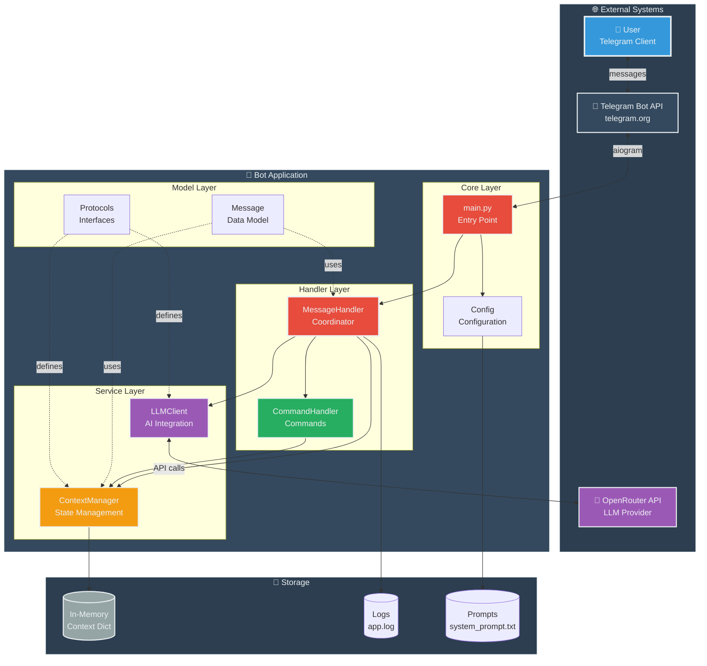

### 1.2 Deployment View

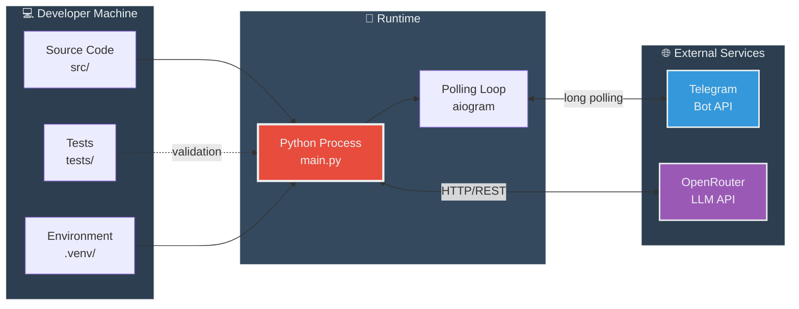

---

## 🧩 2. Структура классов

### 2.1 Class Diagram

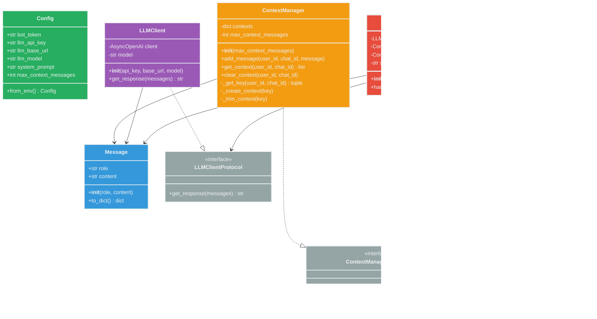

### 2.2 Dependency Graph

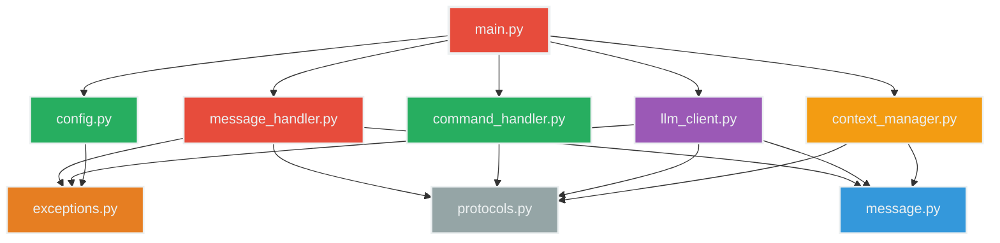

---

## 🔄 3. Потоки данных

### 3.1 Complete Data Flow

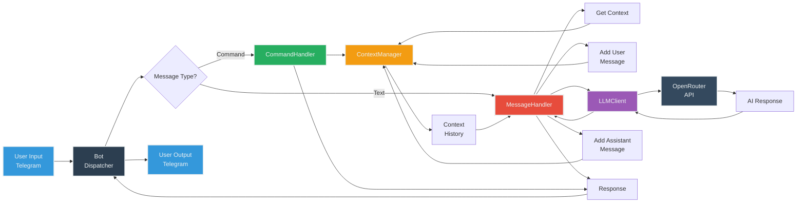

### 3.2 Context Data Flow

```mermaid
graph TB
    subgraph Input["📥 Input"]
        U1[User Message<br/>'Привет']
    end
    
    subgraph ContextManager["💾 ContextManager"]
        Check{Context<br/>exists?}
        Create[Create Context<br/>+ system prompt]
        Get[Get Context]
        Add[Add Message]
        Trim{Size ><br/>max?}
        TrimAction[Trim to max<br/>keep system]
    end
    
    subgraph Storage["🗄️ Storage"]
        Dict["contexts = {<br/>(user_id, chat_id):<br/>[Messages]<br/>}"]
    end
    
    subgraph Output["📤 Output"]
        Context[Context<br/>list[Message]]
    end
    
    U1 --> Check
    Check -->|No| Create
    Check -->|Yes| Get
    Create --> Dict
    Get --> Dict
    Dict --> Add
    Add --> Trim
    Trim -->|Yes| TrimAction
    Trim -->|No| Context
    TrimAction --> Dict
    Dict --> Context
    
    style U1 fill:#3498DB,stroke:#ECF0F1,stroke-width:2px,color:#ECF0F1
    style Dict fill:#95A5A6,stroke:#ECF0F1,stroke-width:2px,color:#ECF0F1
    style Context fill:#27AE60,stroke:#ECF0F1,stroke-width:2px,color:#ECF0F1
    style Check fill:#F39C12,stroke:#ECF0F1,stroke-width:2px,color:#ECF0F1
    style Trim fill:#E67E22,stroke:#ECF0F1,stroke-width:2px,color:#ECF0F1
    style ContextManager fill:#2C3E50,stroke:#ECF0F1,color:#ECF0F1
    style Input fill:#34495E,stroke:#ECF0F1,color:#ECF0F1
    style Storage fill:#34495E,stroke:#ECF0F1,color:#ECF0F1
    style Output fill:#34495E,stroke:#ECF0F1,color:#ECF0F1
```

---

## 🎬 4. Сценарии взаимодействия

### 4.1 Regular Message Flow

```mermaid
sequenceDiagram
    autonumber
    participant U as 👤 User
    participant T as Telegram API
    participant B as Bot
    participant MH as MessageHandler
    participant CM as ContextManager
    participant LC as LLMClient
    participant API as OpenRouter

    U->>T: Send "Привет"
    T->>B: Webhook/Polling
    B->>MH: handle_message(msg, user_id, chat_id)
    
    rect rgb(52, 73, 94)
        Note over MH,CM: Context Management
        MH->>CM: get_context(user_id, chat_id)
        CM-->>MH: [system, prev messages...]
        MH->>CM: add_message(user, "Привет")
        CM-->>MH: ✓
    end
    
    rect rgb(155, 89, 182)
        Note over MH,API: LLM Processing
        MH->>LC: get_response(messages)
        LC->>API: POST /chat/completions
        API-->>LC: {"choices": [...]}
        LC-->>MH: "Здравствуйте!"
    end
    
    rect rgb(52, 73, 94)
        Note over MH,CM: Save Response
        MH->>CM: add_message(assistant, "Здравствуйте!")
        CM-->>MH: ✓
    end
    
    MH-->>B: "Здравствуйте!"
    B->>T: Send message
    T->>U: "Здравствуйте!"
    
    style U fill:#3498DB,stroke:#ECF0F1,color:#ECF0F1
    style T fill:#34495E,stroke:#ECF0F1,color:#ECF0F1
    style B fill:#2C3E50,stroke:#ECF0F1,color:#ECF0F1
    style MH fill:#E74C3C,stroke:#ECF0F1,color:#ECF0F1
    style CM fill:#F39C12,stroke:#ECF0F1,color:#ECF0F1
    style LC fill:#9B59B6,stroke:#ECF0F1,color:#ECF0F1
    style API fill:#34495E,stroke:#ECF0F1,color:#ECF0F1
```

### 4.2 Command Flow (/reset)

```mermaid
sequenceDiagram
    autonumber
    participant U as 👤 User
    participant T as Telegram
    participant B as Bot
    participant MH as MessageHandler
    participant CH as CommandHandler
    participant CM as ContextManager

    U->>T: Send "/reset"
    T->>B: Message
    B->>MH: handle_message("/reset", ...)
    
    MH->>MH: Check if command
    Note over MH: text.startswith("/")
    
    MH->>CH: handle_command("/reset", user_id, chat_id)
    
    CH->>CM: clear_context(user_id, chat_id)
    CM->>CM: del contexts[key]
    CM-->>CH: ✓
    
    CH-->>MH: "История диалога очищена"
    MH-->>B: "История диалога очищена"
    B->>T: Send
    T->>U: "История диалога очищена"
    
    style U fill:#3498DB,stroke:#ECF0F1,color:#ECF0F1
    style MH fill:#E74C3C,stroke:#ECF0F1,color:#ECF0F1
    style CH fill:#27AE60,stroke:#ECF0F1,color:#ECF0F1
    style CM fill:#F39C12,stroke:#ECF0F1,color:#ECF0F1
```

### 4.3 Error Handling Flow

```mermaid
sequenceDiagram
    participant U as 👤 User
    participant MH as MessageHandler
    participant LC as LLMClient
    participant API as OpenRouter

    U->>MH: Send message
    MH->>LC: get_response(messages)
    LC->>API: POST /chat/completions
    
    alt Success
        API-->>LC: Response
        LC-->>MH: AI response
        MH-->>U: AI response
    else API Error
        API--xLC: Timeout/Error
        LC->>LC: raise LLMError
        LC--xMH: LLMError
        MH->>MH: Log error
        MH-->>U: "Извините, временные проблемы..."
    else General Error
        LC--xMH: Exception
        MH->>MH: Log exception
        MH-->>U: "Произошла ошибка..."
    end
    
    style U fill:#3498DB,stroke:#ECF0F1,color:#ECF0F1
    style MH fill:#E74C3C,stroke:#ECF0F1,color:#ECF0F1
    style LC fill:#9B59B6,stroke:#ECF0F1,color:#ECF0F1
    style API fill:#34495E,stroke:#ECF0F1,color:#ECF0F1
```

---

## 🔄 5. Жизненные циклы

### 5.1 Context Lifecycle

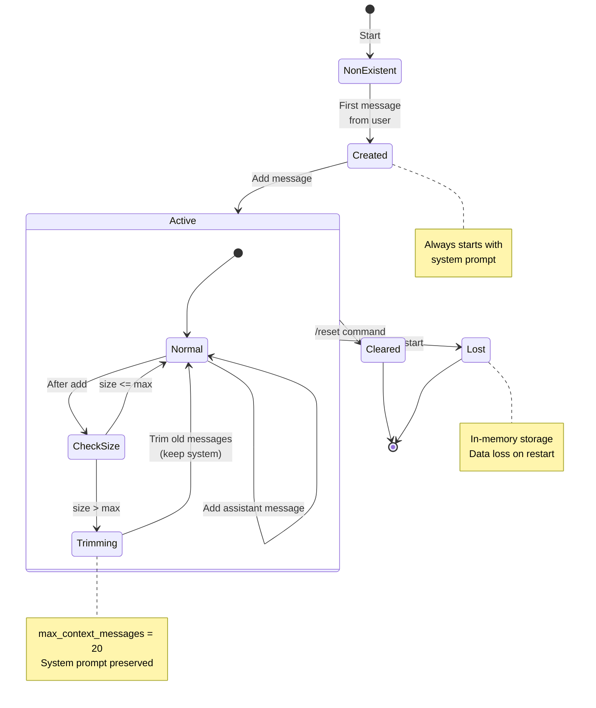

### 5.2 Message Processing State

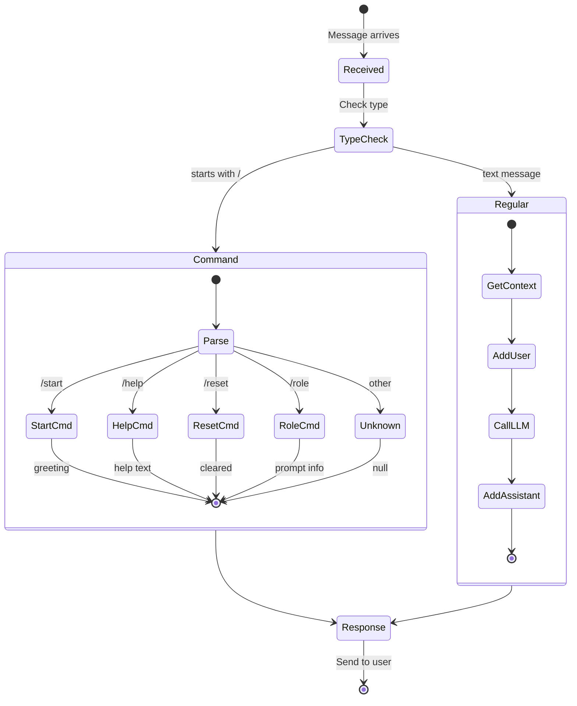

### 5.3 Bot Lifecycle

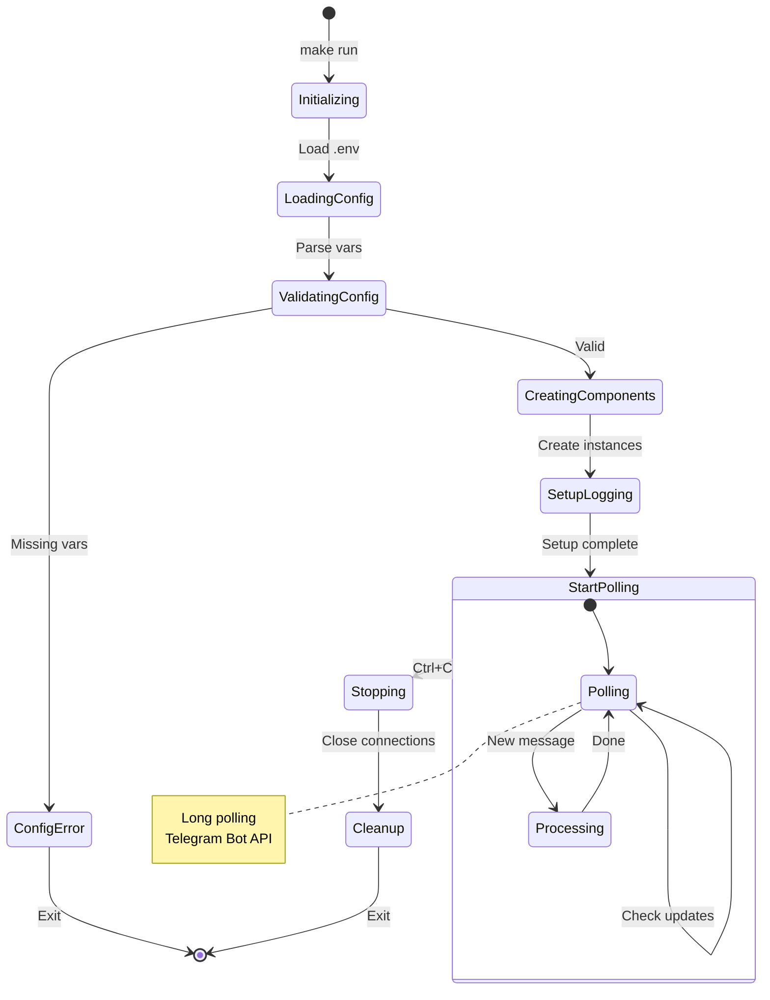

---

## 📂 6. Структура проекта

### 6.1 Project Structure Tree

```mermaid
graph TB
    Root[systech-aidd-live/] --> Src[src/]
    Root --> Tests[tests/]
    Root --> Doc[doc/]
    Root --> Prompts[prompts/]
    Root --> Logs[logs/]
    Root --> Config[Config Files]
    
    Src --> Src1[main.py]
    Src --> Src2[config.py]
    Src --> Src3[message_handler.py]
    Src --> Src4[command_handler.py]
    Src --> Src5[llm_client.py]
    Src --> Src6[context_manager.py]
    Src --> Src7[message.py]
    Src --> Src8[protocols.py]
    Src --> Src9[exceptions.py]
    
    Tests --> Tests1[conftest.py]
    Tests --> Tests2[test_*.py x8]
    
    Doc --> Doc1[guides/]
    Doc --> Doc2[adrs/]
    Doc --> Doc3[reviews/]
    Doc --> Doc4[*.md]
    
    Doc1 --> Guides[00-visual-overview.md<br/>01-getting-started.md<br/>02-repository-tour.md<br/>03-architecture-overview.md<br/>04-data-model.md<br/>06-development-workflow.md<br/>07-testing-strategy.md<br/>08-code-review-process.md<br/>12-troubleshooting.md]
    
    Prompts --> Prompts1[system_prompt.txt]
    
    Logs --> Logs1[app.log]
    
    Config --> Config1[pyproject.toml]
    Config --> Config2[uv.lock]
    Config --> Config3[Makefile]
    Config --> Config4[.env]
    Config --> Config5[.gitignore]
    
    style Root fill:#2C3E50,stroke:#ECF0F1,stroke-width:3px,color:#ECF0F1
    style Src fill:#E74C3C,stroke:#ECF0F1,stroke-width:2px,color:#ECF0F1
    style Tests fill:#27AE60,stroke:#ECF0F1,stroke-width:2px,color:#ECF0F1
    style Doc fill:#3498DB,stroke:#ECF0F1,stroke-width:2px,color:#ECF0F1
    style Prompts fill:#9B59B6,stroke:#ECF0F1,stroke-width:2px,color:#ECF0F1
    style Logs fill:#95A5A6,stroke:#ECF0F1,stroke-width:2px,color:#ECF0F1
    style Config fill:#F39C12,stroke:#ECF0F1,stroke-width:2px,color:#ECF0F1
```

### 6.2 Module Relationships

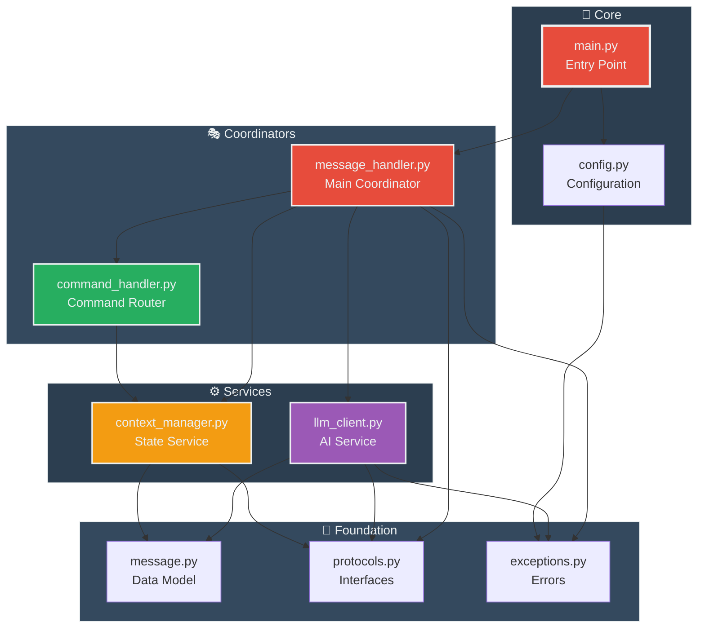

---

## 👤 7. User Journey

### 7.1 First-Time User Journey

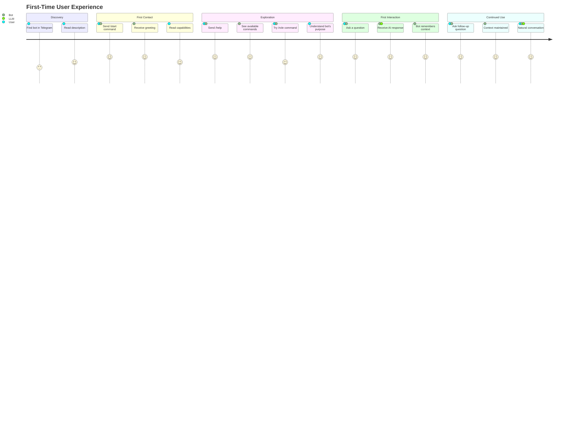

### 7.2 Error Recovery Journey

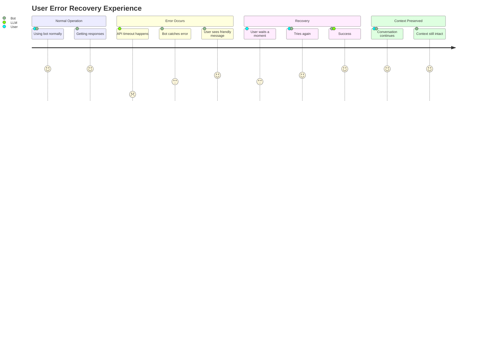

---

## 🛠️ 8. Процессы разработки

### 8.1 Development Workflow

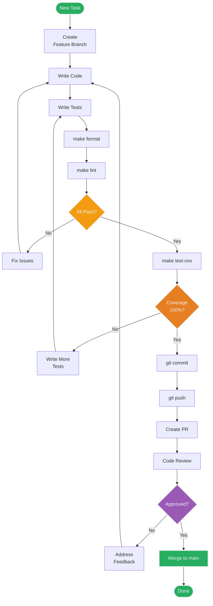

### 8.2 TDD Cycle

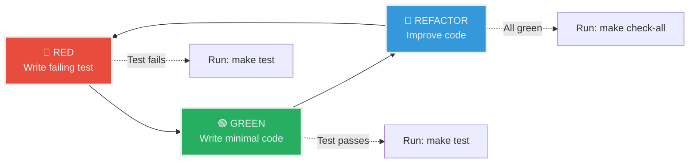

### 8.3 Testing Strategy

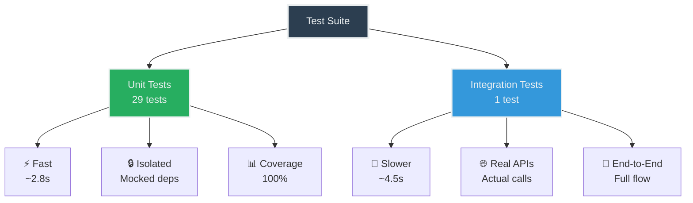

---

## ⚠️ 9. Error Handling

### 9.1 Error Propagation

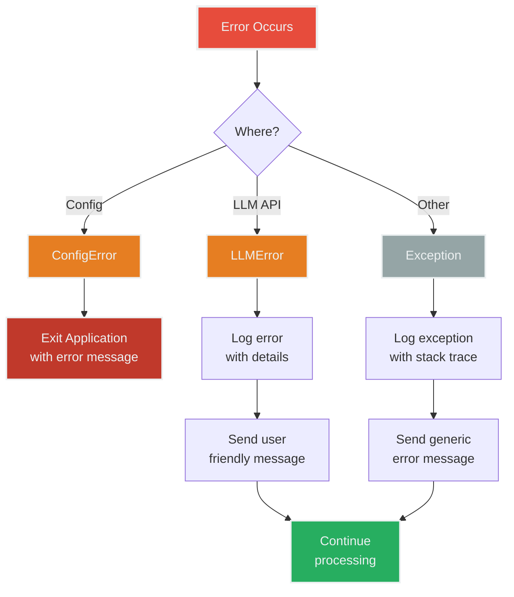

### 9.2 Retry Strategy (Future)

```mermaid
graph LR
    Request[API Request] --> Try{Try}
    Try --> Success{Success?}
    
    Success -->|Yes| Return[Return Response]
    Success -->|No| Count{Retry<br/>Count?}
    
    Count -->|< Max| Wait[Wait<br/>Backoff]
    Wait --> Try
    
    Count -->|>= Max| Fail[Raise Error]
    
    style Request fill:#3498DB,stroke:#ECF0F1,stroke-width:2px,color:#ECF0F1
    style Return fill:#27AE60,stroke:#ECF0F1,stroke-width:2px,color:#ECF0F1
    style Fail fill:#E74C3C,stroke:#ECF0F1,stroke-width:2px,color:#ECF0F1
    style Wait fill:#F39C12,stroke:#ECF0F1,stroke-width:2px,color:#ECF0F1
```

---

## 📅 10. История проекта

### 10.1 Development Timeline

```mermaid
gantt
    title Разработка проекта (8 итераций)
    dateFormat YYYY-MM-DD
    section MVP Phase
    Итерация 0 Echo-бот           :2025-10-10, 1d
    Итерация 1 Интеграция LLM      :2025-10-10, 1d
    Итерация 2 История диалога     :2025-10-10, 1d
    Итерация 3 Команды и обрезка   :2025-10-10, 1d
    Итерация 4 Финальное тестиров  :2025-10-10, 1d
    section Tech Debt Phase
    Итерация 0 Инструменты качества :2025-10-11, 1d
    Итерация 1 Type hints + validat :2025-10-11, 1d
    Итерация 2 Архитектурный рефакт :2025-10-11, 1d
    Итерация 3 Улучшение тестирован :2025-10-11, 1d
    Итерация 4 Финальная проверка   :2025-10-11, 1d
```

### 10.2 Architecture Evolution

```mermaid
graph LR
    subgraph MVP["MVP v0.1"]
        M1[Echo Bot<br/>Simple]
    end
    
    subgraph MVP2["MVP v0.2"]
        M2[+ LLM<br/>Integration]
    end
    
    subgraph MVP3["MVP v0.3"]
        M3[+ Context<br/>Management]
    end
    
    subgraph MVP4["MVP v1.0"]
        M4[+ Commands<br/>Complete]
    end
    
    subgraph Refactor["Refactored v2.0"]
        R1[+ Type Safety<br/>+ SOLID<br/>+ 100% Coverage]
    end
    
    MVP --> MVP2
    MVP2 --> MVP3
    MVP3 --> MVP4
    MVP4 --> Refactor
    
    style MVP fill:#95A5A6,stroke:#ECF0F1,color:#ECF0F1
    style MVP2 fill:#3498DB,stroke:#ECF0F1,color:#ECF0F1
    style MVP3 fill:#F39C12,stroke:#ECF0F1,color:#ECF0F1
    style MVP4 fill:#9B59B6,stroke:#ECF0F1,color:#ECF0F1
    style Refactor fill:#27AE60,stroke:#ECF0F1,stroke-width:3px,color:#ECF0F1
```

### 10.3 Quality Metrics Evolution

```mermaid
graph TB
    Start[Start MVP] --> M1[Coverage: 0%<br/>Type hints: 0%<br/>Tests: 0]
    M1 --> M2[Coverage: 43%<br/>Type hints: 0%<br/>Tests: 4]
    M2 --> M3[Coverage: 47%<br/>Type hints: 100%<br/>Tests: 4]
    M3 --> M4[Coverage: 42%<br/>Type hints: 100%<br/>Tests: 4]
    M4 --> Final[Coverage: 100%<br/>Type hints: 100%<br/>Tests: 30]
    
    style Start fill:#95A5A6,stroke:#ECF0F1,stroke-width:2px,color:#ECF0F1
    style Final fill:#27AE60,stroke:#ECF0F1,stroke-width:3px,color:#ECF0F1
```

---

## 🎯 Резюме визуализаций

### Ключевые точки зрения:

1. **Системная** - как компоненты связаны
2. **Структурная** - классы и их отношения
3. **Динамическая** - потоки данных и взаимодействий
4. **Процессная** - lifecycle и state machines
5. **Организационная** - структура файлов и модулей
6. **Пользовательская** - user journey
7. **Разработческая** - workflow и TDD
8. **Историческая** - эволюция проекта

### Использованные типы диаграмм:

- ✅ **Graph** - архитектура, зависимости, flows
- ✅ **Sequence** - взаимодействия, API calls
- ✅ **State** - жизненные циклы
- ✅ **Class** - структура классов
- ✅ **Journey** - пользовательский опыт
- ✅ **Gantt** - timeline разработки

---

## 📚 Связанные гайды

Для детального понимания см:
- [Architecture Overview](03-architecture-overview.md) - текстовые объяснения
- [Data Model](04-data-model.md) - детали структур данных
- [Development Workflow](06-development-workflow.md) - процесс разработки
- [Getting Started](01-getting-started.md) - начало работы

---

**💡 Совет**: Сохраните этот гайд как визуальный справочник. Диаграммы обновляются вместе с проектом.

