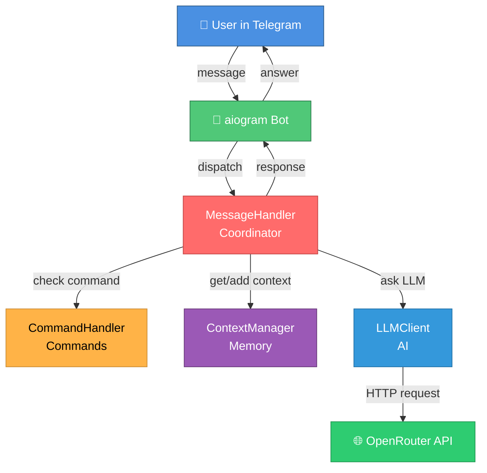
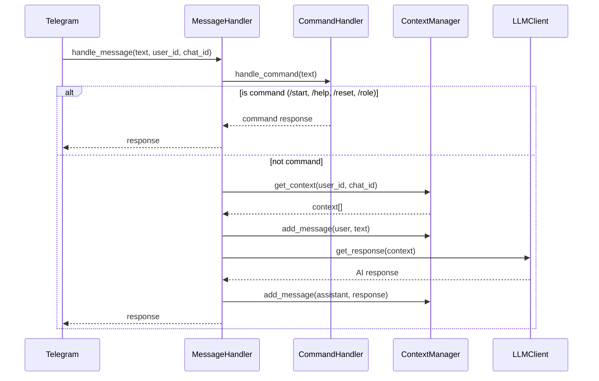
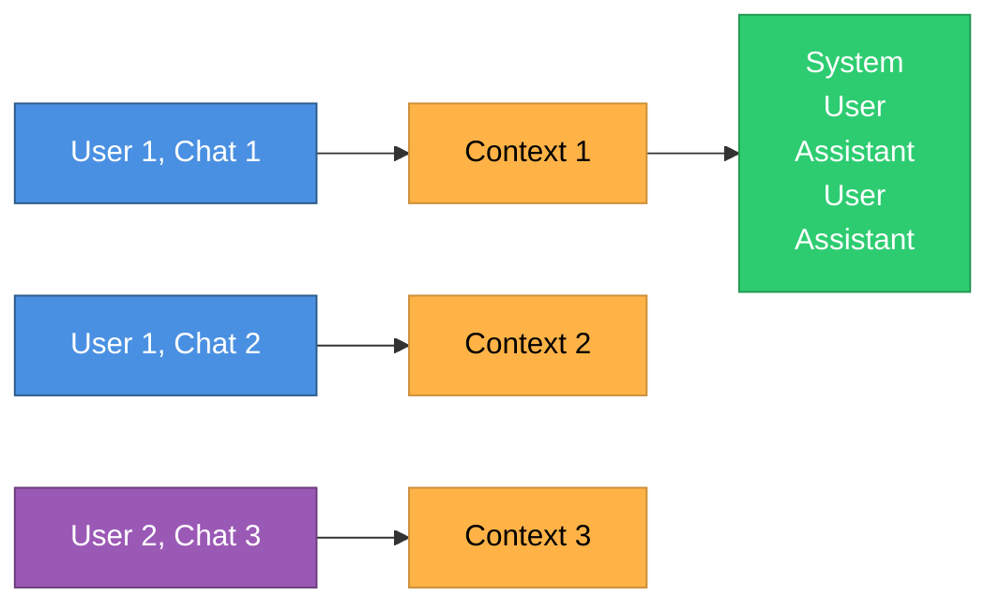
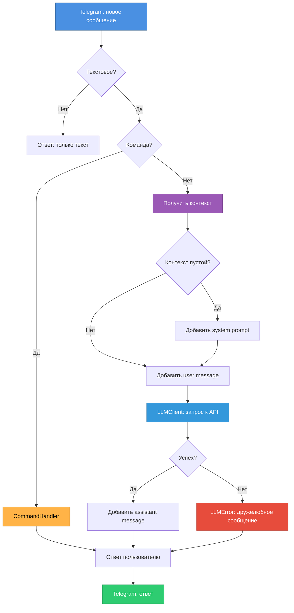

# GUIDE-02: Архитектура проекта

**Цель**: Понять, как устроена система на высоком уровне.

---

## High-Level Overview

Бот построен по принципу **координатора** с четким разделением ответственности:



---

## Основные компоненты

### 1. **MessageHandler** — Координатор
**Файл**: `src/message_handler.py`  
**Роль**: Оркестрирует всю обработку сообщений



**Ответственность**:
- Проверка команд через `CommandHandler`
- Управление контекстом через `ContextManager`
- Запрос к LLM через `LLMClient`
- Обработка ошибок (LLMError → дружелюбное сообщение)

---

### 2. **CommandHandler** — Обработчик команд
**Файл**: `src/command_handler.py`  
**Роль**: Обрабатывает команды бота

**Команды**:
- `/start` → Приветствие
- `/help` → Список команд
- `/reset` → Очистка контекста
- `/role` → Показать system prompt

**Принцип**: Single Responsibility — только команды, ничего больше.

---

### 3. **ContextManager** — Управление памятью
**Файл**: `src/context_manager.py`  
**Роль**: Хранит историю диалогов в памяти



**Структура хранилища**:
```python
contexts = {
    (user_id, chat_id): [
        Message("system", "Ты AICodingExpert..."),
        Message("user", "Привет"),
        Message("assistant", "Здравствуйте!"),
        ...
    ]
}
```

**Ключевые особенности**:
- **Ключ**: `(user_id, chat_id)` — кортеж из двух int
- **Значение**: список объектов `Message`
- **Лимит**: 20 сообщений (настраивается через `MAX_CONTEXT_MESSAGES`)
- **Обрезка**: при превышении лимита удаляются старые сообщения, но `system` всегда сохраняется
- **Хранилище**: In-memory (при перезапуске теряется)

---

### 4. **LLMClient** — Клиент к AI
**Файл**: `src/llm_client.py`  
**Роль**: Отправляет запросы к LLM API

**Особенности**:
- Использует `AsyncOpenAI` (async/await)
- Работает с любым OpenAI-compatible API
- Конвертирует `Message` → dict для API
- Логирует запросы и время выполнения
- Бросает `LLMError` при ошибках

**Поддерживаемые провайдеры**:
- OpenRouter (основной)
- OpenAI
- Ollama (локально)
- Groq
- Любой OpenAI-compatible

---

### 5. **Config** — Конфигурация
**Файл**: `src/config.py`  
**Роль**: Загружает и валидирует настройки из `.env`

**Обязательные параметры**:
- `BOT_TOKEN`
- `LLM_API_KEY`
- `LLM_BASE_URL`
- `LLM_MODEL`

**Опциональные** (с defaults):
- `SYSTEM_PROMPT_FILE` (default: `prompts/system_prompt.txt`)
- `MAX_CONTEXT_MESSAGES` (default: `20`)

**Логика загрузки system prompt**:
1. Попытка загрузить из файла `SYSTEM_PROMPT_FILE`
2. Если не удалось → fallback на `SYSTEM_PROMPT` из .env
3. Если оба отсутствуют → дефолтный промпт

---

### 6. **Message** — Структура сообщения
**Файл**: `src/message.py`  
**Роль**: Data class для сообщения

```python
class Message:
    role: str      # "system" | "user" | "assistant"
    content: str   # текст сообщения
    
    def to_dict(self) -> dict[str, str]:
        # Конвертация в формат OpenAI API
```

---

## Принципы проектирования

### SOLID

#### Single Responsibility Principle (SRP)
- `CommandHandler` — только команды
- `ContextManager` — только память
- `LLMClient` — только LLM API
- `MessageHandler` — только координация

#### Dependency Inversion Principle (DIP)
Используем **Protocols** для абстракции зависимостей:

```python
# src/protocols.py
class LLMClientProtocol(Protocol):
    async def get_response(self, messages: list[Message]) -> str: ...

class ContextManagerProtocol(Protocol):
    def add_message(self, user_id: int, chat_id: int, message: Message) -> None: ...
    def get_context(self, user_id: int, chat_id: int) -> list[Message]: ...
    def clear_context(self, user_id: int, chat_id: int) -> None: ...
```

**Зачем?**
- Легко мокать в тестах
- Можно заменить реализацию (например, ContextManager с БД)
- Явные контракты интерфейсов

---

### DRY (Don't Repeat Yourself)
- Нет дублирования кода
- Переиспользуемые компоненты

### KISS (Keep It Simple, Stupid)
- Один класс = один файл
- Плоская структура (все в `src/`)
- Без избыточных абстракций
- Без фабрик, билдеров, сложных паттернов

---

## Async-first подход

Весь код асинхронный:

```python
# aiogram - async
@dp.message()
async def handle(message: types.Message) -> None: ...

# MessageHandler - async
async def handle_message(...) -> str: ...

# LLMClient - async
async def get_response(...) -> str: ...
```

**Почему?**
- aiogram работает на asyncio
- OpenAI SDK поддерживает async
- Высокая производительность при многих запросах

---

## Flow обработки сообщения



---

## Обработка ошибок

### Custom Exceptions
**Файл**: `src/exceptions.py`

```python
class ConfigError(Exception):
    """Ошибки конфигурации (отсутствующие env vars)"""

class LLMError(Exception):
    """Ошибки LLM API (timeout, unauthorized, etc.)"""
```

### Стратегия обработки
1. **ConfigError** → бот не запустится (падает при старте)
2. **LLMError** → перехватывается в MessageHandler → дружелюбное сообщение пользователю
3. **Unexpected errors** → логируются + generic сообщение пользователю

---

## Логирование

**Формат**: `YYYY-MM-DD HH:MM:SS | LEVEL | message`

**Что логируется**:
- Lifecycle: "Bot started", "Bot stopped"
- Messages: user_id, chat_id, текст
- Commands: выполнение `/start`, `/help`, `/reset`, `/role`
- Context: создание, добавление, обрезка, очистка
- LLM: модель, размер контекста, длительность, ошибки

**Вывод**:
- Файл: `logs/app.log`
- Консоль: stdout

---

## Архитектурные решения (ADR)

Проект использует **Architecture Decision Records** для документирования важных решений:

- **ADR-01**: OpenAI Compatible API для LLM интеграции
- **ADR-02**: aiogram для Telegram Bot API
- **ADR-03**: In-memory storage для контекста (MVP)
- **ADR-04**: Protocols для Dependency Injection
- **ADR-05**: KISS принцип (без оверинжиниринга)

Подробности: `doc/adrs/`

---

## Что дальше?

Переходите к следующим гайдам:
- **GUIDE-06**: Codebase Tour — пройдемся по каждому файлу
- **GUIDE-07**: Development Workflow — как добавлять фичи
- **GUIDE-08**: Testing — стратегия тестирования

