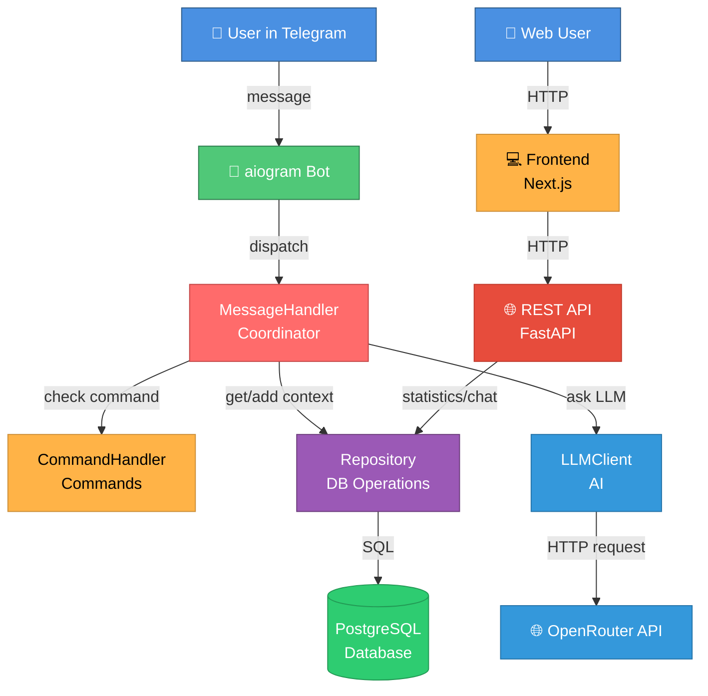
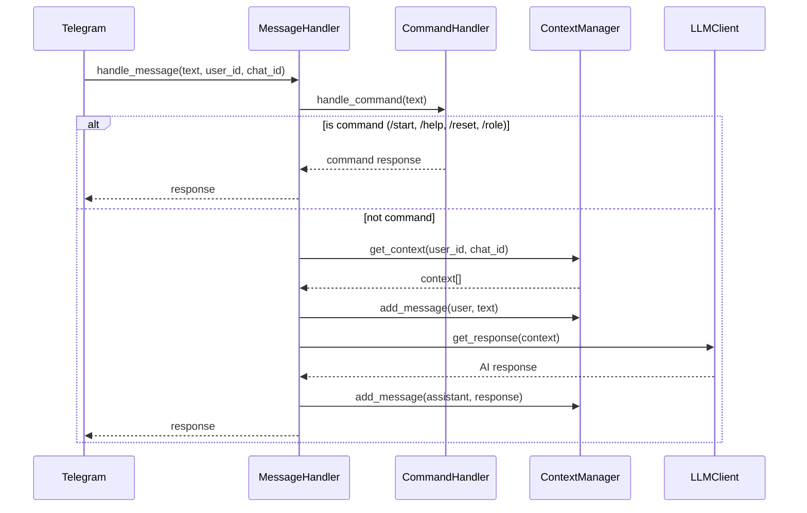
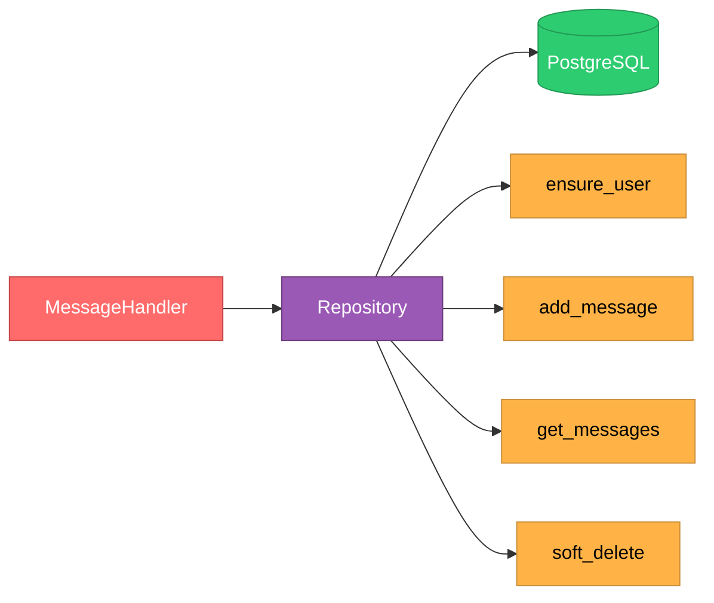
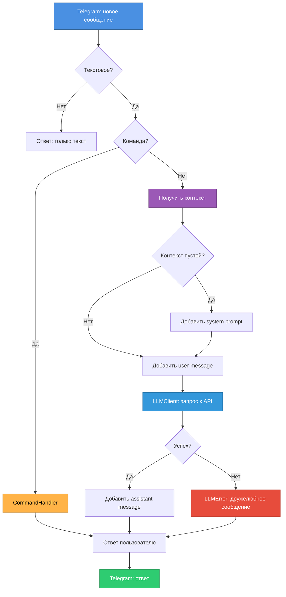

# GUIDE-02: Архитектура проекта

**Цель**: Понять, как устроена система на высоком уровне.

---

## High-Level Overview

Проект состоит из трех основных компонентов: **Telegram Bot**, **REST API** и **Frontend Dashboard**. Все компоненты используют общую базу данных PostgreSQL.



---

## Основные компоненты

### 1. **MessageHandler** — Координатор
**Файл**: `src/message_handler.py`  
**Роль**: Оркестрирует всю обработку сообщений



**Ответственность**:
- Проверка команд через `CommandHandler`
- Управление контекстом через `ContextManager`
- Запрос к LLM через `LLMClient`
- Обработка ошибок (LLMError → дружелюбное сообщение)

---

### 2. **CommandHandler** — Обработчик команд
**Файл**: `src/command_handler.py`  
**Роль**: Обрабатывает команды бота

**Команды**:
- `/start` → Приветствие
- `/help` → Список команд
- `/reset` → Очистка контекста
- `/role` → Показать system prompt

**Принцип**: Single Responsibility — только команды, ничего больше.

---

### 3. **Repository** — Работа с базой данных
**Файл**: `src/repository.py`  
**Роль**: Repository pattern для операций с БД



**Ключевые методы**:
- `ensure_user(user_id)` — создает пользователя если не существует
- `add_message(user_id, chat_id, role, content)` — сохраняет сообщение в БД
- `get_messages(user_id, chat_id, limit)` — получает последние N сообщений для контекста
- `soft_delete_messages(user_id, chat_id)` — логическое удаление (is_deleted=True)

**Ключевые особенности**:
- **Персистентность**: данные сохраняются между перезапусками
- **Лимит**: последние 20 сообщений (настраивается через `MAX_CONTEXT_MESSAGES`)
- **System prompt**: всегда включается первым (не учитывается в лимите)
- **Soft delete**: сообщения помечаются как удаленные, но физически остаются в БД
- **Async operations**: все операции асинхронные через SQLAlchemy 2.0

---

### 4. **LLMClient** — Клиент к AI
**Файл**: `src/llm_client.py`  
**Роль**: Отправляет запросы к LLM API

**Особенности**:
- Использует `AsyncOpenAI` (async/await)
- Работает с любым OpenAI-compatible API
- Конвертирует `Message` → dict для API
- Логирует запросы и время выполнения
- Бросает `LLMError` при ошибках

**Поддерживаемые провайдеры**:
- OpenRouter (основной)
- OpenAI
- Ollama (локально)
- Groq
- Любой OpenAI-compatible

---

### 5. **Database** — Управление подключением к БД
**Файл**: `src/database.py`  
**Роль**: Lifecycle управление async сессиями PostgreSQL

**Ключевые функции**:
- `init_database(database_url, echo)` — инициализация engine и session maker
- `close_database()` — закрытие соединений при остановке
- `get_session()` — async context manager для получения сессии

**Особенности**:
- Async engine через `create_async_engine()`
- Session factory через `async_sessionmaker()`
- Автоматический rollback при ошибках
- Pool management с `pool_pre_ping=True`

---

### 6. **Models** — ORM модели
**Файл**: `src/models.py`  
**Роль**: SQLAlchemy модели для таблиц БД

**Таблица `users`**:
- `id` (PK) — Telegram user_id (BigInteger)
- `created_at` — дата создания
- `is_deleted` — флаг soft delete

**Таблица `messages`**:
- `id` (PK) — автоинкремент
- `user_id` (FK) — ссылка на users
- `chat_id` — Telegram chat_id (BigInteger)
- `role` — роль сообщения (system/user/assistant)
- `content` — текст сообщения
- `content_length` — длина сообщения
- `created_at` — дата создания
- `is_deleted` — флаг soft delete

**Индексы**:
- `idx_messages_user_chat` — для быстрого поиска по (user_id, chat_id, is_deleted, created_at)
- `idx_users_active` — для фильтрации активных пользователей

---

### 7. **REST API** — Statistics и Chat API
**Файл**: `src/api_server.py` и `src/api/`  
**Роль**: FastAPI сервер для статистики и web-чата

**Endpoints**:
- `GET /api/v1/statistics` — статистика по сообщениям и пользователям
- `POST /api/v1/chat/message` — отправка сообщения в чат (normal/admin режимы)
- `GET /api/v1/chat/history` — получение истории чата
- `GET /health` — health check

**Особенности**:
- Swagger UI на `/docs`
- Protocol pattern для StatCollector (mock/real)
- Async обработка запросов
- Интеграция с тем же LLMClient что и бот

---

### 8. **Frontend Dashboard**
**Директория**: `frontend/`  
**Роль**: Web интерфейс для статистики и чата

**Стек**:
- Next.js 15 (App Router)
- TypeScript
- shadcn/ui + Tailwind CSS
- Dark/Light theme support

**Страницы**:
- `/dashboard` — статистика сообщений и пользователей
- `/chat` — web-интерфейс для чата с ботом

---

### 9. **Config** — Конфигурация
**Файл**: `src/config.py`  
**Роль**: Загружает и валидирует настройки из `.env`

**Обязательные параметры**:
- `BOT_TOKEN` — токен Telegram бота
- `LLM_API_KEY` — ключ для LLM API
- `LLM_BASE_URL` — URL провайдера LLM
- `LLM_MODEL` — название модели
- `DATABASE_URL` — строка подключения к PostgreSQL

**Опциональные** (с defaults):
- `SYSTEM_PROMPT_FILE` (default: `prompts/system_prompt.txt`)
- `MAX_CONTEXT_MESSAGES` (default: `20`)
- `DATABASE_ECHO` (default: `False`) — выводить SQL запросы в логи
- `API_HOST` (default: `0.0.0.0`) — хост для API сервера
- `API_PORT` (default: `8000`) — порт для API сервера
- `STAT_COLLECTOR_MODE` (default: `mock`) — режим StatCollector (mock/real)

**Логика загрузки system prompt**:
1. Попытка загрузить из файла `SYSTEM_PROMPT_FILE`
2. Если не удалось → fallback на `SYSTEM_PROMPT` из .env
3. Если оба отсутствуют → дефолтный промпт

---

### 10. **Message** — Data class для LLM
**Файл**: `src/message.py`  
**Роль**: Простой data class для передачи в LLM API

```python
class Message:
    role: str      # "system" | "user" | "assistant"
    content: str   # текст сообщения
    
    def to_dict(self) -> dict[str, str]:
        # Конвертация в формат OpenAI API
```

**Примечание**: Это отдельная структура от ORM моделей. Используется только для взаимодействия с LLM API.

---

## Принципы проектирования

### SOLID

#### Single Responsibility Principle (SRP)
- `CommandHandler` — только команды
- `ContextManager` — только память
- `LLMClient` — только LLM API
- `MessageHandler` — только координация

#### Dependency Inversion Principle (DIP)
Используем **Protocols** для абстракции зависимостей:

```python
# src/protocols.py
class LLMClientProtocol(Protocol):
    async def get_response(self, messages: list[Message]) -> str: ...

# src/api/protocols.py
class StatCollectorProtocol(Protocol):
    async def get_statistics(self, period: str) -> dict: ...
```

**Зачем?**
- Легко мокать в тестах
- Можно заменить реализацию (например, MockStatCollector → RealStatCollector)
- Явные контракты интерфейсов

---

### DRY (Don't Repeat Yourself)
- Нет дублирования кода
- Переиспользуемые компоненты

### KISS (Keep It Simple, Stupid)
- Один класс = один файл
- Плоская структура (все в `src/`)
- Без избыточных абстракций
- Без фабрик, билдеров, сложных паттернов

---

## Async-first подход

Весь код асинхронный:

```python
# aiogram - async
@dp.message()
async def handle(message: types.Message) -> None: ...

# MessageHandler - async
async def handle_message(...) -> str: ...

# LLMClient - async
async def get_response(...) -> str: ...
```

**Почему?**
- aiogram работает на asyncio
- OpenAI SDK поддерживает async
- Высокая производительность при многих запросах

---

## Flow обработки сообщения



---

## Обработка ошибок

### Custom Exceptions
**Файл**: `src/exceptions.py`

```python
class ConfigError(Exception):
    """Ошибки конфигурации (отсутствующие env vars)"""

class LLMError(Exception):
    """Ошибки LLM API (timeout, unauthorized, etc.)"""
```

### Стратегия обработки
1. **ConfigError** → бот не запустится (падает при старте)
2. **LLMError** → перехватывается в MessageHandler → дружелюбное сообщение пользователю
3. **Unexpected errors** → логируются + generic сообщение пользователю

---

## Логирование

**Формат**: `YYYY-MM-DD HH:MM:SS | LEVEL | message`

**Что логируется**:
- Lifecycle: "Bot started", "Bot stopped"
- Messages: user_id, chat_id, текст
- Commands: выполнение `/start`, `/help`, `/reset`, `/role`
- Context: создание, добавление, обрезка, очистка
- LLM: модель, размер контекста, длительность, ошибки

**Вывод**:
- Файл: `logs/app.log`
- Консоль: stdout

---

## Архитектурные решения (ADR)

Проект использует **Architecture Decision Records** для документирования важных решений:

- **ADR-01**: OpenAI Compatible API для LLM интеграции
- **ADR-02**: aiogram для Telegram Bot API
- **ADR-03**: In-memory storage для контекста (MVP, устарел)
- **ADR-04**: Protocols для Dependency Injection
- **ADR-05**: KISS принцип (без оверинжиниринга)
- **ADR-06**: PostgreSQL + SQLAlchemy 2.0 для персистентного хранения
- **ADR-07**: Next.js + TypeScript + shadcn/ui для Frontend

Подробности: `doc/adrs/`

---

## Что дальше?

Переходите к следующим гайдам:
- **GUIDE-06**: Codebase Tour — пройдемся по каждому файлу
- **GUIDE-07**: Development Workflow — как добавлять фичи
- **GUIDE-08**: Testing — стратегия тестирования

