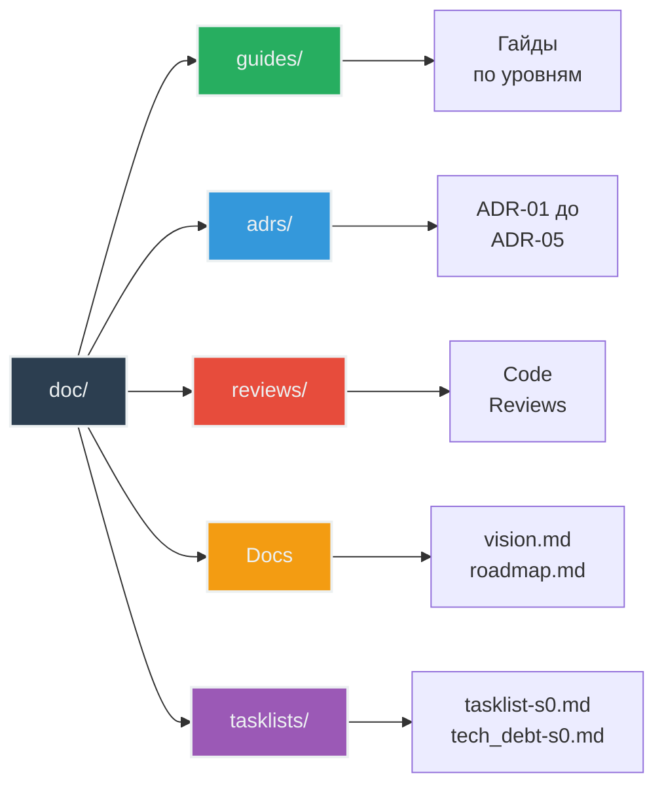

# 🗺️ Repository Tour

**Цель**: Понять где что находится в проекте  
**Для кого**: После успешного запуска бота  
**Время**: 10-15 минут

---

## 📁 Структура репозитория

```
systech-aidd-live/
├── src/              # 📦 Исходный код приложения
├── tests/            # 🧪 Тесты (unit + integration)
├── prompts/          # 💬 Системные промпты для LLM
├── doc/              # 📚 Документация
├── logs/             # 📝 Логи приложения (создается автоматически)
├── .venv/            # 🐍 Виртуальное окружение (создается через uv)
├── pyproject.toml    # 📋 Конфигурация проекта и зависимости
├── uv.lock           # 🔒 Lock-файл зависимостей
├── Makefile          # 🛠️ Команды автоматизации
├── .env              # ⚙️ Конфигурация (не в git)
├── .env.example      # 📄 Пример конфигурации
└── README.md         # 📖 Основная документация
```

---

## 📦 src/ - Исходный код (10 модулей)

### Точка входа
- **`main.py`** - инициализация бота, запуск polling
  - Создает Bot, Dispatcher
  - Настраивает logging
  - Связывает компоненты

### Конфигурация и исключения
- **`config.py`** - Config dataclass, загрузка из .env
- **`exceptions.py`** - ConfigError, LLMError

### Основная логика
- **`message_handler.py`** - координатор обработки сообщений
- **`command_handler.py`** - команды (/start, /help, /reset, /role)
- **`llm_client.py`** - интеграция с LLM API
- **`context_manager.py`** - in-memory хранение истории

### Модели данных и интерфейсы
- **`message.py`** - класс Message (role, content)
- **`protocols.py`** - Protocol интерфейсы для DI

**Принцип**: Один класс = один файл

---

## 🧪 tests/ - Тесты (9 файлов, 30 тестов, 100% coverage)

```
tests/
├── conftest.py              # Фикстуры pytest
├── test_message.py          # 4 теста - класс Message
├── test_config.py           # 5 тестов - Config + валидация
├── test_exceptions.py       # (в conftest.py)
├── test_command_handler.py  # 6 тестов - команды бота
├── test_message_handler.py  # 7 тестов - координация
├── test_llm_client.py       # 4 теста - LLM интеграция
├── test_context_manager.py  # 3 теста - управление контекстом
└── test_integration.py      # 1 тест - полный flow
```

**Структура**:
- `conftest.py` - переиспользуемые фикстуры
- `test_*.py` - тесты для каждого модуля
- Маркер `@pytest.mark.integration` для integration тестов

---

## 💬 prompts/ - Системные промпты

```
prompts/
└── system_prompt.txt  # Промпт роли AICodingExpert
```

**Назначение**: Определяет личность и поведение бота.

**Загрузка**: Config читает файл при старте (fallback на SYSTEM_PROMPT из .env).

---

## 📚 doc/ - Документация



### Структура документации

**guides/** - Гайды для разработчиков (этот документ здесь)

**adrs/** - Architecture Decision Records
- `ADR-01.md` - OpenAI Compatible API
- `ADR-02.md` - Выбор провайдера (OpenRouter)
- `ADR-03.md` - Инструменты качества кода
- `ADR-04.md` - Type hints и валидация
- `ADR-05.md` - Архитектурный рефакторинг

**reviews/** - Код-ревью от Senior Tech Lead

**Другие документы**:
- `vision.md` - техническое видение (660 строк)
- `roadmap.md` - роадмап проекта со спринтами
- `tasklists/` - история разработки по спринтам
  - `tasklist-s0.md` - план разработки MVP (спринт S0)
  - `tasklist_tech_debt-s0.md` - устранение технического долга (спринт S0)

---

## 🛠️ Файлы конфигурации

### pyproject.toml
```toml
[project]
name = "systech-aidd-live"
dependencies = ["aiogram>=3.0", "openai", "python-dotenv"]

[project.optional-dependencies]
dev = ["pytest", "ruff", "mypy", "pytest-cov", "pytest-mock"]

[tool.ruff]     # Настройки линтера
[tool.mypy]     # Настройки type checker
[tool.pytest]   # Настройки тестов
```

**Зачем**: Единый файл для всех зависимостей и настроек инструментов.

### uv.lock
Lock-файл для воспроизводимости окружения. **Не редактировать вручную**.

### Makefile
```makefile
install     # Установка зависимостей
run         # Запуск бота
test        # Unit тесты
test-cov    # Тесты + coverage
format      # Форматирование кода
lint        # Проверка кода
check-all   # Полная проверка
clean       # Очистка временных файлов
```

### .env / .env.example
```bash
# .env - локальная конфигурация (не в git)
BOT_TOKEN=...
LLM_API_KEY=...

# .env.example - пример для новых разработчиков (в git)
BOT_TOKEN=your_bot_token_here
```

---

## 📝 logs/ - Логи приложения

```
logs/
└── app.log  # Создается автоматически при запуске
```

**Формат лога**:
```
2025-10-15 10:00:00 | INFO | Bot started
2025-10-15 10:00:05 | INFO | Message from user_id=12345: "Привет"
```

**Ротация**: Нет (файл растет, периодически чистить через `make clean`)

---

## 🔍 Как найти что нужно

### Хочу понять flow обработки сообщений
→ Начните с `src/main.py` → `message_handler.py`

### Хочу добавить новую команду
→ `src/command_handler.py` → метод `handle_command()`

### Хочу изменить поведение LLM
→ `prompts/system_prompt.txt` или `src/llm_client.py`

### Хочу изменить лимит контекста
→ `.env` → `MAX_CONTEXT_MESSAGES=20`

### Хочу понять архитектурные решения
→ `doc/adrs/` → читать ADR по темам

### Хочу узнать как писать тесты
→ `tests/conftest.py` → фикстуры, затем примеры в `test_*.py`

---

## 📊 Статистика проекта

```
Код:
- Python файлов (src):     10 модулей
- Python файлов (tests):   9 модулей
- Строк кода (src):        ~500 LOC
- Строк тестов:            ~700 LOC

Качество:
- Test Coverage:           100%
- Mypy errors:             0 (strict mode)
- Ruff warnings:           0
- Type hints:              100%

Тесты:
- Unit тесты:              29
- Integration тесты:       1
- Время выполнения:        ~2.8s (unit), ~4.5s (all)
```

---

## 🎯 Ключевые файлы для старта

**День 1** (обязательно прочитать):
1. `README.md` - понять что делает проект
2. `src/main.py` - точка входа
3. `src/message_handler.py` - главный координатор
4. `.env.example` - какая нужна конфигурация

**Неделя 1** (изучить по мере необходимости):
5. `doc/vision.md` - техническое видение
6. `doc/adrs/` - почему сделано именно так
7. `tests/conftest.py` - как писать тесты
8. `Makefile` - какие есть команды

---

## 📌 Правила работы с репозиторием

### ✅ Что МОЖНО редактировать:
- `src/*.py` - исходный код
- `tests/*.py` - тесты
- `prompts/*.txt` - промпты
- `doc/` - документация
- `.env` - локальная конфигурация

### ❌ Что НЕ НАДО редактировать вручную:
- `uv.lock` - управляется uv автоматически
- `.venv/` - виртуальное окружение
- `logs/` - создается автоматически
- `.gitignore` - без необходимости

### ⚠️ Что НЕ КОММИТИТЬ в git:
- `.env` - содержит секреты
- `.venv/` - виртуальное окружение
- `logs/` - логи
- `htmlcov/` - отчеты coverage
- `__pycache__/` - байткод Python

---

## 🎓 Следующие шаги

Теперь когда вы знаете где что находится:

1. [Architecture Overview](03-architecture-overview.md) - понять как компоненты взаимодействуют
2. [Data Model](04-data-model.md) - разобраться со структурами данных
3. [Development Workflow](06-development-workflow.md) - начать писать код

---

## 💡 Советы по навигации

**VSCode**:
- `Cmd+P` - быстрый поиск файлов
- `Cmd+Shift+F` - поиск по всем файлам
- `F12` - перейти к определению

**Terminal**:
- `tree -L 2 -I '__pycache__|.venv'` - показать структуру
- `find src -name "*.py"` - найти все Python файлы
- `grep -r "class.*Handler" src/` - найти все Handler классы

