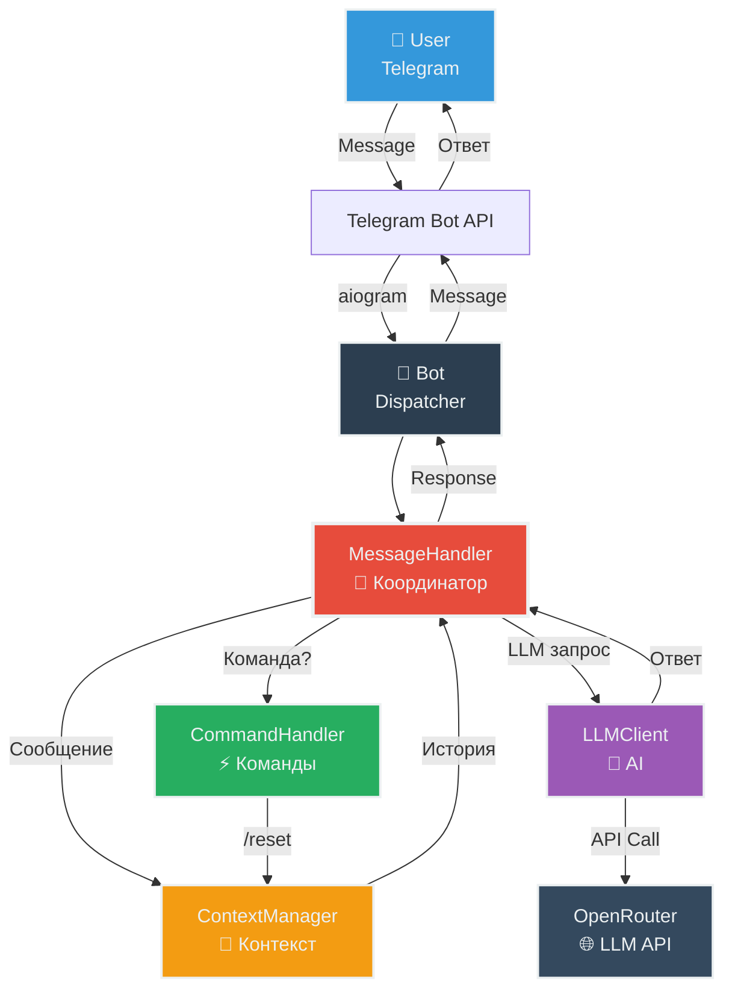
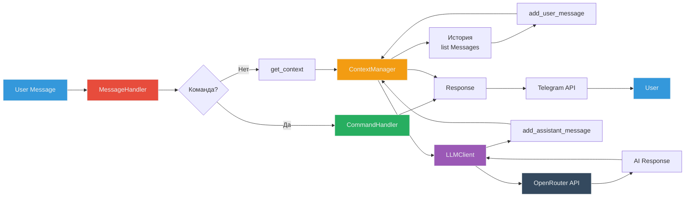
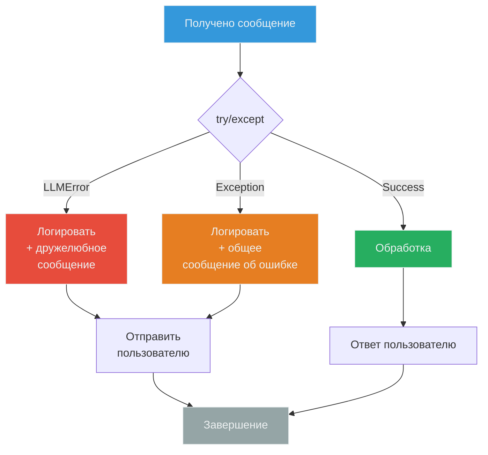
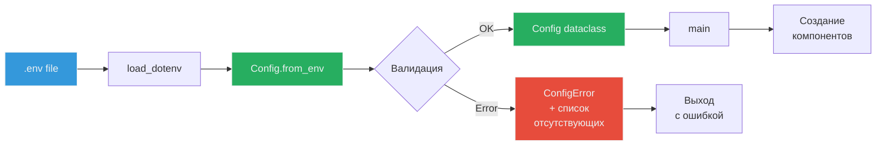

# 🏗️ Architecture Overview

**Цель**: Понять как всё работает вместе  
**Для кого**: Перед началом разработки  
**Время**: 20-30 минут

---

## 🎯 High-Level Architecture



---

## 📦 Компоненты системы

### 🤖 main.py - Entry Point
**Ответственность**: Инициализация и запуск
- Загрузка конфигурации из .env
- Создание всех компонентов
- Настройка logging
- Запуск polling

### 📨 MessageHandler - Координатор
**Ответственность**: Оркестрация обработки
- Делегирует команды в CommandHandler
- Управляет контекстом через ContextManager
- Вызывает LLM через LLMClient
- Обрабатывает ошибки

### ⚡ CommandHandler - Команды
**Ответственность**: Обработка команд бота
- `/start` - приветствие
- `/help` - справка
- `/reset` - очистка контекста
- `/role` - показать промпт

### 💾 ContextManager - Хранение
**Ответственность**: Управление историей
- In-memory хранилище: `dict[(user_id, chat_id), list[Message]]`
- Добавление сообщений
- Автообрезка при превышении лимита
- Очистка контекста

### 🧠 LLMClient - AI Integration
**Ответственность**: Работа с LLM API
- Отправка запросов к OpenRouter
- Конвертация Message → OpenAI format
- Обработка ошибок API

---

## 🔄 Flow обработки сообщения

```mermaid
sequenceDiagram
    participant U as 👤 User
    participant T as Telegram API
    participant B as Bot/Dispatcher
    participant MH as MessageHandler
    participant CH as CommandHandler
    participant CM as ContextManager
    participant LC as LLMClient
    participant LLM as OpenRouter API

    U->>T: Отправить сообщение
    T->>B: Webhook/Polling
    B->>MH: handle_message(message, user_id, chat_id)
    
    alt Команда (starts with /)
        MH->>CH: handle_command(text, user_id, chat_id)
        alt /reset
            CH->>CM: clear_context(user_id, chat_id)
            CM-->>CH: ✓
        end
        CH-->>MH: Response text
    else Обычное сообщение
        MH->>CM: get_context(user_id, chat_id)
        CM-->>MH: list[Message] (история)
        
        MH->>CM: add_message(user_id, chat_id, user_message)
        CM-->>MH: ✓
        
        MH->>LC: get_response(messages)
        LC->>LLM: API Call (chat.completions.create)
        LLM-->>LC: AI Response
        LC-->>MH: response_text
        
        MH->>CM: add_message(user_id, chat_id, assistant_message)
        CM-->>MH: ✓
    end
    
    MH-->>B: response_text
    B->>T: Send message
    T->>U: Показать ответ

    style U fill:#3498DB,stroke:#ECF0F1,color:#ECF0F1
    style MH fill:#E74C3C,stroke:#ECF0F1,color:#ECF0F1
    style CH fill:#27AE60,stroke:#ECF0F1,color:#ECF0F1
    style CM fill:#F39C12,stroke:#ECF0F1,color:#ECF0F1
    style LC fill:#9B59B6,stroke:#ECF0F1,color:#ECF0F1
    style LLM fill:#34495E,stroke:#ECF0F1,color:#ECF0F1
```

---

## 🧩 Принципы дизайна

### SOLID

**S - Single Responsibility Principle**
- `CommandHandler` - только команды
- `ContextManager` - только контекст
- `LLMClient` - только LLM API

**O - Open/Closed** (не применяется жестко в MVP)

**L - Liskov Substitution** (не применяется, нет наследования)

**I - Interface Segregation**
- `LLMClientProtocol` - минимальный интерфейс для LLM
- `ContextManagerProtocol` - минимальный интерфейс для контекста

**D - Dependency Inversion**
- MessageHandler зависит от Protocol, не от конкретных классов
- Легкая подмена в тестах через моки

### KISS (Keep It Simple, Stupid)
- Плоская структура (нет глубокой вложенности)
- Один класс = один файл
- Минимум абстракций
- Никаких DI-контейнеров, фабрик, строителей

### DRY (Don't Repeat Yourself)
- `ContextManager._get_key()` - общий метод для создания ключа
- Фикстуры в `conftest.py` для переиспользования в тестах

---

## 🏛️ Архитектурные паттерны

### Coordinator Pattern
**MessageHandler** координирует взаимодействие компонентов.

**Плюсы**:
- Центральная точка контроля
- Легко отследить flow
- Простота понимания

### Strategy Pattern (через Protocols)
**Protocols** позволяют подменять реализации.

**Применение**:
- Тесты используют mock вместо реального LLMClient
- Можно подменить ContextManager на Redis-based

### In-Memory State
**ContextManager** хранит всё в памяти.

**Плюсы**: Простота, скорость  
**Минусы**: Потеря данных при рестарте

---

## 📊 Data Flow



---

## 🔐 Обработка ошибок



**Стратегия**:
1. Все ошибки LLM API → `LLMError`
2. Все ошибки конфигурации → `ConfigError`
3. MessageHandler ловит все исключения
4. Пользователь всегда получает ответ (дружелюбное сообщение)
5. Все ошибки логируются с полным stack trace

---

## 📝 Логирование

**Что логируется**:

```python
# Lifecycle
"Bot started"
"Bot stopped"

# Сообщения
"Message from user_id=12345 chat_id=67890: 'Привет'"
"Command /start from user_id=12345"

# LLM
"LLM request: model=claude-3.5-sonnet, context_size=5"
"LLM response: duration=1.2s, status=success"

# Контекст
"Context created for user_id=12345 chat_id=67890"
"Context trimmed: 25 → 20 messages"

# Ошибки
"LLM API error: Connection timeout"
```

**Формат**: `YYYY-MM-DD HH:MM:SS | LEVEL | message`

**Выход**: `logs/app.log` + консоль

---

## ⚙️ Конфигурация



**Обязательные параметры**:
- `BOT_TOKEN`
- `LLM_API_KEY`
- `LLM_BASE_URL`
- `LLM_MODEL`

**Опциональные**:
- `SYSTEM_PROMPT_FILE` (default: `prompts/system_prompt.txt`)
- `MAX_CONTEXT_MESSAGES` (default: 20)

---

## 🧪 Тестируемость

**Dependency Injection через Protocols**:

```python
# В продакшене
llm_client = LLMClient(...)
context_manager = ContextManager(...)
message_handler = MessageHandler(llm_client, context_manager, ...)

# В тестах
mock_llm = AsyncMock(spec=LLMClientProtocol)
mock_llm.get_response.return_value = "Mocked response"
message_handler = MessageHandler(mock_llm, ...)
```

**Изоляция тестов**:
- LLM API не вызывается в unit тестах (моки)
- Integration тесты помечены маркером `@pytest.mark.integration`
- Фикстуры в `conftest.py` для переиспользования

---

## 🚀 Масштабируемость

### Текущие ограничения MVP:
- ❌ In-memory контекст (потеря при рестарте)
- ❌ Один процесс (нет горизонтального масштабирования)
- ❌ Polling (вместо webhook)
- ❌ Нет персистентного хранилища

### Пути масштабирования:
1. **Контекст** → Redis/PostgreSQL
2. **Polling** → Webhook + Load Balancer
3. **Горизонтальное масштабирование** → Несколько инстансов + общая БД
4. **Мониторинг** → Prometheus + Grafana
5. **Rate limiting** → Redis-based limiter

---

## 📚 Дополнительная информация

**ADR (Architecture Decision Records)**:
- [ADR-01](../adrs/ADR-01.md) - OpenAI Compatible API
- [ADR-02](../adrs/ADR-02.md) - Выбор OpenRouter
- [ADR-05](../adrs/ADR-05.md) - Архитектурный рефакторинг

**Следующие шаги**:
- [Data Model](04-data-model.md) - разобраться со структурами данных
- [Development Workflow](06-development-workflow.md) - начать разработку
- [Testing Strategy](07-testing-strategy.md) - как писать тесты

---

## 💡 Ключевые takeaways

1. **MessageHandler** - центральный координатор
2. **Protocols** обеспечивают DI и тестируемость
3. **Один класс = один файл** - легко найти код
4. **KISS** - нет избыточных абстракций
5. **Все ошибки логируются** - легко дебажить
6. **100% type hints** - безопасность типов
7. **In-memory state** - простота, но потеря данных при рестарте

