# GUIDE-03: Визуальный обзор проекта

**Цель**: Понять проект с разных точек зрения через визуальные диаграммы.

Этот гайд структурирован по этапам жизненного цикла разработки ПО (SDLC).

---

## 📋 Содержание по этапам SDLC

1. [Планирование](#1-планирование-planning)
2. [Анализ требований](#2-анализ-требований-requirements)
3. [Проектирование](#3-проектирование-design)
4. [Разработка](#4-разработка-development)
5. [Тестирование](#5-тестирование-testing)
6. [Эксплуатация](#6-эксплуатация-operations)

---

## 1. Планирование (Planning)

### 1.1 История разработки (Timeline)

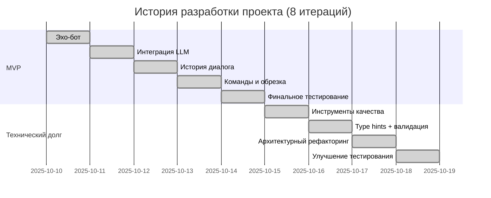
```mermaid
gantt
    title История разработки проекта (8 итераций)
    dateFormat YYYY-MM-DD
    section MVP
    Эхо-бот                    :done, m0, 2025-10-10, 1d
    Интеграция LLM             :done, m1, after m0, 1d
    История диалога            :done, m2, after m1, 1d
    Команды и обрезка          :done, m3, after m2, 1d
    Финальное тестирование     :done, m4, after m3, 1d
    section Технический долг
    Инструменты качества       :done, td0, after m4, 1d
    Type hints + валидация     :done, td1, after td0, 1d
    Архитектурный рефакторинг  :done, td2, after td1, 1d
    Улучшение тестирования     :done, td3, after td2, 1d
```

### 1.2 Распределение работы по итерациям

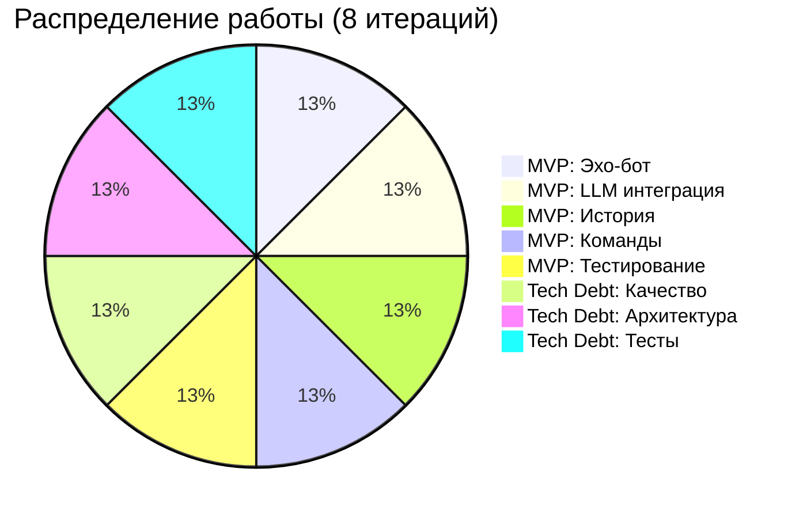
```mermaid
pie title Распределение работы (8 итераций)
    "MVP: Эхо-бот" : 1
    "MVP: LLM интеграция" : 1
    "MVP: История" : 1
    "MVP: Команды" : 1
    "MVP: Тестирование" : 1
    "Tech Debt: Качество" : 1
    "Tech Debt: Архитектура" : 1
    "Tech Debt: Тесты" : 1
```

---

## 2. Анализ требований (Requirements)

### 2.1 Use Cases (Сценарии использования)

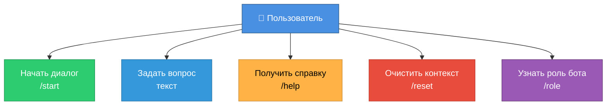
```mermaid
graph TB
    User[👤 Пользователь]
    
    UC1[Начать диалог<br/>/start]
    UC2[Задать вопрос<br/>текст]
    UC3[Получить справку<br/>/help]
    UC4[Очистить контекст<br/>/reset]
    UC5[Узнать роль бота<br/>/role]
    
    User --> UC1
    User --> UC2
    User --> UC3
    User --> UC4
    User --> UC5
    
    style User fill:#4A90E2,stroke:#2E5C8A,color:#FFF
    style UC1 fill:#2ECC71,stroke:#229954,color:#FFF
    style UC2 fill:#3498DB,stroke:#2574A9,color:#FFF
    style UC3 fill:#FFB347,stroke:#CC8F39,color:#000
    style UC4 fill:#E74C3C,stroke:#C0392B,color:#FFF
    style UC5 fill:#9B59B6,stroke:#6C3D7C,color:#FFF
```

### 2.2 User Journey (Типичная сессия)

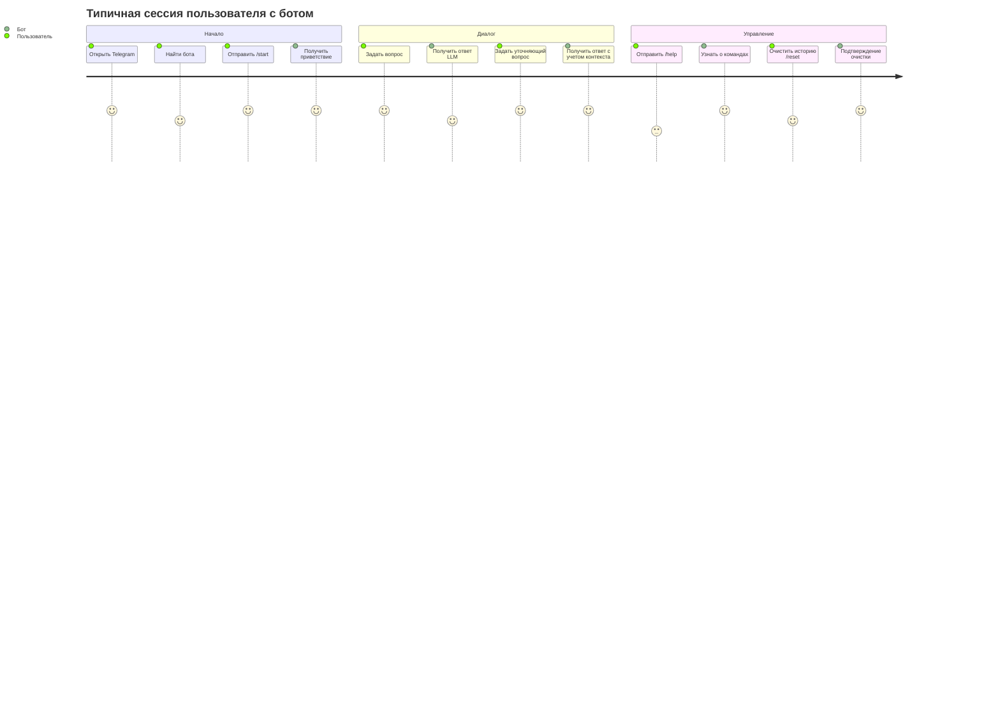
```mermaid
journey
    title Типичная сессия пользователя с ботом
    section Начало
      Открыть Telegram: 5: Пользователь
      Найти бота: 4: Пользователь
      Отправить /start: 5: Пользователь
      Получить приветствие: 5: Бот
    section Диалог
      Задать вопрос: 5: Пользователь
      Получить ответ LLM: 4: Бот
      Задать уточняющий вопрос: 5: Пользователь
      Получить ответ с учетом контекста: 5: Бот
    section Управление
      Отправить /help: 3: Пользователь
      Узнать о командах: 5: Бот
      Очистить историю /reset: 4: Пользователь
      Подтверждение очистки: 5: Бот
```

### 2.3 Функциональные требования

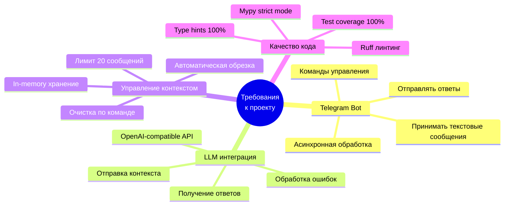
```mermaid
mindmap
  root((Требования<br/>к проекту))
    Telegram Bot
      Принимать текстовые сообщения
      Отправлять ответы
      Команды управления
      Асинхронная обработка
    LLM интеграция
      OpenAI-compatible API
      Отправка контекста
      Получение ответов
      Обработка ошибок
    Управление контекстом
      In-memory хранение
      Лимит 20 сообщений
      Автоматическая обрезка
      Очистка по команде
    Качество кода
      Type hints 100%
      Test coverage 100%
      Mypy strict mode
      Ruff линтинг
```

---

## 3. Проектирование (Design)

### 3.1 Архитектура системы (C4 Context)

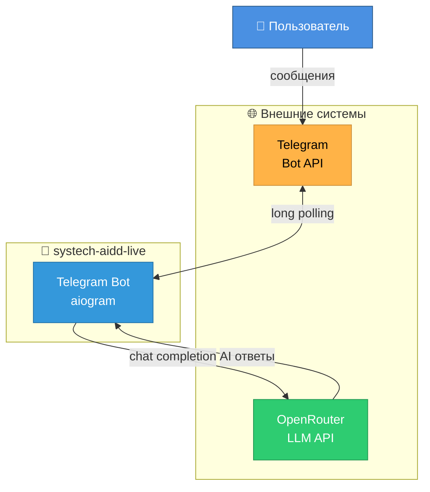
```mermaid
graph TB
    subgraph External["🌐 Внешние системы"]
        TG[Telegram<br/>Bot API]
        LLM[OpenRouter<br/>LLM API]
    end
    
    subgraph System["🤖 systech-aidd-live"]
        Bot[Telegram Bot<br/>aiogram]
    end
    
    User[👤 Пользователь] -->|сообщения| TG
    TG <-->|long polling| Bot
    Bot -->|chat completion| LLM
    LLM -->|AI ответы| Bot
    
    style User fill:#4A90E2,stroke:#2E5C8A,color:#FFF
    style TG fill:#FFB347,stroke:#CC8F39,color:#000
    style LLM fill:#2ECC71,stroke:#229954,color:#FFF
    style Bot fill:#3498DB,stroke:#2574A9,color:#FFF
```

### 3.2 Компонентная архитектура (Containers)

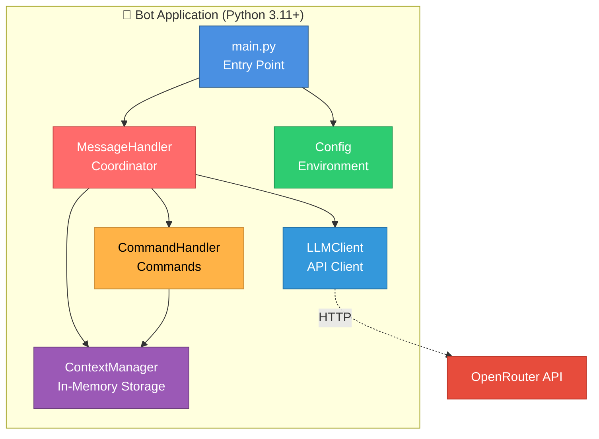
```mermaid
graph TB
    subgraph App["🤖 Bot Application (Python 3.11+)"]
        Main[main.py<br/>Entry Point]
        MH[MessageHandler<br/>Coordinator]
        CH[CommandHandler<br/>Commands]
        CM[ContextManager<br/>In-Memory Storage]
        LLC[LLMClient<br/>API Client]
        CFG[Config<br/>Environment]
    end
    
    Main --> MH
    Main --> CFG
    MH --> CH
    MH --> CM
    MH --> LLC
    CH --> CM
    
    LLC -.->|HTTP| API[OpenRouter API]
    
    style Main fill:#4A90E2,stroke:#2E5C8A,color:#FFF
    style MH fill:#FF6B6B,stroke:#C44545,color:#FFF
    style CH fill:#FFB347,stroke:#CC8F39,color:#000
    style CM fill:#9B59B6,stroke:#6C3D7C,color:#FFF
    style LLC fill:#3498DB,stroke:#2574A9,color:#FFF
    style CFG fill:#2ECC71,stroke:#229954,color:#FFF
    style API fill:#E74C3C,stroke:#C0392B,color:#FFF
```

### 3.3 Классовая диаграмма (Class Diagram)

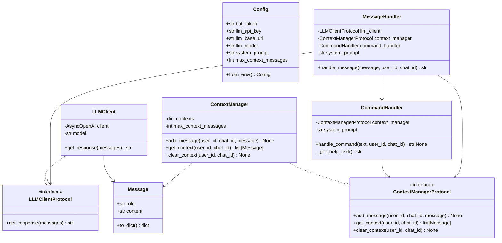
```mermaid
classDiagram
    class Message {
        +str role
        +str content
        +to_dict() dict
    }
    
    class Config {
        +str bot_token
        +str llm_api_key
        +str llm_base_url
        +str llm_model
        +str system_prompt
        +int max_context_messages
        +from_env() Config
    }
    
    class MessageHandler {
        -LLMClientProtocol llm_client
        -ContextManagerProtocol context_manager
        -CommandHandler command_handler
        -str system_prompt
        +handle_message(message, user_id, chat_id) str
    }
    
    class CommandHandler {
        -ContextManagerProtocol context_manager
        -str system_prompt
        +handle_command(text, user_id, chat_id) str|None
        -_get_help_text() str
    }
    
    class ContextManager {
        -dict contexts
        -int max_context_messages
        +add_message(user_id, chat_id, message) None
        +get_context(user_id, chat_id) list[Message]
        +clear_context(user_id, chat_id) None
    }
    
    class LLMClient {
        -AsyncOpenAI client
        -str model
        +get_response(messages) str
    }
    
    class LLMClientProtocol {
        <<interface>>
        +get_response(messages) str
    }
    
    class ContextManagerProtocol {
        <<interface>>
        +add_message(user_id, chat_id, message) None
        +get_context(user_id, chat_id) list[Message]
        +clear_context(user_id, chat_id) None
    }
    
    MessageHandler --> LLMClientProtocol
    MessageHandler --> ContextManagerProtocol
    MessageHandler --> CommandHandler
    CommandHandler --> ContextManagerProtocol
    LLMClient ..|> LLMClientProtocol
    ContextManager ..|> ContextManagerProtocol
    ContextManager --> Message
    LLMClient --> Message
```

### 3.4 Модель данных (ER Diagram)

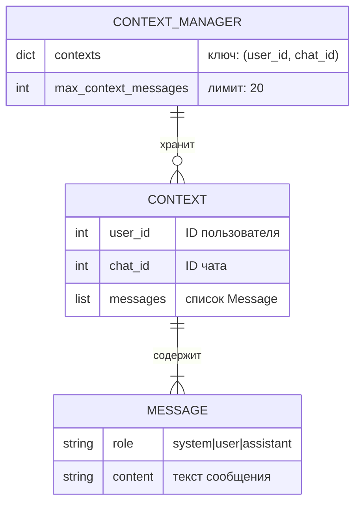
```mermaid
erDiagram
    CONTEXT_MANAGER ||--o{ CONTEXT : "хранит"
    CONTEXT ||--|{ MESSAGE : "содержит"
    
    CONTEXT_MANAGER {
        dict contexts "ключ: (user_id, chat_id)"
        int max_context_messages "лимит: 20"
    }
    
    CONTEXT {
        int user_id "ID пользователя"
        int chat_id "ID чата"
        list messages "список Message"
    }
    
    MESSAGE {
        string role "system|user|assistant"
        string content "текст сообщения"
    }
```

### 3.5 Диаграмма состояний контекста

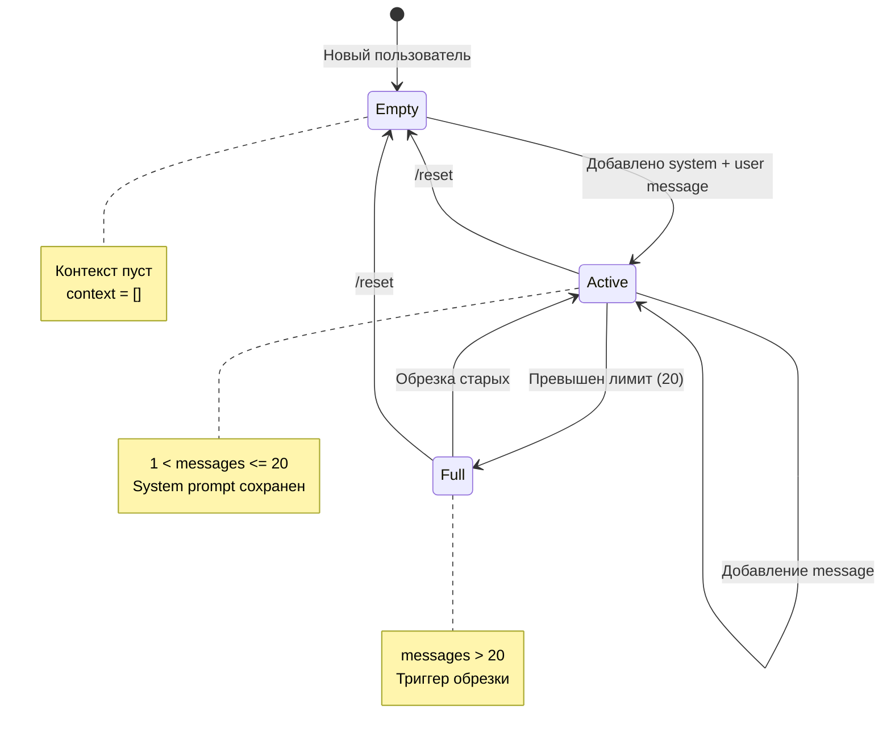
```mermaid
stateDiagram-v2
    [*] --> Empty: Новый пользователь
    
    Empty --> Active: Добавлено system + user message
    Active --> Active: Добавление message
    Active --> Full: Превышен лимит (20)
    Full --> Active: Обрезка старых
    Active --> Empty: /reset
    Full --> Empty: /reset
    
    note right of Empty
        Контекст пуст
        context = []
    end note
    
    note right of Active
        1 < messages <= 20
        System prompt сохранен
    end note
    
    note right of Full
        messages > 20
        Триггер обрезки
    end note
```

---

## 4. Разработка (Development)

### 4.1 Workflow разработки

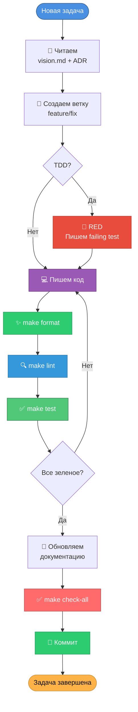
```mermaid
flowchart TD
    Start([Новая задача]) --> Read[📖 Читаем<br/>vision.md + ADR]
    Read --> Branch[🌿 Создаем ветку<br/>feature/fix]
    Branch --> TDD{TDD?}
    TDD -->|Да| Test1[🔴 RED<br/>Пишем failing test]
    TDD -->|Нет| Code
    Test1 --> Code[💻 Пишем код]
    Code --> Format[✨ make format]
    Format --> Lint[🔍 make lint]
    Lint --> Test2[✅ make test]
    Test2 --> Check{Все зеленое?}
    Check -->|Нет| Code
    Check -->|Да| Docs[📝 Обновляем<br/>документацию]
    Docs --> Final[✅ make check-all]
    Final --> Commit[💾 Коммит]
    Commit --> End([Задача завершена])
    
    style Start fill:#4A90E2,stroke:#2E5C8A,color:#FFF
    style Test1 fill:#E74C3C,stroke:#C0392B,color:#FFF
    style Code fill:#9B59B6,stroke:#6C3D7C,color:#FFF
    style Format fill:#2ECC71,stroke:#229954,color:#FFF
    style Lint fill:#3498DB,stroke:#2574A9,color:#FFF
    style Test2 fill:#50C878,stroke:#2E7D4E,color:#FFF
    style Final fill:#FF6B6B,stroke:#C44545,color:#FFF
    style Commit fill:#2ECC71,stroke:#229954,color:#FFF
    style End fill:#FFB347,stroke:#CC8F39,color:#000
```

### 4.2 Git Flow (упрощенный)

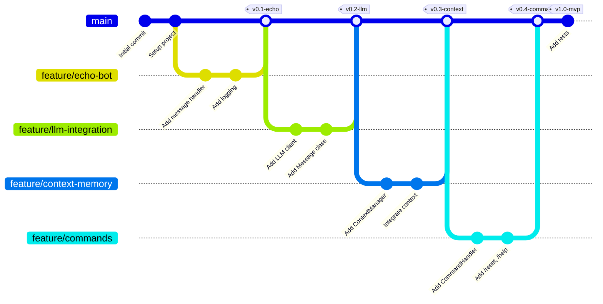
```mermaid
gitGraph
    commit id: "Initial commit"
    commit id: "Setup project"
    branch feature/echo-bot
    checkout feature/echo-bot
    commit id: "Add message handler"
    commit id: "Add logging"
    checkout main
    merge feature/echo-bot tag: "v0.1-echo"
    
    branch feature/llm-integration
    checkout feature/llm-integration
    commit id: "Add LLM client"
    commit id: "Add Message class"
    checkout main
    merge feature/llm-integration tag: "v0.2-llm"
    
    branch feature/context-memory
    checkout feature/context-memory
    commit id: "Add ContextManager"
    commit id: "Integrate context"
    checkout main
    merge feature/context-memory tag: "v0.3-context"
    
    branch feature/commands
    checkout feature/commands
    commit id: "Add CommandHandler"
    commit id: "Add /reset, /help"
    checkout main
    merge feature/commands tag: "v0.4-commands"
    
    commit id: "Add tests" tag: "v1.0-mvp"
```

### 4.3 Структура проекта (Tree)

```mermaid
graph TD
    Root[systech-aidd-live/]
    
    Root --> Src[src/]
    Root --> Tests[tests/]
    Root --> Doc[doc/]
    Root --> Prompts[prompts/]
    Root --> Logs[logs/]
    Root --> Config[Конфигурация]
    
    Src --> Main[main.py]
    Src --> Cfg[config.py]
    Src --> MH[message_handler.py]
    Src --> CH[command_handler.py]
    Src --> CM[context_manager.py]
    Src --> LLC[llm_client.py]
    Src --> Msg[message.py]
    Src --> Proto[protocols.py]
    Src --> Exc[exceptions.py]
    
    Tests --> TConf[conftest.py]
    Tests --> TMsg[test_message.py]
    Tests --> TCfg[test_config.py]
    Tests --> TCH[test_command_handler.py]
    Tests --> TMH[test_message_handler.py]
    Tests --> TLLC[test_llm_client.py]
    Tests --> TCM[test_context_manager.py]
    Tests --> TInt[test_integration.py]
    
    Doc --> Guides[guides/]
    Doc --> Adrs[adrs/]
    Doc --> Vision[vision.md]
    Doc --> Task[tasklist.md]
    
    Prompts --> Prompt[system_prompt.txt]
    Logs --> Log[app.log]
    
    Config --> Pyproject[pyproject.toml]
    Config --> Makefile[Makefile]
    Config --> Env[.env]
    Config --> Lock[uv.lock]
    
    style Root fill:#4A90E2,stroke:#2E5C8A,color:#FFF
    style Src fill:#FFB347,stroke:#CC8F39,color:#000
    style Tests fill:#2ECC71,stroke:#229954,color:#FFF
    style Doc fill:#9B59B6,stroke:#6C3D7C,color:#FFF
    style Prompts fill:#3498DB,stroke:#2574A9,color:#FFF
    style Logs fill:#E74C3C,stroke:#C0392B,color:#FFF
    style Config fill:#50C878,stroke:#2E7D4E,color:#FFF
```

### 4.4 Зависимости проекта

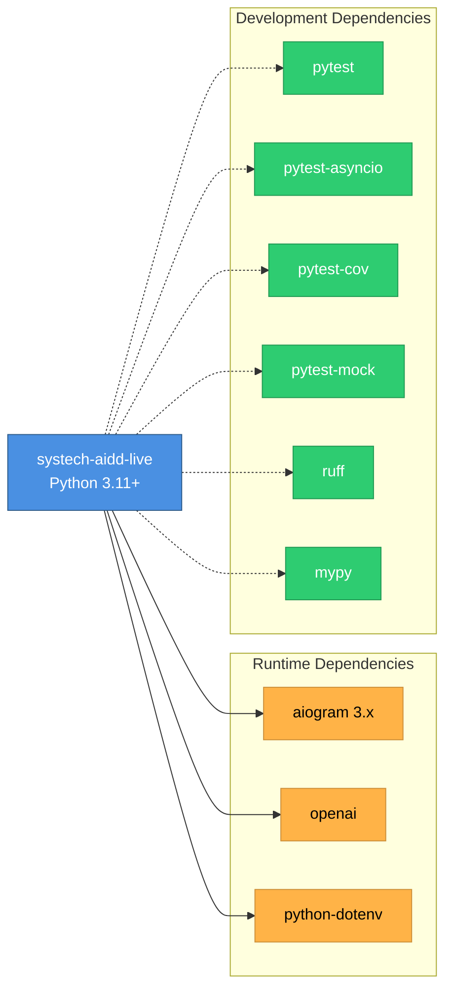
```mermaid
graph LR
    subgraph Runtime["Runtime Dependencies"]
        R1[aiogram 3.x]
        R2[openai]
        R3[python-dotenv]
    end
    
    subgraph Dev["Development Dependencies"]
        D1[pytest]
        D2[pytest-asyncio]
        D3[pytest-cov]
        D4[pytest-mock]
        D5[ruff]
        D6[mypy]
    end
    
    App[systech-aidd-live<br/>Python 3.11+]
    
    App --> R1
    App --> R2
    App --> R3
    App -.-> D1
    App -.-> D2
    App -.-> D3
    App -.-> D4
    App -.-> D5
    App -.-> D6
    
    style App fill:#4A90E2,stroke:#2E5C8A,color:#FFF
    style R1 fill:#FFB347,stroke:#CC8F39,color:#000
    style R2 fill:#FFB347,stroke:#CC8F39,color:#000
    style R3 fill:#FFB347,stroke:#CC8F39,color:#000
    style D1 fill:#2ECC71,stroke:#229954,color:#FFF
    style D2 fill:#2ECC71,stroke:#229954,color:#FFF
    style D3 fill:#2ECC71,stroke:#229954,color:#FFF
    style D4 fill:#2ECC71,stroke:#229954,color:#FFF
    style D5 fill:#2ECC71,stroke:#229954,color:#FFF
    style D6 fill:#2ECC71,stroke:#229954,color:#FFF
```

---

## 5. Тестирование (Testing)

### 5.1 Пирамида тестирования

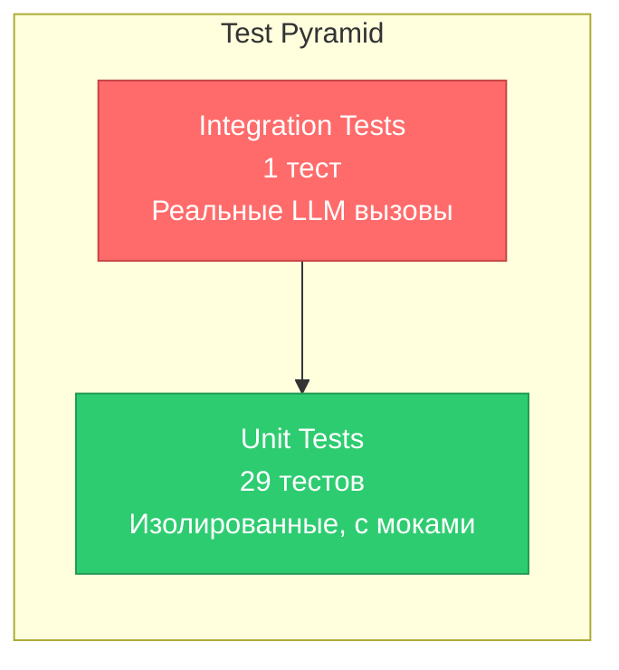
```mermaid
graph TD
    subgraph Pyramid["Test Pyramid"]
        direction TB
        Int[Integration Tests<br/>1 тест<br/>Реальные LLM вызовы]
        Unit[Unit Tests<br/>29 тестов<br/>Изолированные, с моками]
    end
    
    Int --> Unit
    
    style Int fill:#FF6B6B,stroke:#C44545,color:#FFF
    style Unit fill:#2ECC71,stroke:#229954,color:#FFF
```

### 5.2 Распределение тестов по модулям

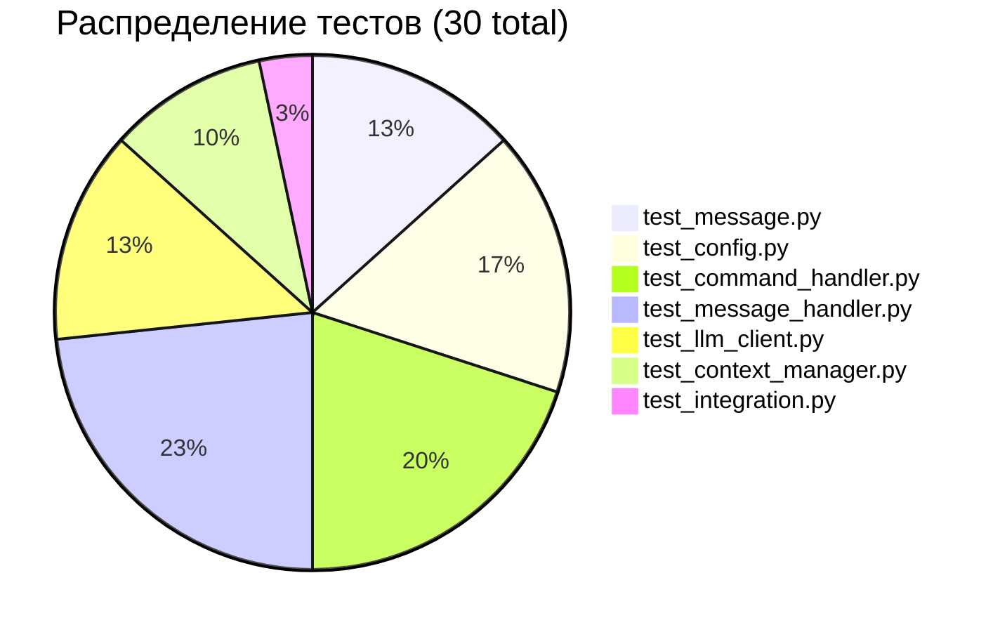
```mermaid
pie title Распределение тестов (30 total)
    "test_message.py" : 4
    "test_config.py" : 5
    "test_command_handler.py" : 6
    "test_message_handler.py" : 7
    "test_llm_client.py" : 4
    "test_context_manager.py" : 3
    "test_integration.py" : 1
```

### 5.3 TDD Workflow (Red-Green-Refactor)

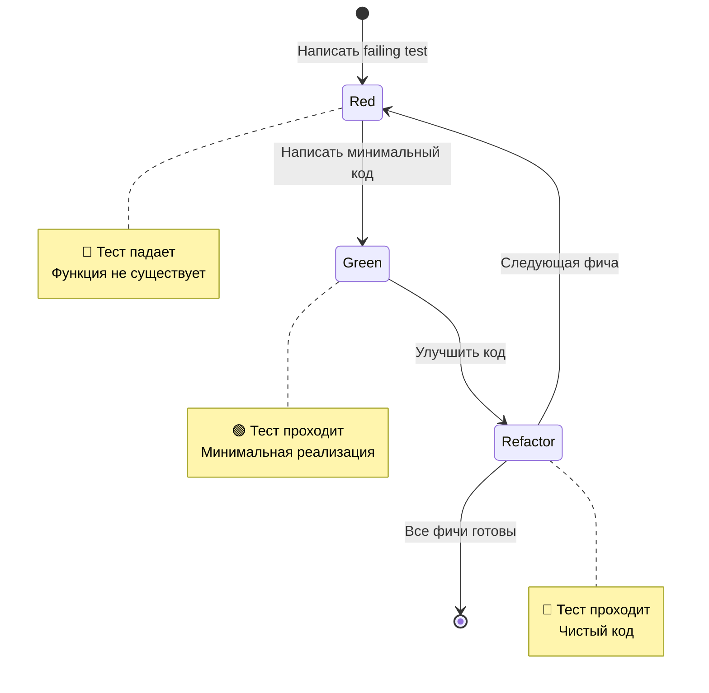
```mermaid
stateDiagram-v2
    [*] --> Red: Написать failing test
    Red --> Green: Написать минимальный код
    Green --> Refactor: Улучшить код
    Refactor --> Red: Следующая фича
    Refactor --> [*]: Все фичи готовы
    
    note right of Red
        🔴 Тест падает
        Функция не существует
    end note
    
    note right of Green
        🟢 Тест проходит
        Минимальная реализация
    end note
    
    note right of Refactor
        🔵 Тест проходит
        Чистый код
    end note
```

### 5.4 Coverage по модулям

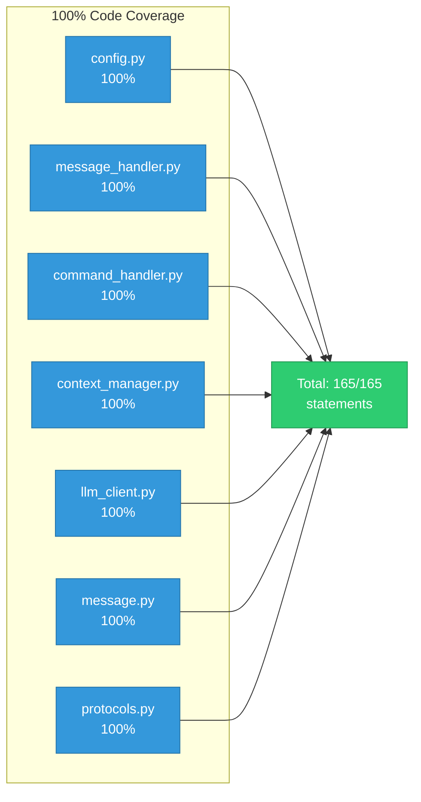
```mermaid
graph LR
    subgraph Coverage["100% Code Coverage"]
        M1[config.py<br/>100%]
        M2[message_handler.py<br/>100%]
        M3[command_handler.py<br/>100%]
        M4[context_manager.py<br/>100%]
        M5[llm_client.py<br/>100%]
        M6[message.py<br/>100%]
        M7[protocols.py<br/>100%]
    end
    
    Total[Total: 165/165<br/>statements]
    
    M1 --> Total
    M2 --> Total
    M3 --> Total
    M4 --> Total
    M5 --> Total
    M6 --> Total
    M7 --> Total
    
    style Total fill:#2ECC71,stroke:#229954,color:#FFF
    style M1 fill:#3498DB,stroke:#2574A9,color:#FFF
    style M2 fill:#3498DB,stroke:#2574A9,color:#FFF
    style M3 fill:#3498DB,stroke:#2574A9,color:#FFF
    style M4 fill:#3498DB,stroke:#2574A9,color:#FFF
    style M5 fill:#3498DB,stroke:#2574A9,color:#FFF
    style M6 fill:#3498DB,stroke:#2574A9,color:#FFF
    style M7 fill:#3498DB,stroke:#2574A9,color:#FFF
```

### 5.5 Стратегия тестирования

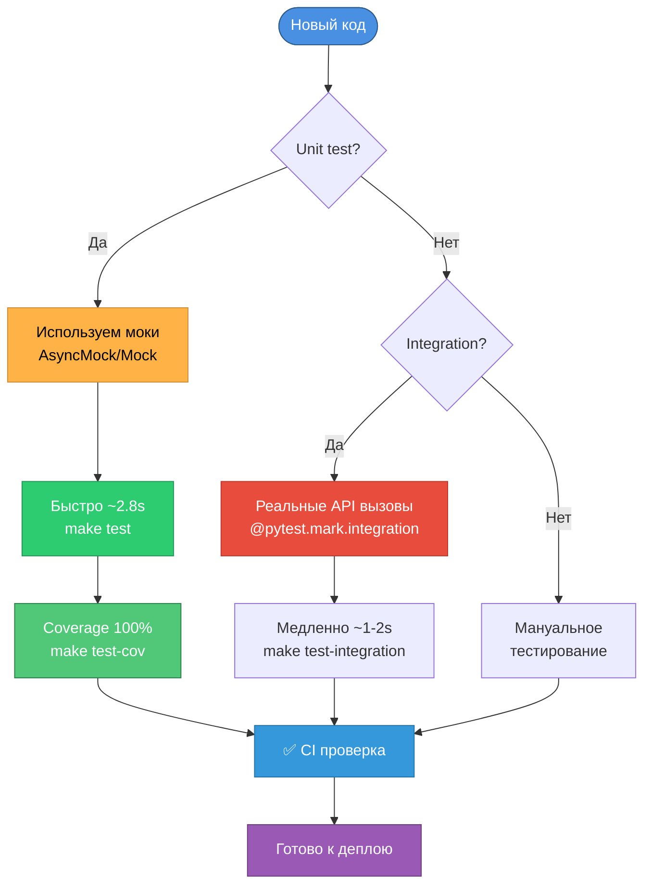
```mermaid
flowchart TD
    Start([Новый код]) --> Unit{Unit test?}
    Unit -->|Да| Mock[Используем моки<br/>AsyncMock/Mock]
    Unit -->|Нет| Int{Integration?}
    
    Mock --> Fast[Быстро ~2.8s<br/>make test]
    Int -->|Да| Real[Реальные API вызовы<br/>@pytest.mark.integration]
    Int -->|Нет| Manual[Мануальное<br/>тестирование]
    
    Fast --> Cov[Coverage 100%<br/>make test-cov]
    Real --> Slow[Медленно ~1-2s<br/>make test-integration]
    
    Cov --> CI[✅ CI проверка]
    Slow --> CI
    Manual --> CI
    
    CI --> Deploy[Готово к деплою]
    
    style Start fill:#4A90E2,stroke:#2E5C8A,color:#FFF
    style Mock fill:#FFB347,stroke:#CC8F39,color:#000
    style Fast fill:#2ECC71,stroke:#229954,color:#FFF
    style Real fill:#E74C3C,stroke:#C0392B,color:#FFF
    style Cov fill:#50C878,stroke:#2E7D4E,color:#FFF
    style CI fill:#3498DB,stroke:#2574A9,color:#FFF
    style Deploy fill:#9B59B6,stroke:#6C3D7C,color:#FFF
```

---

## 6. Эксплуатация (Operations)

### 6.1 Runtime Flow (Запуск → Обработка → Остановка)

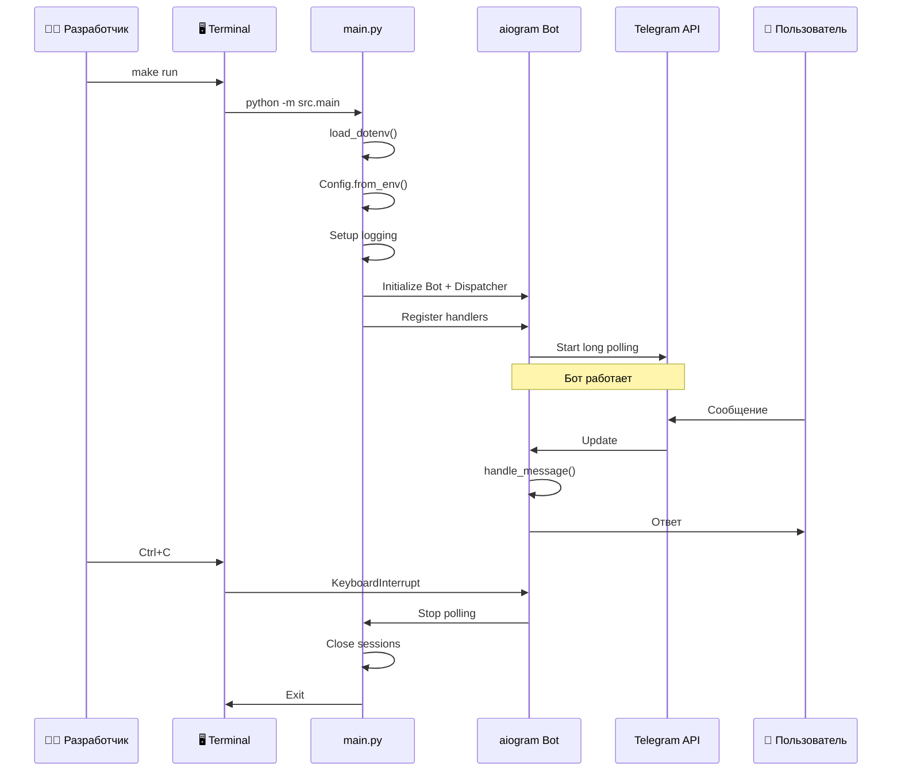
```mermaid
sequenceDiagram
    participant Dev as 👨‍💻 Разработчик
    participant Shell as 🖥️ Terminal
    participant Main as main.py
    participant Bot as aiogram Bot
    participant TG as Telegram API
    participant User as 👤 Пользователь
    
    Dev->>Shell: make run
    Shell->>Main: python -m src.main
    Main->>Main: load_dotenv()
    Main->>Main: Config.from_env()
    Main->>Main: Setup logging
    Main->>Bot: Initialize Bot + Dispatcher
    Main->>Bot: Register handlers
    Bot->>TG: Start long polling
    
    Note over Bot,TG: Бот работает
    
    User->>TG: Сообщение
    TG->>Bot: Update
    Bot->>Bot: handle_message()
    Bot->>User: Ответ
    
    Dev->>Shell: Ctrl+C
    Shell->>Bot: KeyboardInterrupt
    Bot->>Main: Stop polling
    Main->>Main: Close sessions
    Main->>Shell: Exit
```

### 6.2 Логирование (что и куда)

```mermaid
graph TD
    subgraph Events["События для логирования"]
        E1[Bot started/stopped]
        E2[Входящие сообщения]
        E3[Команды]
        E4[LLM запросы]
        E5[Контекст операции]
        E6[Ошибки]
    end
    
    subgraph Logger["logging module"]
        INFO[INFO level]
        ERROR[ERROR level]
    end
    
    subgraph Output["Вывод"]
        File[logs/app.log<br/>файл]
        Console[stdout<br/>консоль]
    end
    
    E1 --> INFO
    E2 --> INFO
    E3 --> INFO
    E4 --> INFO
    E5 --> INFO
    E6 --> ERROR
    
    INFO --> File
    INFO --> Console
    ERROR --> File
    ERROR --> Console
    
    style E1 fill:#4A90E2,stroke:#2E5C8A,color:#FFF
    style E2 fill:#3498DB,stroke:#2574A9,color:#FFF
    style E3 fill:#FFB347,stroke:#CC8F39,color:#000
    style E4 fill:#9B59B6,stroke:#6C3D7C,color:#FFF
    style E5 fill:#2ECC71,stroke:#229954,color:#FFF
    style E6 fill:#E74C3C,stroke:#C0392B,color:#FFF
    style INFO fill:#50C878,stroke:#2E7D4E,color:#FFF
    style ERROR fill:#FF6B6B,stroke:#C44545,color:#FFF
    style File fill:#FFB347,stroke:#CC8F39,color:#000
    style Console fill:#3498DB,stroke:#2574A9,color:#FFF
```

### 6.3 Обработка ошибок (Error Flow)

```mermaid
flowchart TD
    Start([Ошибка возникла]) --> Type{Тип ошибки?}
    
    Type -->|ConfigError| Config[Отсутствует .env]
    Type -->|LLMError| LLM[API недоступен]
    Type -->|Exception| Other[Неожиданная ошибка]
    
    Config --> Fatal[❌ Бот не запустится]
    LLM --> Catch[✅ Перехват в MessageHandler]
    Other --> Catch
    
    Catch --> Log[Логирование ERROR]
    Log --> User[Дружелюбное сообщение<br/>пользователю]
    
    Fatal --> Exit[Exit with error]
    User --> Continue[Бот продолжает работу]
    
    style Start fill:#E74C3C,stroke:#C0392B,color:#FFF
    style Config fill:#FF6B6B,stroke:#C44545,color:#FFF
    style LLM fill:#FFB347,stroke:#CC8F39,color:#000
    style Other fill:#9B59B6,stroke:#6C3D7C,color:#FFF
    style Fatal fill:#E74C3C,stroke:#C0392B,color:#FFF
    style Catch fill:#2ECC71,stroke:#229954,color:#FFF
    style Log fill:#3498DB,stroke:#2574A9,color:#FFF
    style User fill:#50C878,stroke:#2E7D4E,color:#FFF
    style Continue fill:#2ECC71,stroke:#229954,color:#FFF
```

### 6.4 Мониторинг (текущее состояние)

```mermaid
graph TB
    subgraph Monitoring["Текущий мониторинг"]
        Logs[📝 Файловые логи<br/>logs/app.log]
        Console[💻 Консольный вывод<br/>stdout]
    end
    
    subgraph Metrics["Что отслеживается"]
        M1[Lifecycle события]
        M2[Сообщения пользователей]
        M3[LLM запросы + длительность]
        M4[Операции с контекстом]
        M5[Ошибки с traceback]
    end
    
    M1 --> Logs
    M2 --> Logs
    M3 --> Logs
    M4 --> Logs
    M5 --> Logs
    
    M1 --> Console
    M2 --> Console
    M3 --> Console
    M4 --> Console
    M5 --> Console
    
    style Logs fill:#FFB347,stroke:#CC8F39,color:#000
    style Console fill:#3498DB,stroke:#2574A9,color:#FFF
    style M1 fill:#4A90E2,stroke:#2E5C8A,color:#FFF
    style M2 fill:#2ECC71,stroke:#229954,color:#FFF
    style M3 fill:#9B59B6,stroke:#6C3D7C,color:#FFF
    style M4 fill:#50C878,stroke:#2E7D4E,color:#FFF
    style M5 fill:#E74C3C,stroke:#C0392B,color:#FFF
```

### 6.5 Deployment (текущий способ)

```mermaid
flowchart LR
    Dev[👨‍💻 Разработчик] --> Local[💻 Локальная машина]
    
    Local --> Install[uv sync --extra dev]
    Install --> Env[Настройка .env]
    Env --> Run[make run]
    
    Run --> Process[🤖 Python процесс]
    Process --> Poll[Long polling<br/>Telegram]
    
    Stop[Ctrl+C] --> Process
    Process --> Exit[Остановка]
    
    Note1[Нет Docker]
    Note2[Нет systemd]
    Note3[Нет CI/CD]
    Note4[Только manual]
    
    style Dev fill:#4A90E2,stroke:#2E5C8A,color:#FFF
    style Local fill:#FFB347,stroke:#CC8F39,color:#000
    style Process fill:#2ECC71,stroke:#229954,color:#FFF
    style Poll fill:#3498DB,stroke:#2574A9,color:#FFF
    style Stop fill:#E74C3C,stroke:#C0392B,color:#FFF
    style Note1 fill:#9B59B6,stroke:#6C3D7C,color:#FFF
    style Note2 fill:#9B59B6,stroke:#6C3D7C,color:#FFF
    style Note3 fill:#9B59B6,stroke:#6C3D7C,color:#FFF
    style Note4 fill:#9B59B6,stroke:#6C3D7C,color:#FFF
```

---

## 📊 Сводная диаграмма: Метрики проекта

```mermaid
graph TB
    subgraph Code["📝 Код"]
        C1[10 файлов в src/]
        C2[~500 строк кода]
        C3[100% type hints]
    end
    
    subgraph Tests["🧪 Тесты"]
        T1[30 тестов]
        T2[100% coverage]
        T3[165 statements]
    end
    
    subgraph Quality["✨ Качество"]
        Q1[0 ruff warnings]
        Q2[0 mypy errors]
        Q3[strict mode]
    end
    
    subgraph Docs["📚 Документация"]
        D1[README: 365 строк]
        D2[5 Guides]
        D3[5 ADR]
        D4[vision.md: 661 строка]
    end
    
    Project[🤖 systech-aidd-live<br/>MVP готов]
    
    Code --> Project
    Tests --> Project
    Quality --> Project
    Docs --> Project
    
    style Project fill:#2ECC71,stroke:#229954,color:#FFF
    style C1 fill:#4A90E2,stroke:#2E5C8A,color:#FFF
    style C2 fill:#4A90E2,stroke:#2E5C8A,color:#FFF
    style C3 fill:#4A90E2,stroke:#2E5C8A,color:#FFF
    style T1 fill:#FFB347,stroke:#CC8F39,color:#000
    style T2 fill:#FFB347,stroke:#CC8F39,color:#000
    style T3 fill:#FFB347,stroke:#CC8F39,color:#000
    style Q1 fill:#9B59B6,stroke:#6C3D7C,color:#FFF
    style Q2 fill:#9B59B6,stroke:#6C3D7C,color:#FFF
    style Q3 fill:#9B59B6,stroke:#6C3D7C,color:#FFF
    style D1 fill:#3498DB,stroke:#2574A9,color:#FFF
    style D2 fill:#3498DB,stroke:#2574A9,color:#FFF
    style D3 fill:#3498DB,stroke:#2574A9,color:#FFF
    style D4 fill:#3498DB,stroke:#2574A9,color:#FFF
```

---

## 🎯 Итоговая карта проекта

```mermaid
mindmap
  root((systech-aidd-live))
    История
      8 итераций
      MVP за 5 дней
      Tech Debt устранен
    Архитектура
      SOLID принципы
      Async-first
      DI через Protocols
      In-memory storage
    Компоненты
      MessageHandler
      CommandHandler
      ContextManager
      LLMClient
      Config
    Технологии
      Python 3.11+
      aiogram 3.x
      OpenAI SDK
      uv package manager
    Качество
      100% coverage
      mypy strict
      ruff linter
      30 тестов
    Документация
      README
      5 Guides
      5 ADR
      vision.md
    Функциональность
      4 команды
      Контекст 20 сообщений
      LLM интеграция
      Автообрезка
```

---

## 📖 Как использовать этот гайд

### По этапам разработки:
1. **Планирование** → Смотрите Timeline и распределение работы
2. **Требования** → Изучите Use Cases и User Journey
3. **Проектирование** → Анализируйте архитектурные диаграммы
4. **Разработка** → Следуйте Workflow и Git Flow
5. **Тестирование** → Понимайте стратегию через визуализации
6. **Эксплуатация** → Изучите Runtime Flow и мониторинг

### По точкам зрения:
- **Бизнес**: Use Cases, User Journey
- **Архитектор**: C4, компоненты, классы
- **Разработчик**: Workflow, Git Flow, структура
- **Тестировщик**: Пирамида тестов, TDD, Coverage
- **DevOps**: Deployment, мониторинг, логирование

---

## 🔗 Связанные гайды

После визуального понимания переходите к:
- **[GUIDE-02: Архитектура](02-architecture.md)** — текстовое описание архитектуры
- **[GUIDE-06: Codebase Tour](06-codebase-tour.md)** — детальный обзор кода
- **[GUIDE-07: Development Workflow](07-development-workflow.md)** — как работать с проектом

---

**Все диаграммы отражают только текущее состояние проекта (MVP).**

