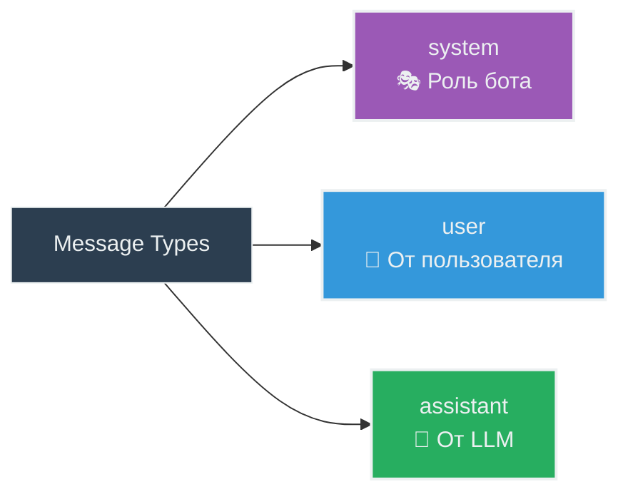
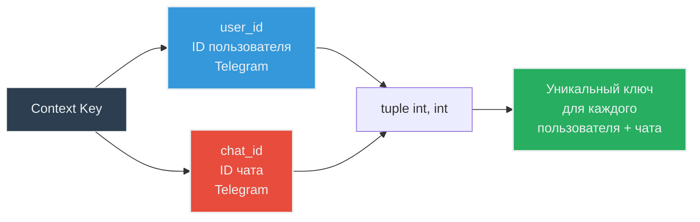
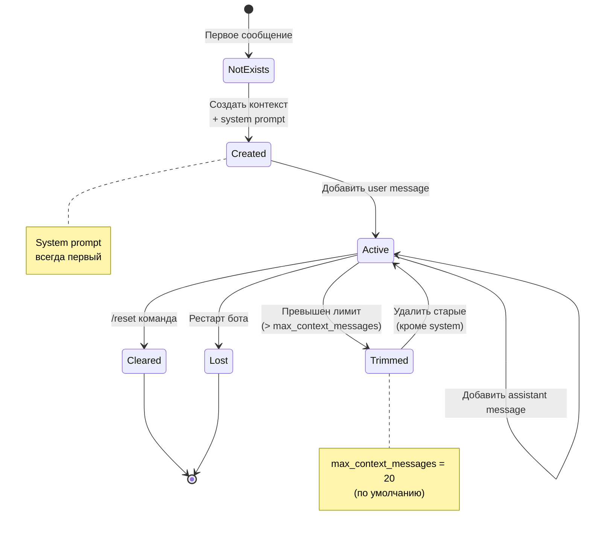

# 💾 Data Model & Context Management

**Цель**: Понять структуры данных и управление состоянием  
**Для кого**: Перед работой с контекстом/LLM  
**Время**: 15-20 минут

---

## 🧩 Класс Message

### Структура

```python
class Message:
    """Represents a chat message with role and content."""
    
    def __init__(self, role: str, content: str) -> None:
        self.role = role        # "system" | "user" | "assistant"
        self.content = content  # str - текст сообщения
    
    def to_dict(self) -> dict[str, str]:
        """Convert to OpenAI API format."""
        return {"role": self.role, "content": self.content}
```

### Типы ролей



**`system`** - системный промпт (роль, правила поведения)
- Всегда первое сообщение в контексте
- Загружается из `prompts/system_prompt.txt`
- Определяет личность бота (AICodingExpert)

**`user`** - сообщение от пользователя
- Текст запроса/вопроса
- Добавляется в контекст автоматически

**`assistant`** - ответ от LLM
- Генерируется через OpenRouter API
- Сохраняется в контекст для истории

### Пример использования

```python
# Создание сообщений
system_msg = Message("system", "Ты полезный ассистент")
user_msg = Message("user", "Привет!")
assistant_msg = Message("assistant", "Здравствуйте!")

# Конвертация для API
messages = [msg.to_dict() for msg in [system_msg, user_msg]]
# → [
#     {"role": "system", "content": "Ты полезный ассистент"},
#     {"role": "user", "content": "Привет!"}
# ]
```

---

## 🗂️ ContextManager - Управление историей

### Структура хранилища

```python
class ContextManager:
    def __init__(self, max_context_messages: int = 20):
        self.max_context_messages = max_context_messages
        self.contexts: dict[tuple[int, int], list[Message]] = {}
        #              ↑ ключ                    ↑ значение
        #         (user_id, chat_id)        список сообщений
```

### Ключ контекста



**Зачем tuple из двух ID?**
- `user_id` - один пользователь может писать из разных чатов
- `chat_id` - в групповом чате несколько пользователей
- `(user_id, chat_id)` - уникальная изоляция диалогов

### Структура данных в памяти

```python
contexts = {
    (12345, 67890): [
        Message("system", "Ты AICodingExpert..."),
        Message("user", "Привет"),
        Message("assistant", "Здравствуйте!"),
        Message("user", "Как дела?"),
        Message("assistant", "Отлично, спасибо!"),
    ],
    (12345, 99999): [  # Тот же user, другой chat
        Message("system", "Ты AICodingExpert..."),
        Message("user", "Другой вопрос"),
    ],
}
```

---

## 🔄 Жизненный цикл контекста



### 1. Создание контекста

**Триггер**: Первое сообщение от пользователя

**Действие**:
```python
contexts[(user_id, chat_id)] = [
    Message("system", system_prompt)  # Всегда первое
]
```

**Логирование**: `"Context created for user_id={user_id} chat_id={chat_id}"`

### 2. Добавление сообщений

**Метод**:
```python
def add_message(self, user_id: int, chat_id: int, message: Message) -> None:
    key = self._get_key(user_id, chat_id)
    
    # Создать контекст если не существует
    if key not in self.contexts:
        self._create_context(key)
    
    # Добавить сообщение
    self.contexts[key].append(message)
    
    # Обрезать если превышен лимит
    self._trim_context(key)
```

### 3. Автообрезка контекста

**Триггер**: После каждого `add_message()`, если `len > max_context_messages`

**Логика**:
```python
def _trim_context(self, key: tuple[int, int]) -> None:
    messages = self.contexts[key]
    
    if len(messages) > self.max_context_messages:
        # Сохранить system prompt (первое сообщение)
        system_msg = messages[0]
        
        # Взять последние N-1 сообщений
        recent_messages = messages[-(self.max_context_messages - 1):]
        
        # Новый контекст: system + recent
        self.contexts[key] = [system_msg] + recent_messages
```

**Пример**:
```
До обрезки (21 сообщение):
[system, user1, asst1, ..., user10, asst10]

После обрезки (20 сообщений):
[system, user2, asst2, ..., user10, asst10]
       ↑ сохранен          ↑ последние 19
```

### 4. Очистка контекста

**Триггер**: Команда `/reset`

**Действие**:
```python
def clear_context(self, user_id: int, chat_id: int) -> None:
    key = self._get_key(user_id, chat_id)
    if key in self.contexts:
        del self.contexts[key]
```

---

## 📊 Пример полного flow

```mermaid
sequenceDiagram
    participant U as User
    participant MH as MessageHandler
    participant CM as ContextManager
    participant LC as LLMClient

    Note over CM: Контекст пустой {}
    
    U->>MH: "Привет"
    MH->>CM: get_context(user_id, chat_id)
    CM-->>MH: [] (пустой)
    
    Note over CM: Создан: [(system, "Ты...")]
    
    MH->>CM: add_message(user, "Привет")
    Note over CM: [(system), (user, "Привет")]
    
    MH->>LC: get_response([system, user])
    LC-->>MH: "Здравствуйте!"
    
    MH->>CM: add_message(assistant, "Здравствуйте!")
    Note over CM: [(system), (user), (assistant)]
    
    MH-->>U: "Здравствуйте!"
    
    U->>MH: "Как дела?"
    MH->>CM: get_context(user_id, chat_id)
    CM-->>MH: [(system), (user, "Привет"), (assistant, "Здравствуйте!")]
    
    MH->>CM: add_message(user, "Как дела?")
    Note over CM: 4 сообщения в контексте
    
    MH->>LC: get_response([все 4 сообщения])
    LC-->>MH: "Отлично!"
    
    MH->>CM: add_message(assistant, "Отлично!")
    Note over CM: 5 сообщений в контексте
    
    MH-->>U: "Отлично!"

    style U fill:#3498DB,stroke:#ECF0F1,color:#ECF0F1
    style CM fill:#F39C12,stroke:#ECF0F1,color:#ECF0F1
    style LC fill:#9B59B6,stroke:#ECF0F1,color:#ECF0F1
```

---

## ⚙️ Конфигурация контекста

### Параметры

**`MAX_CONTEXT_MESSAGES`** (default: 20)
- Максимальное количество сообщений в истории
- Включая system prompt
- При превышении - удаляются старые (кроме system)

**Настройка в .env**:
```bash
MAX_CONTEXT_MESSAGES=20  # Рекомендуется 15-30
```

**Почему 20?**
- Баланс между памятью и стоимостью API
- Claude 3.5 Sonnet: ~$3 за 1M input tokens
- 20 сообщений ≈ 1000-3000 tokens ≈ $0.003-0.009 за запрос

### Расчет токенов

```
Типичный диалог (20 сообщений):
- System prompt: ~200 tokens
- 10 пар (user + assistant): ~1500 tokens
- Итого: ~1700 tokens

Стоимость:
- Input: 1700 tokens × $3/1M = $0.0051
- Output: ~200 tokens × $15/1M = $0.003
- Total: ~$0.008 за один запрос
```

---

## 💡 Ограничения и компромиссы

### In-Memory Storage

**Плюсы**:
- ✅ Быстро (нет I/O)
- ✅ Просто реализовать
- ✅ Не требует БД

**Минусы**:
- ❌ Потеря данных при рестарте
- ❌ Не масштабируется горизонтально
- ❌ Ограничено памятью сервера

### Автообрезка

**Плюсы**:
- ✅ Контроль стоимости API
- ✅ Предсказуемый размер запросов
- ✅ Защита от слишком длинных контекстов

**Минусы**:
- ❌ LLM забывает старую информацию
- ❌ Нет summarization старых сообщений

---

## 🔮 Пути улучшения (для Production)

### 1. Персистентное хранилище

**PostgreSQL**:
```sql
CREATE TABLE contexts (
    user_id BIGINT,
    chat_id BIGINT,
    messages JSONB,
    updated_at TIMESTAMP,
    PRIMARY KEY (user_id, chat_id)
);
```

**Redis**:
```python
redis_client.set(
    f"context:{user_id}:{chat_id}",
    json.dumps(messages),
    ex=86400  # TTL 24 часа
)
```

### 2. Context Summarization

Вместо удаления старых сообщений - суммаризация через LLM:

```python
old_messages = messages[1:10]
summary = llm.summarize(old_messages)
new_context = [system, Message("system", f"Краткое содержание: {summary}"), ...recent]
```

### 3. Векторное хранилище

Для длинных диалогов - semantic search:

```python
# Сохранить все в vector DB (Pinecone, Weaviate)
vector_db.upsert(messages)

# При запросе - найти релевантные
relevant = vector_db.search(user_query, top_k=10)
context = [system] + relevant + [current_user_message]
```

---

## 🧪 Тестирование Data Model

### Тесты для Message

```python
def test_message_creation():
    msg = Message("user", "test")
    assert msg.role == "user"
    assert msg.content == "test"

def test_message_to_dict():
    msg = Message("assistant", "response")
    assert msg.to_dict() == {"role": "assistant", "content": "response"}
```

### Тесты для ContextManager

```python
def test_add_message_creates_context():
    cm = ContextManager(max_context_messages=20)
    cm.add_message(123, 456, Message("user", "hi"))
    
    context = cm.get_context(123, 456)
    assert len(context) == 2  # system + user
    assert context[0].role == "system"
    assert context[1].content == "hi"

def test_context_trimming():
    cm = ContextManager(max_context_messages=3)
    
    # Добавить 5 сообщений
    for i in range(5):
        cm.add_message(1, 1, Message("user", f"msg{i}"))
    
    context = cm.get_context(1, 1)
    assert len(context) == 3  # system + 2 последних
    assert context[0].role == "system"  # system сохранен
```

---

## 📚 Следующие шаги

Теперь когда вы понимаете модель данных:

- [Development Workflow](06-development-workflow.md) - начать разработку
- [Testing Strategy](07-testing-strategy.md) - писать тесты для новых фич
- [Architecture Overview](03-architecture-overview.md) - вернуться к общей картине

---

## 💡 Ключевые takeaways

1. **Message** - простая структура (role + content)
2. **ContextManager** - in-memory dict с ключом `(user_id, chat_id)`
3. **System prompt** - всегда первое сообщение, никогда не удаляется
4. **Автообрезка** - при превышении лимита удаляются старые (кроме system)
5. **Потеря данных** - при рестарте бота контекст очищается
6. **Изоляция** - каждый user+chat имеет отдельный контекст

