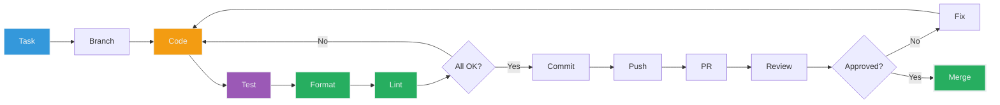
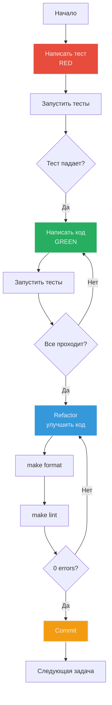

# 🔧 Development Workflow

**Цель**: Как правильно работать с кодом  
**Для кого**: Перед первым PR  
**Время**: 20-25 минут

---

## 🎯 Общий процесс разработки



---

## 📋 Детальный workflow

### 1️⃣ Создать feature branch

```bash
# Убедиться что на main и всё актуально
git checkout main
git pull origin main

# Создать feature branch
git checkout -b feature/add-weather-command

# Naming convention:
# feature/   - новая фича
# fix/       - багфикс
# refactor/  - рефакторинг
# docs/      - только документация
```

### 2️⃣ Разработать функционал

**Принцип**: Один класс = один файл

**Пример**: Добавление команды `/weather`

#### 2.1 Обновить CommandHandler

```python
# src/command_handler.py

def handle_command(self, text: str, user_id: int, chat_id: int) -> str | None:
    if text == "/start":
        return self._handle_start()
    elif text == "/help":
        return self._handle_help()
    elif text == "/reset":
        return self._handle_reset(user_id, chat_id)
    elif text == "/role":
        return self._handle_role()
    elif text == "/weather":  # ← Новая команда
        return self._handle_weather()
    return None

def _handle_weather(self) -> str:
    """Handle /weather command."""
    return "🌤️ Функция погоды в разработке!"
```

#### 2.2 Обновить help текст

```python
def _get_help_text(self) -> str:
    return """
    /start - начать работу с ботом
    /help - показать эту справку
    /reset - очистить историю диалога
    /role - показать информацию о роли ассистента
    /weather - показать погоду (новое!)
    """
```

### 3️⃣ Написать тесты

**TDD подход** (если новый модуль):
1. Red: написать failing test
2. Green: минимальный код чтобы тест прошел
3. Refactor: улучшить код

**Пример теста**:

```python
# tests/test_command_handler.py

def test_handle_weather_command(command_handler):
    """Test /weather command."""
    result = command_handler.handle_command("/weather", 123, 456)
    
    assert result is not None
    assert "погод" in result.lower()
```

**Запустить тесты**:

```bash
# Только новые тесты
uv run pytest tests/test_command_handler.py::test_handle_weather_command -v

# Все тесты
make test

# С coverage
make test-cov
```

### 4️⃣ Форматирование кода

```bash
make format

# Что делает: uv run ruff format src/ tests/
```

**Автоматически**:
- Форматирует код по PEP 8
- Выравнивает импорты
- Исправляет пробелы и отступы
- Line length = 100 символов

### 5️⃣ Проверка качества (Linting)

```bash
make lint

# Что делает:
# 1. uv run ruff check src/ tests/
# 2. uv run mypy src/ tests/
```

**Ruff проверяет**:
- Неиспользуемые импорты
- Неопределенные переменные
- Style issues
- Complexity

**Mypy проверяет**:
- Type hints соответствие
- Корректность типов
- Strict mode compliance

**Все должно быть 0 ошибок**!

### 6️⃣ Финальная проверка

```bash
make check-all

# Что делает: make format && make lint && make test-cov
```

**Должно быть**:
```
✓ Ruff: 0 warnings
✓ Mypy: 0 errors
✓ Tests: XX/XX passed
✓ Coverage: 100%
```

### 7️⃣ Коммит изменений

```bash
# Посмотреть что изменилось
git status
git diff

# Добавить файлы
git add src/command_handler.py
git add tests/test_command_handler.py

# Коммит с понятным сообщением
git commit -m "feat: add /weather command

- Added _handle_weather() method to CommandHandler
- Updated help text with /weather
- Added test for weather command
- Coverage: 100%"
```

**Commit message convention**:

```
<type>: <subject>

<body>

<footer>
```

**Types**:
- `feat:` - новая фича
- `fix:` - багфикс
- `refactor:` - рефакторинг без изменения функционала
- `test:` - добавление тестов
- `docs:` - документация
- `style:` - форматирование

### 8️⃣ Push и создание PR

```bash
# Push в свой branch
git push origin feature/add-weather-command

# Создать PR через GitHub UI
```

**PR Template** (заполнить в описании):

```markdown
## Что изменилось
- Добавлена команда `/weather`
- Обновлена справка `/help`

## Как протестировать
1. Запустить бота
2. Отправить `/weather`
3. Должен ответить "🌤️ Функция погоды в разработке!"

## Checklist
- [x] Код отформатирован (make format)
- [x] Линтинг прошел (make lint)
- [x] Тесты написаны и проходят
- [x] Coverage 100%
- [x] Документация обновлена (если нужно)
```

---

## 🛠️ Команды Makefile

### Основные команды

```bash
make install      # Установка зависимостей (один раз после clone)
make run          # Запуск бота
```

### Тестирование

```bash
make test         # Unit тесты (быстро, ~2-3s)
make test-cov     # Unit тесты + coverage report
make test-all     # Все тесты включая integration (~4-5s)
make test-integration  # Только integration тесты
```

**Когда использовать**:
- `make test` - во время разработки (быстрая обратная связь)
- `make test-cov` - перед коммитом (проверить coverage)
- `make test-all` - перед push (финальная проверка)

### Качество кода

```bash
make format       # Автоформатирование (ruff format)
make lint         # Проверка (ruff check + mypy)
make check-all    # Полная проверка (format + lint + test-cov)
```

**Когда использовать**:
- `make format` - после написания кода
- `make lint` - перед каждым коммитом
- `make check-all` - перед push

### Утилиты

```bash
make clean        # Очистить логи и temporary файлы
```

---

## 📝 Правила написания кода

### Структура файлов

**Один класс = один файл**:

```
✅ Правильно:
src/
├── command_handler.py    # class CommandHandler
├── llm_client.py         # class LLMClient
└── context_manager.py    # class ContextManager

❌ Неправильно:
src/
└── handlers.py           # CommandHandler + MessageHandler + ...
```

### Type Hints - обязательны

```python
✅ Правильно:
def handle_message(self, text: str, user_id: int) -> str:
    return "response"

❌ Неправильно:
def handle_message(self, text, user_id):
    return "response"
```

### Naming Conventions

**Classes**: PascalCase
```python
class MessageHandler:
class LLMClient:
```

**Functions/Methods**: snake_case
```python
def handle_message():
def _get_key():  # Private method
```

**Constants**: UPPER_SNAKE_CASE
```python
MAX_CONTEXT_MESSAGES = 20
DEFAULT_MODEL = "claude-3.5-sonnet"
```

**Variables**: snake_case
```python
user_id = 123
chat_id = 456
```

### Imports - организованы автоматически

```python
# 1. Standard library
import asyncio
import logging
from typing import Protocol

# 2. Third-party
from aiogram import Bot, types
from openai import AsyncOpenAI

# 3. Local imports
from src.config import Config
from src.message import Message
```

**Ruff автоматически сортирует** при `make format`.

---

## 🎨 Примеры типичных задач

### Задача 1: Добавить новую команду

**Файлы для изменения**:
1. `src/command_handler.py` - добавить обработку
2. `tests/test_command_handler.py` - добавить тест

**Workflow**:
```bash
# 1. Написать тест (Red)
def test_new_command():
    result = handler.handle_command("/new", 1, 1)
    assert result is not None

# 2. Запустить - тест упадет
make test

# 3. Реализовать минимальный код (Green)
def handle_command(...):
    elif text == "/new":
        return "New command response"

# 4. Запустить - тест проходит
make test

# 5. Refactor если нужно

# 6. Финальная проверка
make check-all
```

### Задача 2: Изменить LLM модель

**Файлы для изменения**:
1. `.env` - изменить `LLM_MODEL`
2. Никакого кода менять не нужно!

```bash
# .env
LLM_MODEL=anthropic/claude-3-opus

# Перезапустить бота
make run
```

### Задача 3: Добавить новый метод в ContextManager

**Workflow**:
```bash
# 1. Написать тест
# tests/test_context_manager.py
def test_get_context_size():
    cm = ContextManager()
    cm.add_message(1, 1, Message("user", "hi"))
    assert cm.get_context_size(1, 1) == 2  # system + user

# 2. Реализовать
# src/context_manager.py
def get_context_size(self, user_id: int, chat_id: int) -> int:
    key = self._get_key(user_id, chat_id)
    return len(self.contexts.get(key, []))

# 3. Проверить type hints
make lint  # Mypy должен быть доволен

# 4. Финальная проверка
make check-all
```

---

## ⚠️ Типичные ошибки и как их избежать

### Ошибка 1: Забыть type hints

```python
❌ Mypy ругается:
def process(data):  # error: Missing type annotation
    return data

✅ Исправить:
def process(data: str) -> str:
    return data
```

### Ошибка 2: Не запустить format перед коммитом

```bash
❌ PR будет отклонен из-за style issues

✅ Всегда запускать:
make format
git add .
git commit
```

### Ошибка 3: Падающие тесты

```bash
❌ Закоммитить с падающими тестами

✅ Убедиться что все проходит:
make test-cov
# Все зеленое → можно коммитить
```

### Ошибка 4: Coverage упал

```bash
❌ Добавить код без тестов - coverage < 100%

✅ Написать тесты для нового кода:
# Coverage должен остаться 100%
make test-cov
```

---

## 🔄 Итеративный цикл разработки



**Red-Green-Refactor** - классический TDD цикл.

---

## 🚀 Продвинутые техники

### Debugging в VSCode

**launch.json** уже настроен:

```bash
# Открыть VSCode
code .

# F5 - запустить с отладкой
# Выбрать "Python: Run Bot"

# Поставить breakpoint
# Отладчик остановится
```

### Запуск отдельного теста

```bash
# Запустить один тест
uv run pytest tests/test_llm_client.py::test_get_response_success -v

# Запустить все тесты в файле
uv run pytest tests/test_llm_client.py -v

# Запустить с выводом print statements
uv run pytest tests/test_llm_client.py -v -s
```

### Watch mode для разработки

```bash
# Запускать тесты при каждом изменении файла
uv run pytest-watch

# Или использовать entr (macOS)
ls src/*.py tests/*.py | entr make test
```

---

## 📚 Следующие шаги

После освоения workflow:

- [Testing Strategy](07-testing-strategy.md) - детально про тесты
- [Code Review Process](08-code-review-process.md) - как проходить ревью
- [Troubleshooting](12-troubleshooting.md) - если что-то не работает

---

## 💡 Ключевые takeaways

1. **Branch → Code → Test → Format → Lint → Commit** - всегда
2. **`make check-all`** перед каждым push
3. **TDD** - тесты сначала, код потом
4. **Type hints** - обязательны везде
5. **Один класс = один файл** - не нарушать
6. **0 warnings, 0 errors, 100% coverage** - стандарт качества
7. **Коммиты** - часто, с понятными сообщениями

