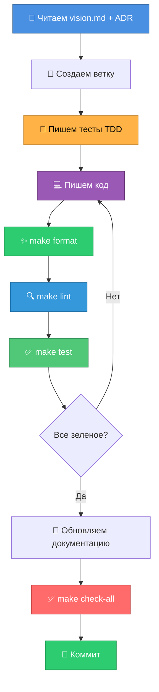
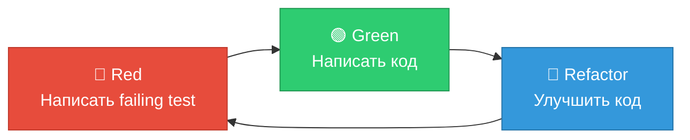

# GUIDE-07: Development Workflow

**Цель**: Научиться правильному процессу разработки в проекте.

---

## Принципы разработки

### 1. KISS (Keep It Simple, Stupid)
- Никакого оверинжиниринга
- Простые решения для простых задач
- Один класс = один файл (строго!)

### 2. Type Safety
- **Type hints обязательны** для всех функций и методов
- Mypy strict mode — 0 ошибок
- Docstrings для всех публичных методов

### 3. Async/Await
- Все IO операции асинхронные
- Используем `async def` и `await`
- aiogram + AsyncOpenAI = async-first

### 4. Тестируемость
- Protocols для DI
- Fixtures для переиспользования
- Моки для изоляции unit тестов

---

## Development Workflow



---

## Шаг 1: Изучение документации

Перед началом работы:

1. **Прочитайте `doc/vision.md`**:
   - Принципы проектирования
   - Технологии
   - Архитектурные особенности

2. **Изучите ADR** (`doc/adrs/`):
   - ADR-01: Почему OpenAI Compatible API
   - ADR-02: Почему aiogram
   - ADR-03: In-memory storage (устарел)
   - ADR-04: Protocols для DI
   - ADR-05: KISS принцип
   - ADR-06: PostgreSQL + SQLAlchemy
   - ADR-07: Frontend stack (Next.js)

3. **Проверьте существующий код**:
   - Есть ли похожая логика?
   - Можно ли переиспользовать компоненты?

4. **Убедитесь, что БД запущена**:
   ```bash
   make db-up
   docker ps | grep postgres
   ```

---

## Шаг 2: Создание ветки

```bash
# Обновить main
git checkout main
git pull

# Создать feature ветку
git checkout -b feature/add-user-stats

# или fix ветку
git checkout -b fix/context-memory-leak
```

**Naming convention**:
- `feature/` — новый функционал
- `fix/` — исправление бага
- `refactor/` — рефакторинг без изменения функционала
- `docs/` — только документация

---

## Шаг 3: TDD подход (опционально)

**Test-Driven Development** для сложной логики:

### Red → Green → Refactor



**Пример**:

```python
# 1. RED: Пишем тест (падает)
def test_user_statistics():
    stats = get_user_statistics(user_id=123)
    assert stats["message_count"] == 5
    # AssertionError: функция не существует

# 2. GREEN: Пишем минимальный код (работает)
def get_user_statistics(user_id: int) -> dict[str, int]:
    return {"message_count": 5}  # захардкоженно
    # Тест проходит!

# 3. REFACTOR: Улучшаем код (работает красиво)
def get_user_statistics(user_id: int) -> dict[str, int]:
    context = context_manager.get_context(user_id, chat_id)
    return {"message_count": len(context)}
    # Тест проходит + реальная логика!
```

---

## Шаг 4: Написание кода

### Правило: Один класс = один файл

**Плохо** ❌:
```python
# src/handlers.py
class MessageHandler: ...
class CommandHandler: ...
class ContextManager: ...
```

**Хорошо** ✅:
```python
# src/message_handler.py
class MessageHandler: ...

# src/command_handler.py
class CommandHandler: ...

# src/context_manager.py
class ContextManager: ...
```

### Type hints обязательны

**Плохо** ❌:
```python
def add_message(user_id, chat_id, message):
    self.contexts[key].append(message)
```

**Хорошо** ✅:
```python
def add_message(self, user_id: int, chat_id: int, message: Message) -> None:
    self.contexts[key].append(message)
```

### Docstrings для публичных методов

**Формат**:
```python
def handle_message(self, message: types.Message, user_id: int, chat_id: int) -> str:
    """Handle incoming message and return bot response.
    
    Args:
        message: Telegram message object
        user_id: User ID from Telegram
        chat_id: Chat ID from Telegram
    
    Returns:
        Response text to send back to user
    """
```

### Async/await

**Правило**: Если функция делает IO операцию → async

```python
# ✅ Правильно
async def get_response(self, messages: list[Message]) -> str:
    response = await self.client.chat.completions.create(...)
    return response.choices[0].message.content

# ❌ Неправильно (блокирующий вызов)
def get_response(self, messages: list[Message]) -> str:
    response = self.client.chat.completions.create(...)  # sync, плохо!
```

---

## Шаг 5: Форматирование

```bash
make format
```

Эта команда запускает `ruff format`:
- Автоматически форматирует код
- Приводит к единому стилю
- Line length: 100 символов

**Результат**:
```
Formatted 5 files
```

---

## Шаг 6: Линтинг

```bash
make lint
```

Эта команда запускает:
1. **`ruff check`** — проверка кода на ошибки
2. **`mypy`** — проверка типов (strict mode)

**Ожидаемый результат**:
```
All checks passed!
Success: no issues found
```

**Если есть ошибки**:

### Ruff errors

```bash
src/example.py:10:1: F401 [*] `os` imported but unused
```

**Исправление**: Удалить неиспользуемый import.

### Mypy errors

```bash
src/example.py:15: error: Argument 1 has incompatible type "str"; expected "int"
```

**Исправление**: Привести типы в соответствие или добавить type hints.

---

## Шаг 7: Тестирование

```bash
make test
```

Эта команда запускает unit тесты (без integration).

**Ожидаемый результат**:
```
==================== 29 passed in 2.8s ====================
```

**Если есть падающие тесты**:
```
FAILED tests/test_example.py::test_feature - AssertionError
```

**Исправление**:
1. Посмотреть детали ошибки
2. Исправить код или тест
3. Повторить `make test`

### Запуск конкретного теста

```bash
uv run pytest tests/test_message_handler.py::test_handle_message
```

### Запуск с coverage

```bash
make test-cov
```

Проверьте coverage report:
```
Name                      Stmts   Miss  Cover
---------------------------------------------
src/config.py                42      0   100%
src/message_handler.py       35      0   100%
...
TOTAL                       165      0   100%
```

**Цель**: Сохранить 100% coverage.

---

## Шаг 8: Обновление документации

Если вы добавили:
- **Новую команду** → обновить `README.md` (секция "Команды бота")
- **Новый модуль** → обновить `README.md` (секция "Структура проекта")
- **Архитектурное решение** → создать ADR (`doc/adrs/ADR-XX.md`)
- **Изменение в API** → обновить соответствующий гайд

---

## Шаг 9: Полная проверка

```bash
make check-all
```

Эта команда запускает:
1. `make format` — форматирование
2. `make lint` — проверка качества
3. `make test-cov` — тесты с coverage

**Все должно быть зеленым перед коммитом!**

---

## Шаг 10: Коммит

### Формат commit message

```
<type>(<scope>): <subject>

<body>

<footer>
```

**Types**:
- `feat`: новая фича
- `fix`: исправление бага
- `refactor`: рефакторинг
- `test`: добавление тестов
- `docs`: документация
- `chore`: вспомогательные изменения

**Примеры**:

```bash
# Новая фича
git commit -m "feat(commands): add /stats command to show user statistics"

# Исправление бага
git commit -m "fix(context): prevent memory leak in context trimming"

# Рефакторинг
git commit -m "refactor(llm): extract message conversion to separate method"

# Документация
git commit -m "docs(guides): add development workflow guide"
```

**Подробный коммит**:
```bash
git commit -m "feat(commands): add /stats command

Add new command to show user statistics:
- Message count
- Active days
- Average messages per day

Resolves #42"
```

---

## Пример: Добавление новой команды

### Задача: Добавить команду `/stats`

#### 1. Изучение

Читаем `src/command_handler.py`:
- Метод `handle_command` проверяет команды
- Команды возвращают `str`, не-команды возвращают `None`

#### 2. Создание ветки

```bash
git checkout -b feature/add-stats-command
```

#### 3. TDD: Пишем тест

```python
# tests/test_command_handler.py
import pytest
from sqlalchemy.ext.asyncio import AsyncSession

@pytest.mark.asyncio
async def test_stats_command(
    command_handler: CommandHandler,
    db_session: AsyncSession
) -> None:
    """Test /stats command returns user statistics."""
    # Setup: добавим сообщения в БД через repository
    from src.repository import MessageRepository
    repo = MessageRepository(db_session)
    await repo.add_message(123, 456, "user", "Hello")
    await repo.add_message(123, 456, "assistant", "Hi")
    await db_session.commit()
    
    # Act
    response = await command_handler.handle_command("/stats", 123, 456)
    
    # Assert
    assert response is not None
    assert "Статистика" in response
    assert "Сообщений в контексте: 2" in response
```

Запускаем: `uv run pytest tests/test_command_handler.py::test_stats_command`

**Результат**: ❌ FAILED (команда не существует)

**Примечание**: Теперь тесты работают с реальной БД (используется SQLite in-memory для тестов)

#### 4. Пишем код

```python
# src/command_handler.py
async def handle_command(self, text: str, user_id: int, chat_id: int) -> str | None:
    """Handle command and return response, or None if not a command."""
    # ... existing commands ...
    
    if text == "/stats":
        logging.info(f"Command /stats from user_id={user_id}")
        return await self._get_stats(user_id, chat_id)
    
    return None

async def _get_stats(self, user_id: int, chat_id: int) -> str:
    """Get statistics for user."""
    # Получаем сессию БД
    async with get_session() as session:
        repo = MessageRepository(session)
        messages = await repo.get_messages(user_id, chat_id, limit=20)
        message_count = len(messages)
    
    return f"📊 Статистика:\nСообщений в контексте: {message_count}"
```

Запускаем тест снова: `uv run pytest tests/test_command_handler.py::test_stats_command`

**Результат**: ✅ PASSED

**Важно**: Обратите внимание на `async`/`await` - теперь команды работают с БД асинхронно

#### 5. Обновляем help

```python
def _get_help_text(self) -> str:
    """Get help text with available commands."""
    return (
        "Доступные команды:\n"
        "/start - Начать диалог\n"
        "/help - Показать эту справку\n"
        "/reset - Очистить историю диалога\n"
        "/role - Показать информацию о роли ассистента\n"
        "/stats - Показать статистику диалога"  # ← добавили
    )
```

#### 6. Проверка качества

```bash
make format  # ✅ Formatted
make lint    # ✅ All checks passed
make test    # ✅ 30 passed
```

#### 7. Обновляем документацию

```markdown
# README.md (секция "Команды бота")

- `/start` - начать работу с ботом
- `/help` - показать справку
- `/reset` - очистить историю диалога
- `/role` - показать информацию о роли ассистента
- `/stats` - показать статистику диалога  ← добавили
```

#### 8. Финальная проверка

```bash
make check-all  # ✅ Все зеленое
```

#### 9. Коммит

```bash
git add .
git commit -m "feat(commands): add /stats command to show dialog statistics

Show user statistics including message count in context.
Updated help text and README."
```

#### 10. Тестирование вручную

```bash
make run
```

В Telegram:
1. Отправьте боту несколько сообщений
2. Отправьте `/stats`
3. Увидите: "📊 Статистика:\nСообщений в контексте: X"

✅ Готово!

---

## Инструменты разработки

### VSCode Setup

Проект настроен для VSCode (`.vscode/` директория):

**Конфигурации запуска** (F5):
- `Python: Run Bot` — запуск с отладкой
- `Python: Run All Tests` — все тесты
- `Python: Run Tests (No Integration)` — unit тесты
- `Python: Debug Current Test File` — отладка текущего файла

**Tasks** (Cmd+Shift+P → Tasks: Run Task):
- `Run Bot`
- `Run Tests`
- `Format Code`
- `Lint Code`
- `Check All`

**Расширения** (автоматически предлагаются):
- Python
- Pylance
- Ruff
- Python Debugger

### Debugging

Поставьте breakpoint в коде:
```python
async def handle_message(...):
    import pdb; pdb.set_trace()  # ← breakpoint
    response = await self.llm_client.get_response(context)
```

Запустите через F5 → `Python: Run Bot`

---

## Частые сценарии

### Добавление нового модуля

1. Создать файл: `src/new_module.py`
2. Один класс на файл
3. Добавить type hints
4. Создать Protocol если нужно DI
5. Написать тесты: `tests/test_new_module.py`
6. Обновить `README.md`

### Изменение логики работы с БД

1. Обновить ORM модели в `src/models.py` (если нужно)
2. Создать миграцию: `make db-revision message="описание"`
3. Применить миграцию: `make db-migrate`
4. Обновить Repository методы
5. Обновить тесты (используют SQLite in-memory)
6. Запустить `make test`

### Добавление нового API endpoint

1. Добавить Pydantic схемы в `src/api/schemas.py`
2. Добавить endpoint в `src/api/main.py`
3. Написать тесты в `tests/test_api_*.py`
4. Проверить документацию в Swagger UI: `make api-docs`
5. Протестировать вручную: `make api-test`

### Изменение существующей логики

1. Найти соответствующий тест
2. Обновить тест (red)
3. Изменить код (green)
4. Запустить `make test` (all green)

### Исправление бага

1. Создать failing test (воспроизвести баг)
2. Исправить код
3. Тест проходит (green)
4. Запустить все тесты

---

## Checklist перед коммитом

- [ ] `make format` — код отформатирован
- [ ] `make lint` — 0 ошибок ruff и mypy
- [ ] `make test` — все тесты проходят
- [ ] Coverage не упал (проверить через `make test-cov`)
- [ ] Миграции применены (если изменялись модели): `make db-migrate`
- [ ] API работает (если изменялся API): `make api-run` + `make api-test`
- [ ] Документация обновлена (если нужно)
- [ ] Commit message правильного формата
- [ ] Мануальное тестирование пройдено

---

## ADR процесс

### Когда создавать ADR?

Создавайте Architecture Decision Record для:
- Выбора технологии (библиотека, фреймворк)
- Архитектурного паттерна (DI, хранилище)
- Изменения core принципов (например, переход с in-memory на БД)

### Шаблон ADR

```markdown
# ADR-XX: Название решения

**Статус:** Принято / Отклонено / Устарело
**Дата:** YYYY-MM-DD

## Контекст
Почему нужно принять решение?

## Решение
Что мы выбрали?

## Последствия
### Положительные:
- ✅ Пункт 1

### Отрицательные:
- ⚠️ Пункт 1

## Альтернативы
Что рассматривали и почему отклонили?
```

Сохраните в `doc/adrs/ADR-XX.md`.

---

## Что дальше?

Переходите к следующему гайду:
- **GUIDE-08**: Testing — стратегия тестирования, как писать хорошие тесты

