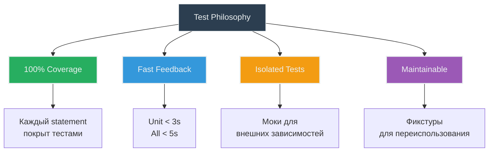
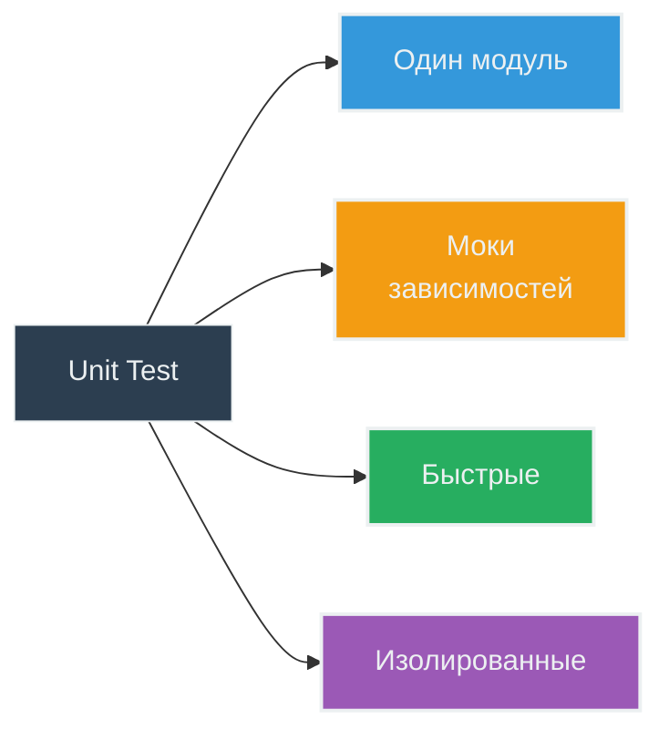
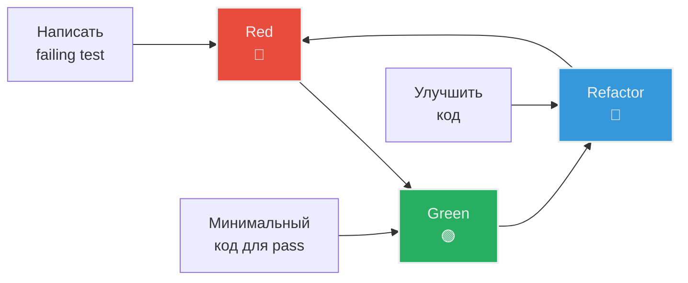

# 🧪 Testing Strategy

**Цель**: Как писать и запускать тесты  
**Для кого**: Перед написанием тестов  
**Время**: 25-30 минут

---

## 📊 Текущее состояние тестов

```
Total tests: 30
- Unit tests: 29
- Integration tests: 1

Coverage: 100%
Execution time: ~2.8s (unit), ~4.5s (all)

Test files: 9
```

---

## 🎯 Философия тестирования



**Принципы**:
1. **100% coverage** - каждая строка покрыта
2. **Быстрые тесты** - instant feedback loop
3. **Изолированные** - моки для внешних API
4. **Понятные** - читаются как документация
5. **Maintainable** - легко обновлять

---

## 📁 Структура тестов

```
tests/
├── conftest.py              # 🔧 Фикстуры pytest
├── test_message.py          # 4 теста - Message class
├── test_config.py           # 5 тестов - Config + validation
├── test_command_handler.py  # 6 тестов - команды бота
├── test_message_handler.py  # 7 тестов - координация
├── test_llm_client.py       # 4 теста - LLM (3 unit + 1 integration)
├── test_context_manager.py  # 3 теста - контекст
└── test_integration.py      # 1 тест - полный flow
```

**Naming convention**:
- `test_*.py` - файлы тестов
- `test_<функция>_<сценарий>` - тест-функции

---

## 🔧 conftest.py - Фикстуры

### Что такое фикстуры?

**Фикстуры** - переиспользуемый setup код для тестов.

```python
# conftest.py
import pytest
from unittest.mock import AsyncMock, Mock
from src.llm_client import LLMClient
from src.context_manager import ContextManager
from src.command_handler import CommandHandler

@pytest.fixture
def mock_llm_client():
    """Mock LLM client for testing."""
    client = AsyncMock(spec=LLMClient)
    client.get_response.return_value = "Mocked LLM response"
    return client

@pytest.fixture
def context_manager():
    """Real context manager for testing."""
    return ContextManager(max_context_messages=20)

@pytest.fixture
def command_handler(context_manager):
    """Command handler with real context manager."""
    system_prompt = "Test system prompt"
    return CommandHandler(context_manager, system_prompt)
```

**Использование в тестах**:

```python
# test_message_handler.py
def test_handle_message(mock_llm_client, context_manager):
    # Фикстуры автоматически инжектятся
    handler = MessageHandler(mock_llm_client, context_manager, ...)
    result = await handler.handle_message(...)
    assert result == "Mocked LLM response"
```

---

## 🧩 Unit Tests

### Принципы Unit тестов



### Пример 1: Тест простого класса

```python
# test_message.py
from src.message import Message

def test_message_creation():
    """Test Message instance creation."""
    msg = Message("user", "Hello")
    
    assert msg.role == "user"
    assert msg.content == "Hello"

def test_message_to_dict():
    """Test conversion to dict."""
    msg = Message("assistant", "Hi there!")
    
    result = msg.to_dict()
    
    assert result == {"role": "assistant", "content": "Hi there!"}
```

**Что тестируем**:
- Создание объекта
- Публичные методы
- Граничные случаи

### Пример 2: Тест с моками

```python
# test_message_handler.py
import pytest
from unittest.mock import AsyncMock
from src.message_handler import MessageHandler
from src.message import Message

@pytest.mark.asyncio
async def test_handle_regular_message(mock_llm_client, context_manager):
    """Test handling regular user message."""
    # Arrange
    handler = MessageHandler(
        mock_llm_client,
        context_manager,
        command_handler=None,
        system_prompt="Test prompt"
    )
    mock_message = AsyncMock()
    mock_message.text = "Hello bot"
    
    # Act
    result = await handler.handle_message(mock_message, 123, 456)
    
    # Assert
    assert result == "Mocked LLM response"
    mock_llm_client.get_response.assert_called_once()
```

**AAA Pattern**:
- **Arrange** - подготовка (setup)
- **Act** - действие (вызов тестируемой функции)
- **Assert** - проверка (verification)

### Пример 3: Тест обработки ошибок

```python
# test_llm_client.py
@pytest.mark.asyncio
async def test_llm_error_handling():
    """Test LLM API error is wrapped in LLMError."""
    # Arrange
    client = LLMClient(api_key="test", base_url="http://test", model="test")
    
    # Mock OpenAI client to raise exception
    with patch.object(client.client.chat.completions, 'create',
                      side_effect=Exception("API Error")):
        messages = [Message("user", "test")]
        
        # Act & Assert
        with pytest.raises(LLMError, match="API Error"):
            await client.get_response(messages)
```

**Тестируем**:
- Exception handling
- Конвертация Exception → LLMError
- Error message сохраняется

---

## 🔗 Integration Tests

### Отличия от Unit тестов

| Аспект | Unit Tests | Integration Tests |
|--------|-----------|-------------------|
| Scope | Один модуль | Несколько модулей |
| Зависимости | Моки | Реальные (или реальные API) |
| Скорость | Быстро (~2-3s) | Медленнее (~4-5s) |
| Запуск | Всегда | Опционально |
| Маркер | Нет | `@pytest.mark.integration` |

### Пример Integration теста

```python
# test_integration.py
import pytest
from src.context_manager import ContextManager
from src.message import Message

@pytest.mark.integration
@pytest.mark.asyncio
async def test_context_trimming_integration():
    """Integration test for context trimming with real ContextManager."""
    # Arrange
    max_messages = 5
    cm = ContextManager(max_context_messages=max_messages)
    user_id, chat_id = 123, 456
    
    # Act - добавить много сообщений
    for i in range(10):
        cm.add_message(user_id, chat_id, Message("user", f"message {i}"))
    
    # Assert - контекст обрезан
    context = cm.get_context(user_id, chat_id)
    assert len(context) == max_messages
    assert context[0].role == "system"  # system prompt сохранен
```

### Запуск Integration тестов

```bash
# Только unit тесты (быстро)
make test

# Только integration тесты
make test-integration

# Все тесты
make test-all
```

---

## 🎭 Моки (Mocks)

### AsyncMock для async функций

```python
from unittest.mock import AsyncMock

# Создать мок
mock_client = AsyncMock()

# Настроить return value
mock_client.get_response.return_value = "Mocked response"

# Использовать в тесте
result = await mock_client.get_response([...])
assert result == "Mocked response"

# Проверить что вызвано
mock_client.get_response.assert_called_once()
```

### Mock для sync функций

```python
from unittest.mock import Mock

mock_handler = Mock()
mock_handler.handle_command.return_value = "Command result"

result = mock_handler.handle_command("/start", 1, 1)
assert result == "Command result"
```

### Проверка вызовов

```python
# Вызвано ровно один раз
mock.method.assert_called_once()

# Вызвано с конкретными аргументами
mock.method.assert_called_with(arg1, arg2)

# Никогда не вызвано
mock.method.assert_not_called()

# Вызвано N раз
assert mock.method.call_count == 3
```

---

## 📈 Coverage

### Требования

```
Target: 100% statement coverage
Minimum: 90% (для новых фич)
```

### Запуск с coverage

```bash
# Unit тесты + coverage
make test-cov

# Все тесты + coverage
make test-all

# Вывод в консоль
---------- coverage: platform darwin, python 3.11.0 -----------
Name                          Stmts   Miss  Cover   Missing
-----------------------------------------------------------
src/command_handler.py           19      0   100%
src/config.py                    35      0   100%
src/context_manager.py           29      0   100%
...
-----------------------------------------------------------
TOTAL                           165      0   100%
```

### HTML отчет

```bash
make test-cov

# Открыть отчет
open htmlcov/index.html
```

**Что показывает**:
- 🟢 Зеленые строки - покрыты
- 🔴 Красные строки - не покрыты
- 🟡 Желтые строки - частично покрыты (branches)

### Исключения из coverage

```toml
# pyproject.toml
[tool.coverage.run]
omit = [
    "tests/*",           # Тесты не покрываем
    "**/__pycache__/*",  # Байткод
    "src/main.py"        # Entry point (сложно тестировать)
]
```

---

## ✍️ Написание хороших тестов

### Naming Convention

```python
✅ Правильно:
def test_add_message_creates_context():
def test_handle_reset_command():
def test_llm_error_handling():

❌ Неправильно:
def test1():
def test_stuff():
def my_test():
```

**Формат**: `test_<что_тестируем>_<сценарий>`

### Docstrings

```python
def test_context_trimming_with_max_limit():
    """Test that context is trimmed when exceeding max_context_messages.
    
    Given: ContextManager with max_context_messages=3
    When: Adding 5 messages
    Then: Context contains only 3 messages (system + 2 latest)
    """
    # ...
```

### Один тест = один сценарий

```python
✅ Правильно:
def test_add_message_creates_context():
    # Тестирует только создание контекста
    cm.add_message(1, 1, Message("user", "hi"))
    assert len(cm.contexts) == 1

def test_add_message_appends_to_existing():
    # Тестирует добавление к существующему
    cm.add_message(1, 1, Message("user", "hi"))
    cm.add_message(1, 1, Message("user", "bye"))
    assert len(cm.get_context(1, 1)) == 3  # system + 2

❌ Неправильно:
def test_add_message():
    # Тестирует слишком много сценариев
    # Создание + добавление + обрезка + очистка
    # Если упадет - непонятно где проблема
```

### Arrange-Act-Assert

```python
def test_handle_command_returns_help():
    # Arrange - подготовка
    handler = CommandHandler(context_manager, "prompt")
    
    # Act - действие
    result = handler.handle_command("/help", 123, 456)
    
    # Assert - проверка
    assert result is not None
    assert "/start" in result
    assert "/help" in result
```

---

## 🚀 TDD Workflow



### Пример TDD цикла

**Задача**: Добавить метод `get_context_size()` в ContextManager

#### 1️⃣ Red - Написать тест

```python
# test_context_manager.py
def test_get_context_size_returns_count():
    """Test get_context_size returns message count."""
    cm = ContextManager()
    cm.add_message(1, 1, Message("user", "hi"))
    
    size = cm.get_context_size(1, 1)
    
    assert size == 2  # system + user
```

```bash
# Запустить - тест упадет (метода еще нет)
make test
# FAILED - AttributeError: 'ContextManager' has no attribute 'get_context_size'
```

#### 2️⃣ Green - Минимальный код

```python
# context_manager.py
def get_context_size(self, user_id: int, chat_id: int) -> int:
    """Return number of messages in context."""
    key = self._get_key(user_id, chat_id)
    return len(self.contexts.get(key, []))
```

```bash
# Запустить - тест проходит
make test
# PASSED ✓
```

#### 3️⃣ Refactor - Улучшить

```python
# Добавить тест для граничного случая
def test_get_context_size_for_nonexistent_context():
    """Test get_context_size returns 0 for non-existent context."""
    cm = ContextManager()
    
    size = cm.get_context_size(999, 999)
    
    assert size == 0

# Код уже работает корректно (благодаря .get(key, []))
```

```bash
# Запустить все тесты
make test-cov
# Coverage: 100% ✓
```

---

## 🔍 Debugging тестов

### Запуск одного теста

```bash
# По имени
uv run pytest tests/test_message.py::test_message_creation -v

# С выводом print
uv run pytest tests/test_message.py::test_message_creation -v -s
```

### Debugging в VSCode

1. Открыть тестовый файл
2. Поставить breakpoint
3. F5 → "Debug Current Test File"
4. Отладчик остановится на breakpoint

### pytest verbose mode

```bash
# Подробный вывод
uv run pytest tests/ -v

# Еще более подробный
uv run pytest tests/ -vv

# С выводом print и logging
uv run pytest tests/ -v -s --log-cli-level=INFO
```

---

## 📋 Checklist перед коммитом

```bash
# 1. Все тесты проходят
make test
✓ 29/29 passed

# 2. Coverage 100%
make test-cov
✓ Coverage: 100%

# 3. Нет warnings
make lint
✓ 0 warnings

# 4. Код отформатирован
make format
✓ All files formatted

# 5. Финальная проверка
make check-all
✓ All checks passed
```

---

## 💡 Лучшие практики

### ✅ DO

- Писать тесты для каждого публичного метода
- Использовать фикстуры для переиспользования
- Тестировать error paths (not just happy path)
- Использовать AAA pattern
- Давать понятные имена тестам
- Запускать тесты часто

### ❌ DON'T

- Не тестировать приватные методы напрямую
- Не делать тесты зависимыми друг от друга
- Не тестировать implementation details
- Не использовать time.sleep() в тестах
- Не игнорировать падающие тесты
- Не коммитить без 100% coverage

---

## 🎓 Примеры тестов из проекта

### test_config.py

```python
def test_config_from_env_with_all_variables(monkeypatch, tmp_path):
    """Test Config loads all variables correctly."""
    # Arrange
    prompt_file = tmp_path / "prompt.txt"
    prompt_file.write_text("Test prompt")
    
    monkeypatch.setenv("BOT_TOKEN", "test_token")
    monkeypatch.setenv("LLM_API_KEY", "test_key")
    monkeypatch.setenv("LLM_BASE_URL", "https://test.com")
    monkeypatch.setenv("LLM_MODEL", "test-model")
    monkeypatch.setenv("SYSTEM_PROMPT_FILE", str(prompt_file))
    
    # Act
    config = Config.from_env()
    
    # Assert
    assert config.bot_token == "test_token"
    assert config.llm_api_key == "test_key"
    assert config.system_prompt == "Test prompt"
```

### test_command_handler.py

```python
def test_handle_start_command(command_handler):
    """Test /start command returns greeting."""
    result = command_handler.handle_command("/start", 123, 456)
    
    assert result is not None
    assert "привет" in result.lower() or "hello" in result.lower()
```

---

## 📚 Следующие шаги

- [Code Review Process](08-code-review-process.md) - как проходить ревью
- [Development Workflow](06-development-workflow.md) - вернуться к workflow
- [Troubleshooting](12-troubleshooting.md) - если тесты не работают

---

## 💡 Ключевые takeaways

1. **100% coverage** - стандарт проекта
2. **Моки** для внешних зависимостей
3. **Фикстуры** в conftest.py для переиспользования
4. **TDD** - red, green, refactor
5. **AAA pattern** - arrange, act, assert
6. **Integration тесты** помечены маркером
7. **`make test-cov`** перед каждым коммитом

