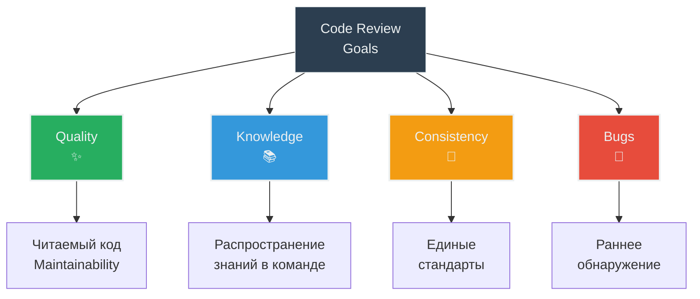
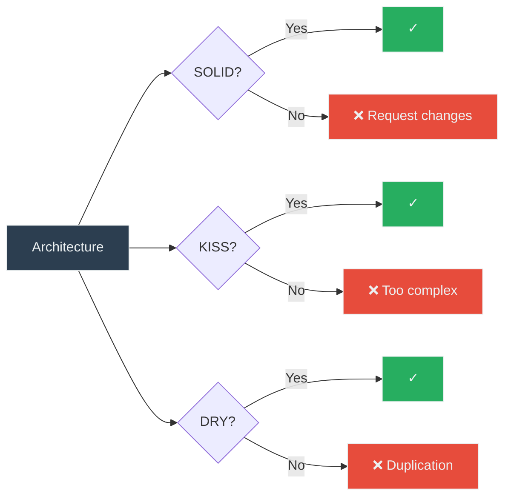

# 👀 Code Review Process

**Цель**: Стандарты ревью кода  
**Для кого**: Reviewer и автор PR  
**Время**: 15-20 минут

---

## 🎯 Цели Code Review



---

## 📝 Checklist перед созданием PR

### Автор должен проверить:

#### ✅ Качество кода

```bash
# 1. Код отформатирован
make format
# → Все файлы форматированы ✓

# 2. Линтинг пройден
make lint
# → 0 ruff warnings ✓
# → 0 mypy errors ✓

# 3. Тесты проходят
make test-cov
# → 30/30 passed ✓
# → Coverage: 100% ✓
```

#### ✅ Документация

- [ ] README обновлен (если нужно)
- [ ] Docstrings добавлены для новых функций
- [ ] Комментарии для сложной логики
- [ ] ADR создан (для архитектурных решений)

#### ✅ Тесты

- [ ] Новый код покрыт unit тестами
- [ ] Edge cases протестированы
- [ ] Error paths покрыты
- [ ] Coverage не упал (100%)

#### ✅ Git hygiene

- [ ] Commit messages понятные
- [ ] Branch актуальный (rebase на main)
- [ ] Нет debug кода (print, console.log)
- [ ] Нет закомментированного кода

---

## 📋 PR Template

```markdown
## 🎯 Что изменилось

Краткое описание изменений (1-2 предложения).

## 🔧 Детали реализации

- Добавлен метод `X` в класс `Y`
- Обновлена логика обработки `Z`
- Рефакторинг `W` для улучшения читаемости

## 🧪 Как протестировать

1. Запустить бота: `make run`
2. Отправить `/command`
3. Ожидаемый результат: "Response text"

## 📊 Метрики

- Tests: 30/30 passed ✓
- Coverage: 100% ✓
- Ruff: 0 warnings ✓
- Mypy: 0 errors ✓

## ✅ Checklist

- [x] Код отформатирован (`make format`)
- [x] Линтинг пройден (`make lint`)
- [x] Тесты написаны и проходят
- [x] Coverage 100%
- [x] Документация обновлена
- [x] Self-review проведен

## 🔗 Связанные Issue

Closes #123 (если есть)
```

---

## 👁️ Что проверять при Review

### 1. Архитектура и дизайн (🏗️ Critical)



**Вопросы**:
- ✅ Соблюдается Single Responsibility?
- ✅ Зависимости через Protocols?
- ✅ Нет дублирования кода?
- ✅ Класс в отдельном файле?
- ❌ Избыточная абстракция?
- ❌ Слишком сложная логика?

**Примеры комментариев**:

```markdown
✅ Good:
> Отлично, что выделили CommandHandler в отдельный класс (SRP).

❌ Needs work:
> Метод `handle_message()` делает слишком много (150 строк).
> Предлагаю выделить логику валидации в отдельный метод `_validate_message()`.
```

### 2. Type Safety (🔒 Critical)

**Проверить**:
- ✅ Все функции имеют type hints
- ✅ Return types указаны
- ✅ Нет `Any` без необходимости
- ✅ Mypy strict mode проходит

**Примеры**:

```python
❌ Bad:
def process(data):
    return data.upper()

✅ Good:
def process(data: str) -> str:
    return data.upper()
```

### 3. Тестирование (🧪 Critical)

**Checklist**:
- [ ] Новый код покрыт тестами
- [ ] Edge cases протестированы
- [ ] Error handling протестирован
- [ ] Coverage не упал (100%)
- [ ] Тесты изолированы (моки)

**Red flags** 🚩:
- ❌ Coverage упал ниже 100%
- ❌ Нет тестов для error paths
- ❌ Тесты используют реальные API
- ❌ Flaky tests (падают рандомно)

### 4. Читаемость (📖 High)

**Проверить**:
- ✅ Понятные имена переменных/функций
- ✅ Функции < 50 строк
- ✅ Docstrings для публичных методов
- ✅ Комментарии для сложной логики
- ❌ Магические числа

**Примеры**:

```python
❌ Bad:
def f(x, y):
    return x * 86400 + y  # Что это?

✅ Good:
SECONDS_PER_DAY = 86400

def calculate_total_seconds(days: int, extra_seconds: int) -> int:
    """Calculate total seconds from days and extra seconds."""
    return days * SECONDS_PER_DAY + extra_seconds
```

### 5. Error Handling (⚠️ High)

**Проверить**:
- ✅ Используются custom exceptions
- ✅ Ошибки логируются
- ✅ Пользователь получает понятное сообщение
- ❌ Нет голых `except:`
- ❌ Нет проглатывания ошибок

**Примеры**:

```python
❌ Bad:
try:
    response = api.call()
except:
    pass  # Проглатываем ошибку

✅ Good:
try:
    response = api.call()
except APIError as e:
    logging.error(f"API call failed: {e}")
    raise LLMError(f"Failed to get response: {e}") from e
```

### 6. Performance (⚡ Medium)

**Проверить**:
- ✅ Нет O(n²) там где можно O(n)
- ✅ Используется async/await
- ✅ Нет лишних API calls
- ❌ Нет memory leaks
- ❌ Нет блокирующих операций

**Примеры**:

```python
❌ Bad:
for message in messages:
    if message.id in [m.id for m in all_messages]:  # O(n²)
        ...

✅ Good:
message_ids = {m.id for m in all_messages}  # O(n)
for message in messages:
    if message.id in message_ids:  # O(1)
        ...
```

---

## 💬 Как оставлять комментарии

### Тон и стиль

```markdown
✅ Constructive:
> Предлагаю вынести эту логику в отдельный метод для улучшения читаемости.
> Что думаешь?

❌ Destructive:
> Этот код ужасный, переписывай.
```

### Типы комментариев

**🚨 Blocking (must fix)**:
```markdown
🚨 BLOCKING: Нет тестов для этого метода. Coverage упал до 95%.
```

**⚠️ Important (should fix)**:
```markdown
⚠️ Здесь нет обработки ошибок. Если API упадет, получим unhandled exception.
```

**💡 Suggestion (nice to have)**:
```markdown
💡 Suggestion: Можно использовать list comprehension для краткости:
\`\`\`python
return [msg.to_dict() for msg in messages]
\`\`\`
```

**❓ Question (для понимания)**:
```markdown
❓ Почему здесь используется sync вместо async? Это блокирующая операция?
```

**👍 Praise (положительный feedback)**:
```markdown
👍 Отличное решение с использованием Protocol для DI!
```

---

## ✅ Процесс Review

```mermaid
sequenceDiagram
    participant A as Author
    participant R as Reviewer
    participant CI as CI/CD
    
    A->>A: Создать PR
    A->>CI: Push code
    CI->>CI: Run tests, lint
    CI-->>A: ✓ All checks passed
    
    A->>R: Request review
    R->>R: Review code
    
    alt Changes needed
        R->>A: Request changes
        A->>A: Fix issues
        A->>CI: Push fixes
        CI-->>A: ✓ Checks passed
        A->>R: Re-request review
    else Looks good
        R->>A: Approve ✓
        A->>A: Merge to main
    end
    
    style A fill:#3498DB,stroke:#ECF0F1,color:#ECF0F1
    style R fill:#27AE60,stroke:#ECF0F1,color:#ECF0F1
    style CI fill:#F39C12,stroke:#ECF0F1,color:#ECF0F1
```

### 1. Автор создает PR

```bash
git push origin feature/new-command
# Создать PR через GitHub
```

### 2. Reviewer проводит review

**Время на review**: 30-60 минут для среднего PR

**Порядок review**:
1. Прочитать описание PR
2. Посмотреть diff (измененные файлы)
3. Проверить архитектуру
4. Проверить тесты
5. Проверить детали реализации
6. Оставить комментарии

### 3. Автор исправляет замечания

```bash
# Исправить код
git add .
git commit -m "fix: address review comments"
git push origin feature/new-command
```

### 4. Reviewer проверяет исправления

- Все комментарии resolved?
- Качество исправлений OK?
- Approve ✓ или еще итерация

### 5. Merge

**Кто мержит**: Автор после approve

**Стратегия merge**: Squash and merge (один commit в main)

---

## 🚩 Red Flags (auto-reject)

### Critical issues:

1. **❌ Падающие тесты**
   ```
   Tests: 25/30 failed
   → Reject immediately
   ```

2. **❌ Coverage упал**
   ```
   Coverage: 85% (было 100%)
   → Reject, добавить тесты
   ```

3. **❌ Mypy errors**
   ```
   src/handler.py:10: error: Missing return type
   → Reject, добавить type hints
   ```

4. **❌ Ruff warnings**
   ```
   src/handler.py:15: Unused import
   → Reject, запустить make format
   ```

5. **❌ Нет тестов**
   ```
   Added 100 lines of code, 0 test lines
   → Reject, написать тесты
   ```

6. **❌ Закоммичены секреты**
   ```
   .env file in commit
   → Reject, удалить из истории
   ```

---

## 📊 Checklist для Reviewer

### Quick check (5 минут)

- [ ] PR description понятный
- [ ] CI/CD checks passed (зеленые)
- [ ] Diff размер разумный (< 500 строк)
- [ ] Нет очевидных проблем

### Architecture review (10 минут)

- [ ] SOLID principles соблюдены
- [ ] Нет дублирования кода
- [ ] Один класс = один файл
- [ ] Зависимости через Protocols

### Code review (15 минут)

- [ ] Type hints везде
- [ ] Error handling корректный
- [ ] Naming понятный
- [ ] Нет magic numbers
- [ ] Комментарии для сложной логики

### Testing review (10 минут)

- [ ] Тесты добавлены
- [ ] Coverage 100%
- [ ] Edge cases покрыты
- [ ] Моки используются правильно

### Documentation review (5 минут)

- [ ] README обновлен (если нужно)
- [ ] Docstrings добавлены
- [ ] ADR создан (если нужно)

---

## 💡 Best Practices

### ✅ DO

- **Быстро реагировать** - review в течение 24 часов
- **Быть конструктивным** - предлагать решения
- **Хвалить хорошее** - positive feedback важен
- **Задавать вопросы** - для понимания
- **Тестировать локально** - если что-то непонятно
- **Approve быстро** - если всё хорошо

### ❌ DON'T

- **Нитпикинг** - не придираться к мелочам
- **Bike-shedding** - не спорить о форматировании (есть ruff)
- **Personal preferences** - не навязывать стиль
- **Silent approval** - объяснять почему одобряешь
- **Blocking без причины** - обосновывать request changes
- **Игнорировать** - не оставлять PR без ответа

---

## 🎓 Примеры хороших комментариев

### Архитектура

```markdown
💡 Suggestion: CommandHandler становится большим (200 строк). 
Предлагаю вынести обработку каждой команды в отдельные классы:
- StartCommandHandler
- HelpCommandHandler  
- ResetCommandHandler

Что думаешь о паттерне Command?
```

### Type Safety

```markdown
⚠️ Здесь может быть None:
\`\`\`python
message = context.get(key)
message.text  # ← AttributeError if None
\`\`\`

Предлагаю:
\`\`\`python
message = context.get(key)
if message is not None:
    return message.text
return ""
\`\`\`
```

### Performance

```markdown
❓ Question: Почему здесь используется list вместо set?
\`\`\`python
if user_id in user_list:  # O(n)
\`\`\`

Set будет быстрее для больших списков:
\`\`\`python
if user_id in user_set:  # O(1)
\`\`\`
```

---

## 📚 Дополнительные ресурсы

- [Google Code Review Guidelines](https://google.github.io/eng-practices/review/)
- [GitHub Pull Request Best Practices](https://github.com/marketplace/actions/pull-request-best-practices)
- [Development Workflow](06-development-workflow.md) - создание PR

---

## 💡 Ключевые takeaways

1. **Self-review** перед созданием PR
2. **`make check-all`** - автоматические проверки
3. **Constructive feedback** - помогаем расти
4. **Fast turnaround** - review в течение 24 часов
5. **Red flags** - автоматический reject
6. **Documentation** - обновляется вместе с кодом
7. **Praise good work** - positive feedback важен

