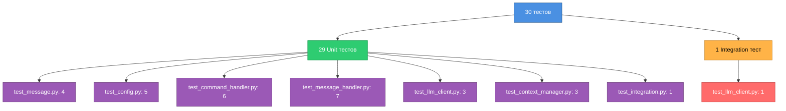
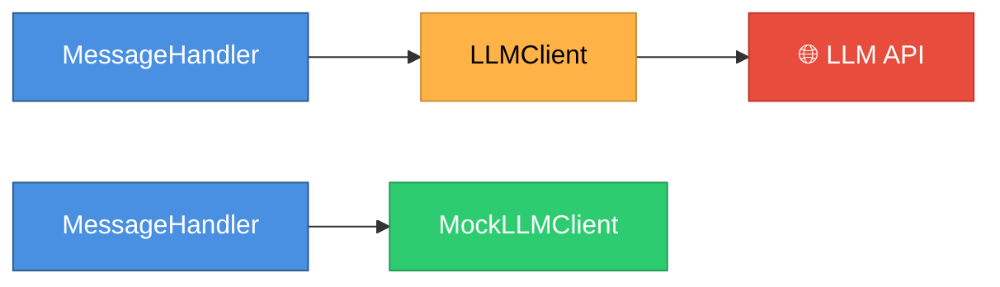
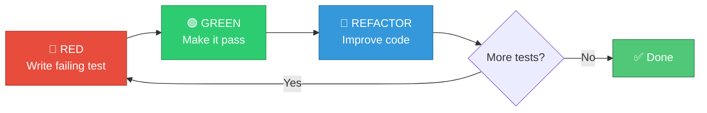

# GUIDE-08: Testing

**Цель**: Понять стратегию тестирования и научиться писать тесты.

---

## Стратегия тестирования

Проект имеет **100% code coverage** с разделением на unit и integration тесты.



---

## Типы тестов

### Unit тесты (29 штук)
**Назначение**: Тестируют отдельные компоненты в изоляции.

**Характеристики**:
- Используют моки для внешних зависимостей
- Быстрые (~2.8s для всех)
- Не требуют внешних сервисов (LLM API, БД)
- Запускаются на каждый коммит

**Запуск**:
```bash
make test              # Unit тесты
make test-cov          # Unit тесты с coverage
```

### Integration тесты (1 штука)
**Назначение**: Тестируют реальные интеграции с внешними сервисами.

**Характеристики**:
- Делают реальные HTTP запросы к LLM API
- Медленные (~1-2s на тест)
- Требуют валидные API ключи в `.env`
- Запускаются вручную или на CI для main ветки

**Запуск**:
```bash
make test-integration  # Только integration
make test-all          # Все тесты (unit + integration)
```

**Маркер**:
```python
@pytest.mark.integration
async def test_llm_real_api_call():
    """Integration test with real LLM API."""
    ...
```

---

## Структура тестов

### Организация файлов

```
tests/
├── __init__.py
├── conftest.py                  # Общие fixtures
├── test_message.py              # 4 теста для Message
├── test_config.py               # 5 тестов для Config
├── test_command_handler.py      # 6 тестов для CommandHandler
├── test_message_handler.py      # 7 тестов для MessageHandler
├── test_llm_client.py           # 4 теста для LLMClient (3 unit + 1 integration)
├── test_context_manager.py      # 3 теста для ContextManager
└── test_integration.py          # 1 integration тест
```

### Naming convention

**Файлы**: `test_<module_name>.py`
- `test_message.py` для `src/message.py`
- `test_config.py` для `src/config.py`

**Функции**: `test_<what_it_tests>`
- `test_message_creation()` — создание Message
- `test_config_missing_fields()` — валидация Config

---

## Fixtures (conftest.py)

### `clean_env` (autouse=True)

```python
@pytest.fixture(autouse=True)
def clean_env(monkeypatch: pytest.MonkeyPatch) -> None:
    """Clean environment variables before each test."""
    env_vars_to_remove = [
        "BOT_TOKEN",
        "LLM_API_KEY",
        # ...
    ]
    for var in env_vars_to_remove:
        monkeypatch.delenv(var, raising=False)
```

**Назначение**: Очищает env vars перед каждым тестом для изоляции.

**Автоматически**: Применяется ко всем тестам (`autouse=True`).

---

### `context_manager`

```python
@pytest.fixture
def context_manager() -> ContextManager:
    """Create a real ContextManager instance."""
    return ContextManager(max_context_messages=20)
```

**Использование**:
```python
def test_add_message(context_manager: ContextManager) -> None:
    msg = Message("user", "Hello")
    context_manager.add_message(123, 456, msg)
    # ...
```

---

### `mock_llm_client`

```python
@pytest.fixture
def mock_llm_client() -> AsyncMock:
    """Create a mock LLM client."""
    client = AsyncMock()
    client.get_response = AsyncMock(return_value="Mocked LLM response")
    return client
```

**Использование**:
```python
async def test_message_handler(mock_llm_client: AsyncMock) -> None:
    handler = MessageHandler(mock_llm_client, ...)
    response = await handler.handle_message(...)
    assert response == "Mocked LLM response"
```

---

### `command_handler`

```python
@pytest.fixture
def command_handler(context_manager: ContextManager) -> CommandHandler:
    """Create a CommandHandler instance."""
    return CommandHandler(context_manager)
```

---

### `sample_message`

```python
@pytest.fixture
def sample_message() -> Message:
    """Create a sample Message instance."""
    return Message("user", "Hello, world!")
```

---

### `mock_telegram_message`

```python
@pytest.fixture
def mock_telegram_message() -> Mock:
    """Create a mock Telegram message."""
    msg = Mock()
    msg.text = "Test message"
    msg.from_user.id = 12345
    msg.chat.id = 67890
    return msg
```

---

## Моки и изоляция

### Зачем моки?

**Проблема**: Unit тест не должен зависеть от внешних сервисов.

**Решение**: Мокируем зависимости.



### AsyncMock

Для async функций используем `AsyncMock`:

```python
from unittest.mock import AsyncMock

# Создание мока
mock_client = AsyncMock()
mock_client.get_response = AsyncMock(return_value="Test response")

# Использование
response = await mock_client.get_response([...])
assert response == "Test response"

# Проверка вызовов
mock_client.get_response.assert_called_once()
```

### Mock

Для sync функций используем `Mock`:

```python
from unittest.mock import Mock

# Создание мока
mock_message = Mock()
mock_message.text = "Hello"
mock_message.from_user.id = 123

# Использование
assert mock_message.text == "Hello"
```

---

## Примеры тестов

### Простой unit тест

```python
# tests/test_message.py
def test_message_creation() -> None:
    """Test Message instance creation."""
    msg = Message("user", "Hello")
    
    assert msg.role == "user"
    assert msg.content == "Hello"
```

**Паттерн**: Arrange → Act → Assert

---

### Тест с fixture

```python
# tests/test_context_manager.py
def test_add_and_get_message(context_manager: ContextManager) -> None:
    """Test adding and retrieving messages."""
    # Arrange
    msg = Message("user", "Hello")
    
    # Act
    context_manager.add_message(123, 456, msg)
    context = context_manager.get_context(123, 456)
    
    # Assert
    assert len(context) == 1
    assert context[0].role == "user"
    assert context[0].content == "Hello"
```

---

### Async тест с моком

```python
# tests/test_message_handler.py
async def test_handle_regular_message(
    mock_llm_client: AsyncMock,
    context_manager: ContextManager,
    command_handler: CommandHandler,
    mock_telegram_message: Mock,
) -> None:
    """Test handling regular message."""
    # Arrange
    handler = MessageHandler(
        mock_llm_client,
        context_manager,
        command_handler,
        "System prompt",
    )
    
    # Act
    response = await handler.handle_message(
        mock_telegram_message,
        user_id=123,
        chat_id=456,
    )
    
    # Assert
    assert response == "Mocked LLM response"
    mock_llm_client.get_response.assert_called_once()
```

---

### Тест с проверкой исключения

```python
# tests/test_config.py
def test_config_missing_fields(monkeypatch: pytest.MonkeyPatch) -> None:
    """Test Config raises error when required fields are missing."""
    # Arrange: установить только часть полей
    monkeypatch.setenv("BOT_TOKEN", "test_token")
    # LLM_API_KEY отсутствует
    
    # Act & Assert
    with pytest.raises(ConfigError) as exc_info:
        Config.from_env()
    
    assert "LLM_API_KEY" in str(exc_info.value)
```

---

### Integration тест

```python
# tests/test_llm_client.py
@pytest.mark.integration
async def test_llm_client_real_api_call(monkeypatch: pytest.MonkeyPatch) -> None:
    """Integration test: real LLM API call."""
    # Arrange: загрузить .env
    load_dotenv()
    config = Config.from_env()
    client = LLMClient(
        api_key=config.llm_api_key,
        base_url=config.llm_base_url,
        model=config.llm_model,
    )
    
    messages = [
        Message("system", "You are a helpful assistant."),
        Message("user", "Say 'Hello'"),
    ]
    
    # Act: реальный API вызов
    response = await client.get_response(messages)
    
    # Assert
    assert isinstance(response, str)
    assert len(response) > 0
```

**Важно**: Помечен `@pytest.mark.integration` для отдельного запуска.

---

## Запуск тестов

### Все команды

```bash
# Unit тесты (быстро, без integration)
make test
# Эквивалентно: uv run pytest tests/ -v -m "not integration"

# Unit тесты с coverage
make test-cov
# Эквивалентно: uv run pytest -m "not integration"

# Только integration тесты
make test-integration
# Эквивалентно: uv run pytest tests/ -v -m "integration"

# Все тесты (unit + integration)
make test-all
# Эквивалентно: uv run pytest tests/ -v
```

---

### Запуск конкретного файла

```bash
uv run pytest tests/test_message.py
```

---

### Запуск конкретного теста

```bash
uv run pytest tests/test_message.py::test_message_creation
```

---

### Запуск с verbose

```bash
uv run pytest tests/ -v
```

**Вывод**:
```
tests/test_message.py::test_message_creation PASSED
tests/test_message.py::test_message_to_dict PASSED
...
==================== 30 passed in 4.5s ====================
```

---

### Запуск с деталями ошибок

```bash
uv run pytest tests/ -vv
```

Покажет:
- Детали assertion errors
- Полный traceback

---

## Coverage

### Запуск с coverage

```bash
make test-cov
```

**Вывод**:
```
Name                      Stmts   Miss  Cover   Missing
-------------------------------------------------------
src/config.py                42      0   100%
src/message_handler.py       35      0   100%
src/command_handler.py       23      0   100%
src/context_manager.py       28      0   100%
src/llm_client.py            24      0   100%
src/message.py                5      0   100%
src/protocols.py              8      0   100%
-------------------------------------------------------
TOTAL                       165      0   100%
```

---

### HTML отчет

Coverage автоматически создает HTML отчет:

```bash
open htmlcov/index.html
```

В браузере увидите:
- Список всех файлов с coverage %
- Подсветку покрытых/непокрытых строк
- Missing lines (если coverage < 100%)

---

### Настройка coverage

**Файл**: `pyproject.toml`

```toml
[tool.pytest.ini_options]
addopts = "--cov=src --cov-report=term-missing --cov-report=html"

[tool.coverage.run]
omit = ["tests/*", "**/__pycache__/*", "src/main.py"]
```

**Пояснение**:
- `--cov=src` — измерять покрытие в `src/`
- `--cov-report=term-missing` — показывать непокрытые строки
- `--cov-report=html` — генерировать HTML отчет
- `omit` — исключить `tests/` и `main.py` из измерений

---

## TDD Workflow

### Red → Green → Refactor



### Пример: Добавление метода

**Задача**: Добавить метод `Message.is_user()` для проверки роли.

#### 1. RED: Пишем тест (падает)

```python
# tests/test_message.py
def test_message_is_user() -> None:
    """Test is_user method."""
    user_msg = Message("user", "Hello")
    system_msg = Message("system", "Prompt")
    
    assert user_msg.is_user() is True
    assert system_msg.is_user() is False
```

Запускаем:
```bash
uv run pytest tests/test_message.py::test_message_is_user
```

**Результат**: ❌ AttributeError: 'Message' object has no attribute 'is_user'

#### 2. GREEN: Пишем код (проходит)

```python
# src/message.py
class Message:
    def __init__(self, role: str, content: str) -> None:
        self.role = role
        self.content = content
    
    def is_user(self) -> bool:
        """Check if message is from user."""
        return self.role == "user"
```

Запускаем:
```bash
uv run pytest tests/test_message.py::test_message_is_user
```

**Результат**: ✅ PASSED

#### 3. REFACTOR: Улучшаем (если нужно)

Код уже хороший, refactor не нужен. ✅

---

## Написание хороших тестов

### Правило 1: Arrange-Act-Assert

```python
def test_example() -> None:
    # Arrange: подготовка данных
    msg = Message("user", "Hello")
    
    # Act: выполнение действия
    result = msg.to_dict()
    
    # Assert: проверка результата
    assert result["role"] == "user"
```

---

### Правило 2: Один тест = одна проверка

**Плохо** ❌:
```python
def test_everything() -> None:
    msg = Message("user", "Hello")
    assert msg.role == "user"
    assert msg.content == "Hello"
    assert msg.to_dict() == {"role": "user", "content": "Hello"}
    assert msg.is_user() is True
```

**Хорошо** ✅:
```python
def test_message_role() -> None:
    msg = Message("user", "Hello")
    assert msg.role == "user"

def test_message_to_dict() -> None:
    msg = Message("user", "Hello")
    assert msg.to_dict() == {"role": "user", "content": "Hello"}

def test_message_is_user() -> None:
    msg = Message("user", "Hello")
    assert msg.is_user() is True
```

---

### Правило 3: Понятные имена

**Плохо** ❌:
```python
def test_1() -> None: ...
def test_message() -> None: ...
```

**Хорошо** ✅:
```python
def test_message_creation_with_valid_data() -> None: ...
def test_message_to_dict_returns_correct_format() -> None: ...
```

---

### Правило 4: Изолируйте тесты

Каждый тест должен быть независим:
- Не полагайтесь на порядок выполнения
- Используйте fixtures для setup
- Очищайте состояние (autouse fixtures)

---

### Правило 5: Тестируйте граничные случаи

```python
def test_context_trimming() -> None:
    """Test context is trimmed when exceeding limit."""
    cm = ContextManager(max_context_messages=3)
    
    # Добавляем 5 сообщений (превышаем лимит)
    for i in range(5):
        cm.add_message(123, 456, Message("user", f"Message {i}"))
    
    context = cm.get_context(123, 456)
    
    # Проверяем, что осталось только 3
    assert len(context) == 3
```

---

## Debugging тестов

### Запуск с print

```python
def test_debug() -> None:
    msg = Message("user", "Hello")
    print(f"Message: {msg.role} - {msg.content}")  # ← добавили print
    assert msg.role == "user"
```

Запуск с `-s` (показать stdout):
```bash
uv run pytest tests/test_message.py::test_debug -s
```

---

### Использование pdb

```python
def test_debug() -> None:
    msg = Message("user", "Hello")
    import pdb; pdb.set_trace()  # ← breakpoint
    assert msg.role == "user"
```

Запуск:
```bash
uv run pytest tests/test_message.py::test_debug
```

Откроется интерактивный debugger.

---

### VSCode debugging

1. Откройте тестовый файл
2. Поставьте breakpoint (клик слева от номера строки)
3. F5 → `Python: Debug Current Test File`
4. Debugger остановится на breakpoint

---

## Checklist для новых тестов

- [ ] Тест имеет понятное имя (`test_what_it_tests`)
- [ ] Использует fixtures из `conftest.py` (если нужно)
- [ ] Следует Arrange-Act-Assert паттерну
- [ ] Проверяет одну вещь (single responsibility)
- [ ] Изолирован от других тестов
- [ ] Использует моки для внешних зависимостей
- [ ] Проходит при запуске: `uv run pytest tests/test_*.py`
- [ ] Coverage не упал: `make test-cov`

---

## Полезные команды

```bash
# Быстрая проверка одного теста
uv run pytest tests/test_message.py::test_message_creation -v

# Запуск с выводом print
uv run pytest tests/ -s

# Запуск последнего упавшего теста
uv run pytest --lf

# Остановиться на первом упавшем
uv run pytest -x

# Показать самые медленные тесты
uv run pytest --durations=10

# Запуск в параллель (быстрее)
uv run pytest -n auto  # требует pytest-xdist
```

---

## Метрики проекта

**Текущее состояние**:
- ✅ 30 тестов
- ✅ 100% code coverage
- ✅ 0 flaky tests
- ✅ Быстрые тесты (~2.8s для unit)

**Цель**: Сохранить 100% coverage при добавлении новых фич.

---

## Что дальше?

Вы прошли все MUST HAVE гайды! 🎉

**Следующие шаги**:
1. Попрактикуйтесь: добавьте новую команду `/stats`
2. Напишите тесты в TDD стиле
3. Изучите существующие тесты в `tests/`
4. Поэкспериментируйте с integration тестами

**Дополнительно**:
- Изучите `doc/adrs/` для понимания архитектурных решений
- Прочитайте `doc/vision.md` для понимания принципов проекта
- Просмотрите `doc/tasklist.md` для истории разработки

