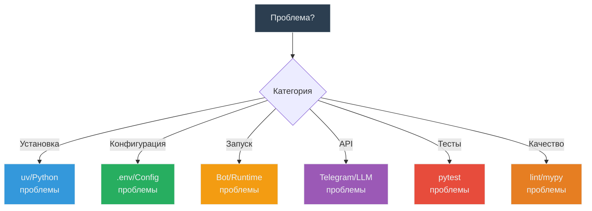

# 🔧 Troubleshooting Guide

**Цель**: Решение типичных проблем  
**Для кого**: Все разработчики  
**Время**: Справочник (по необходимости)

---

## 🎯 Диагностика проблем



---

## 🐍 Проблемы установки

### ❌ Command not found: uv

**Симптомы**:
```bash
$ uv --version
zsh: command not found: uv
```

**Решение**:
```bash
# macOS/Linux
curl -LsSf https://astral.sh/uv/install.sh | sh

# Добавить в PATH (если нужно)
export PATH="$HOME/.cargo/bin:$PATH"

# Перезапустить терминал
source ~/.zshrc  # или ~/.bashrc

# Проверить
uv --version
```

### ❌ Python version mismatch

**Симптомы**:
```bash
$ uv sync
error: requires python>=3.11, but current is 3.9
```

**Решение**:
```bash
# Проверить версию
python --version

# Установить Python 3.11+ (macOS)
brew install python@3.11

# Или pyenv
pyenv install 3.11.0
pyenv local 3.11.0

# Пересоздать окружение
rm -rf .venv
uv sync --extra dev
```

### ❌ No module named 'src'

**Симптомы**:
```bash
$ python -m src.main
ModuleNotFoundError: No module named 'src'
```

**Решение**:
```bash
# ✅ Правильно - через uv run
uv run python -m src.main

# Или активировать venv
source .venv/bin/activate
python -m src.main
```

---

## ⚙️ Проблемы конфигурации

### ❌ ConfigError: Missing required environment variables

**Симптомы**:
```bash
$ make run
ConfigError: Missing required environment variables: ['BOT_TOKEN', 'LLM_API_KEY']
```

**Решение**:
```bash
# 1. Проверить наличие .env
ls -la .env

# 2. Если нет - создать из примера
cp .env.example .env

# 3. Заполнить переменные
vim .env  # или nano, code

# 4. Проверить содержимое
cat .env | grep -v '^#'

# 5. Запустить снова
make run
```

### ❌ Invalid BOT_TOKEN format

**Симптомы**:
```bash
aiogram.exceptions.TelegramUnauthorizedError: Unauthorized
```

**Решение**:
```bash
# 1. Проверить формат токена (должен быть вида: 1234567890:ABCdef...)
# 2. Получить новый токен через @BotFather:
#    - Открыть @BotFather в Telegram
#    - /newbot
#    - Следовать инструкциям
#    - Скопировать токен в .env
```

### ❌ System prompt file not found

**Симптомы**:
```bash
ConfigError: System prompt file not found: prompts/system_prompt.txt
```

**Решение**:
```bash
# 1. Проверить наличие файла
ls -la prompts/system_prompt.txt

# 2. Создать если нет
mkdir -p prompts
cat > prompts/system_prompt.txt << 'EOF'
Ты полезный AI-ассистент.
EOF

# 3. Или использовать переменную окружения
echo "SYSTEM_PROMPT=Ты полезный ассистент" >> .env
```

---

## 🤖 Проблемы запуска бота

### ❌ Bot не отвечает на сообщения

**Диагностика**:
```bash
# 1. Проверить что бот запущен
ps aux | grep python | grep main

# 2. Проверить логи
tail -f logs/app.log

# 3. Проверить что нет ошибок в консоли
```

**Возможные причины**:

#### A. Polling не работает

```bash
# В логах:
ConnectionError: Failed to connect to Telegram API
```

**Решение**:
- Проверить интернет соединение
- Проверить что Telegram не заблокирован
- Попробовать использовать VPN

#### B. Bot заблокирован пользователем

```bash
# В логах:
TelegramForbiddenError: bot was blocked by the user
```

**Решение**:
- Разблокировать бота в Telegram
- Отправить `/start` заново

### ❌ Bot падает при старте

**Симптомы**:
```bash
$ make run
Traceback (most recent call last):
  ...
KeyError: 'BOT_TOKEN'
```

**Решение**:
```bash
# 1. Проверить .env загружается
python -c "from dotenv import load_dotenv; import os; load_dotenv(); print(os.getenv('BOT_TOKEN'))"

# 2. Если None - проверить путь к .env
ls -la .env

# 3. Проверить что нет пробелов в .env
# ❌ Неправильно:
BOT_TOKEN = 123456  # Пробелы вокруг =

# ✅ Правильно:
BOT_TOKEN=123456
```

---

## 🌐 Проблемы с API

### ❌ LLM API timeout

**Симптомы**:
```bash
# В логах:
LLMError: Request timeout after 30s
```

**Решение**:
```bash
# 1. Проверить интернет
ping openrouter.ai

# 2. Проверить API ключ
curl -H "Authorization: Bearer $LLM_API_KEY" \
  https://openrouter.ai/api/v1/models

# 3. Проверить баланс OpenRouter
# Зайти на openrouter.ai → проверить credits

# 4. Попробовать другую модель (более быструю)
# .env:
LLM_MODEL=anthropic/claude-3-haiku  # Быстрая модель
```

### ❌ Rate limit exceeded

**Симптомы**:
```bash
LLMError: Rate limit exceeded. Please try again later.
```

**Решение**:
```bash
# 1. Подождать (обычно 1 минута)
sleep 60

# 2. Проверить лимиты провайдера

# 3. Использовать другой API ключ (если есть)

# 4. Добавить rate limiting в боте (TODO)
```

### ❌ Invalid API key

**Симптомы**:
```bash
LLMError: Invalid API key
```

**Решение**:
```bash
# 1. Проверить ключ в .env
cat .env | grep LLM_API_KEY

# 2. Создать новый ключ на openrouter.ai

# 3. Обновить .env
vim .env

# 4. Перезапустить бота
make run
```

---

## 🧪 Проблемы с тестами

### ❌ Tests не запускаются

**Симптомы**:
```bash
$ make test
pytest: command not found
```

**Решение**:
```bash
# 1. Установить dev зависимости
make install

# Или
uv sync --extra dev

# 2. Запустить через uv run
uv run pytest tests/
```

### ❌ pytest: error: unrecognized arguments: --cov

**Симптомы**:
```bash
$ make test-cov
error: unrecognized arguments: --cov
```

**Решение**:
```bash
# Установить pytest-cov
uv sync --extra dev

# Проверить установку
uv run pytest --version
```

### ❌ Import errors в тестах

**Симптомы**:
```bash
tests/test_message.py:1: ImportError: No module named 'src'
```

**Решение**:
```bash
# ✅ Всегда запускать через uv run
uv run pytest tests/

# Или через make
make test
```

### ❌ Flaky tests (падают рандомно)

**Симптомы**:
```bash
# Иногда проходит, иногда падает
test_llm_integration PASSED  # run 1
test_llm_integration FAILED  # run 2
```

**Решение**:
```bash
# 1. Проверить что не используется реальный API в unit тестах
# (должны быть моки)

# 2. Проверить что нет race conditions

# 3. Запустить несколько раз для проверки
for i in {1..5}; do make test; done

# 4. Если integration тест - пропустить его
make test  # (без integration)
```

---

## 🔍 Проблемы с качеством кода

### ❌ Mypy errors

**Симптомы**:
```bash
$ make lint
src/handler.py:10: error: Function is missing a return type annotation
```

**Решение**:
```python
# ❌ Before:
def handle_message(text):
    return text

# ✅ After:
def handle_message(text: str) -> str:
    return text
```

**Частые ошибки**:

#### Missing type annotation
```python
# ❌
def process(data):

# ✅
def process(data: str) -> str:
```

#### Incompatible types
```python
# ❌
def get_count() -> int:
    return "5"  # str вместо int

# ✅
def get_count() -> int:
    return 5
```

#### Optional type not handled
```python
# ❌
def process(value: str | None) -> str:
    return value.upper()  # value может быть None

# ✅
def process(value: str | None) -> str:
    if value is None:
        return ""
    return value.upper()
```

### ❌ Ruff warnings

**Симптомы**:
```bash
$ make lint
src/handler.py:5:8: F401 'os' imported but unused
```

**Решение**:
```bash
# Автоматически исправить большинство проблем
make format

# Проверить что исправилось
make lint
```

**Частые warnings**:

#### F401: Unused import
```python
# ❌
import os  # Не используется

# ✅
# Удалить импорт
```

#### E501: Line too long
```python
# ❌
very_long_variable_name = some_function_with_long_name(argument1, argument2, argument3, argument4)

# ✅
very_long_variable_name = some_function_with_long_name(
    argument1, argument2, argument3, argument4
)
```

### ❌ Coverage упал

**Симптомы**:
```bash
$ make test-cov
Coverage: 85% (было 100%)
```

**Решение**:
```bash
# 1. Посмотреть HTML отчет
open htmlcov/index.html

# 2. Найти непокрытые строки (красные)

# 3. Написать тесты для них

# 4. Проверить coverage снова
make test-cov
```

---

## 📝 Проблемы с Git

### ❌ Merge conflicts

**Симптомы**:
```bash
$ git pull origin main
CONFLICT (content): Merge conflict in src/handler.py
```

**Решение**:
```bash
# 1. Открыть файл с конфликтом
vim src/handler.py

# 2. Найти маркеры
<<<<<<< HEAD
your changes
=======
their changes
>>>>>>> main

# 3. Выбрать нужный вариант или объединить

# 4. Удалить маркеры

# 5. Добавить и закоммитить
git add src/handler.py
git commit -m "fix: resolve merge conflict"
```

### ❌ Accidentally committed secrets

**Симптомы**:
```bash
# .env файл в git
$ git status
modified: .env
```

**Решение**:
```bash
# 1. НЕ коммитить!
git reset HEAD .env

# 2. Добавить в .gitignore (уже должно быть)
echo ".env" >> .gitignore

# 3. Если уже закоммитили - удалить из истории
git rm --cached .env
git commit -m "fix: remove .env from git"

# 4. Сменить все секреты (BOT_TOKEN, API_KEY)
```

---

## 🆘 Экстренная диагностика

### Quick health check

```bash
# 1. Python версия
python --version  # Должно быть 3.11+

# 2. uv работает
uv --version

# 3. Зависимости установлены
ls -la .venv/

# 4. .env существует
ls -la .env

# 5. Тесты проходят
make test

# 6. Линтинг проходит
make lint

# 7. Бот запускается
timeout 5 make run || true  # Запустить на 5 сек
```

### Полная переустановка

```bash
# 1. Удалить окружение
rm -rf .venv

# 2. Очистить кеши
rm -rf __pycache__ src/__pycache__ tests/__pycache__
rm -rf .pytest_cache .mypy_cache .ruff_cache

# 3. Переустановить
make install

# 4. Проверить
make check-all
```

---

## 📚 Где искать помощь

### 1. Логи

```bash
# Последние 50 строк
tail -n 50 logs/app.log

# Следить в реальном времени
tail -f logs/app.log

# Найти ошибки
grep ERROR logs/app.log
```

### 2. Документация проекта

- [README.md](../../README.md) - основная документация
- [Getting Started](01-getting-started.md) - установка
- [Architecture Overview](03-architecture-overview.md) - как работает

### 3. Внешние ресурсы

- [aiogram docs](https://docs.aiogram.dev/)
- [OpenRouter docs](https://openrouter.ai/docs)
- [pytest docs](https://docs.pytest.org/)
- [ruff docs](https://docs.astral.sh/ruff/)
- [mypy docs](https://mypy.readthedocs.io/)

### 4. Создать issue

Если проблема не решается:

```markdown
**Описание проблемы**:
Краткое описание что не работает.

**Как воспроизвести**:
1. Шаг 1
2. Шаг 2
3. ...

**Ожидаемое поведение**:
Что должно произойти.

**Актуальное поведение**:
Что происходит на самом деле.

**Окружение**:
- OS: macOS 14.0
- Python: 3.11.5
- uv: 0.1.0

**Логи**:
\`\`\`
Вставить релевантные логи
\`\`\`
```

---

## 💡 Профилактика проблем

### Регулярные проверки

```bash
# Раз в неделю - обновить зависимости
uv lock --upgrade

# Перед каждым коммитом
make check-all

# После git pull
make install  # Если pyproject.toml изменился
```

### Best practices

- ✅ Всегда использовать `uv run` для запуска
- ✅ Проверять `.env` перед запуском
- ✅ Читать логи при ошибках
- ✅ Запускать `make check-all` перед push
- ✅ Не коммитить `.env` и секреты
- ✅ Держать `main` актуальным (`git pull`)

---

## 🎯 Чек-лист диагностики

Когда что-то не работает, пройти по списку:

- [ ] Python 3.11+ установлен
- [ ] uv установлен и в PATH
- [ ] `.venv/` создан (`make install`)
- [ ] `.env` существует и заполнен
- [ ] Интернет соединение работает
- [ ] Логи проверены (`logs/app.log`)
- [ ] `make test` проходит
- [ ] `make lint` проходит
- [ ] `make run` запускается без ошибок

Если всё выше ✓ но проблема остается → создать issue.

---

## 💬 FAQ

**Q: Бот медленно отвечает**  
A: Попробуйте более быструю модель (claude-3-haiku) или проверьте интернет.

**Q: Coverage упал, как найти что не покрыто?**  
A: `make test-cov` → `open htmlcov/index.html` → красные строки не покрыты.

**Q: Как запустить только один тест?**  
A: `uv run pytest tests/test_file.py::test_name -v`

**Q: Можно ли использовать локальную LLM?**  
A: Да, установите Ollama и укажите в .env: `LLM_BASE_URL=http://localhost:11434/v1`

**Q: Как очистить логи?**  
A: `make clean` или `rm logs/app.log`

---

## ✅ Резюме

**Если что-то не работает**:
1. Проверить логи (`logs/app.log`)
2. Запустить `make check-all`
3. Посмотреть этот гайд
4. Создать issue если не помогло

**Большинство проблем** решаются через:
- `make install` (переустановка)
- Проверка `.env` (конфигурация)
- `make format` (форматирование)
- Чтение логов (диагностика)

