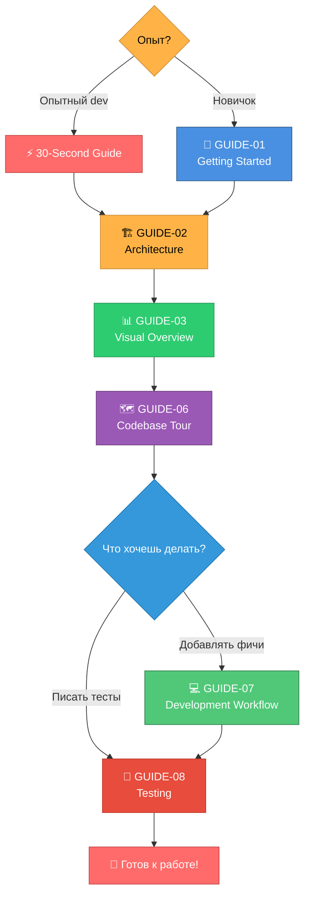

# 📚 Руководства по проекту

Коллекция гайдов для полного онбординга и понимания проекта.

---

## 🎯 Как использовать гайды

**⚡ Для быстрого старта**: [30-Second Onboarding Guide](30sec-onboarding-guide.md) — запустите проект за 30 секунд!

Гайды организованы по уровню сложности:

1. **Начните с GUIDE-01** — запустите проект локально за 20 минут
2. **Изучите GUIDE-02** — поймите архитектуру системы
3. **Пройдите GUIDE-06** — детальный тур по всем файлам
4. **Прочитайте GUIDE-07** — научитесь правильному workflow
5. **Освойте GUIDE-08** — научитесь писать тесты

**Время на прохождение**: 4 часа для полного понимания.

---

## 📖 Доступные гайды

### ⚡ [30-Second Onboarding Guide](30sec-onboarding-guide.md)
**Цель**: Запустить проект за 30 секунд (для опытных разработчиков).

**Охват**:
- Минимальный набор команд без объяснений
- Требует предустановленные Python, Docker, токены
- Команды для запуска бота, API и frontend

**Для кого**: Опытные разработчики, знакомые с Python и Docker.

---

### [GUIDE-01: Getting Started](01-getting-started.md)
**Цель**: За 20 минут запустить бота локально с PostgreSQL и отправить первое сообщение.

**Охват**:
- Установка Python, uv, Docker
- Клонирование репозитория
- Получение токенов (Telegram, OpenRouter)
- Настройка .env (включая DATABASE_URL)
- Запуск PostgreSQL в Docker
- Применение миграций БД
- Первый запуск и тестирование
- Проверка персистентности контекста
- Troubleshooting (включая проблемы с БД)

**Для кого**: Новые разработчики, первый запуск проекта.

---

### [GUIDE-02: Архитектура проекта](02-architecture.md)
**Цель**: Понять, как устроена система на высоком уровне (Bot + API + Frontend + DB).

**Охват**:
- High-level диаграммы системы (Telegram Bot, REST API, Frontend, PostgreSQL)
- Основные компоненты: MessageHandler, Repository, Database, API, Frontend
- Принципы проектирования (SOLID, KISS, DRY)
- Async-first подход с SQLAlchemy 2.0
- Repository pattern для работы с БД
- Flow обработки сообщений
- Персистентное хранение в PostgreSQL
- Soft delete стратегия
- REST API с FastAPI
- Обработка ошибок
- Логирование
- ADR (включая ADR-06: PostgreSQL, ADR-07: Frontend stack)

**Для кого**: Разработчики, желающие понять полную архитектуру перед началом работы.

---

### [GUIDE-03: Визуальный обзор проекта](03-visual-overview.md)
**Цель**: Понять проект с разных точек зрения через визуальные диаграммы.

**Охват** (структурирован по этапам SDLC):
- **Планирование**: Timeline, Gantt, распределение работы
- **Анализ требований**: Use Cases, User Journey, Mind Map
- **Проектирование**: C4, компоненты, классы, ER, состояния
- **Разработка**: Workflow, Git Flow, структура проекта, зависимости
- **Тестирование**: Пирамида, TDD, Coverage, стратегия
- **Эксплуатация**: Runtime Flow, логирование, ошибки, мониторинг

**Диаграммы**: 26 Mermaid диаграмм с контрастными цветами

**Для кого**: Все роли (разработчики, архитекторы, тестировщики, DevOps) — визуальное понимание проекта.

---

### [GUIDE-06: Codebase Tour](06-codebase-tour.md)
**Цель**: Пройтись по всем файлам проекта с объяснением назначения.

**Охват**:
- Структура проекта (src/, frontend/, alembic/, tests/, doc/)
- Детальный разбор модулей бота:
  - main.py — точка входа бота
  - config.py — конфигурация
  - message_handler.py — координатор
  - command_handler.py — команды
  - llm_client.py — LLM API
  - models.py — SQLAlchemy ORM модели
  - database.py — управление подключением к БД
  - repository.py — Repository pattern
  - message.py — data class для LLM
  - protocols.py — DI интерфейсы
  - exceptions.py — custom errors
- Детальный разбор API модулей:
  - api_server.py — точка входа API
  - src/api/main.py — FastAPI приложение
  - src/api/schemas.py — Pydantic схемы
  - src/api/stat_collector_*.py — реализации StatCollector
  - src/api/chat_handler.py — обработчик chat API
- Frontend структура (Next.js)
- Миграции БД (Alembic)
- Тестовые файлы и fixtures
- Конфигурационные файлы (pyproject.toml, Makefile, docker-compose.yml)
- Навигация по коду (где искать что)

**Для кого**: Разработчики, готовые погрузиться в детали реализации.

---

### [GUIDE-07: Development Workflow](07-development-workflow.md)
**Цель**: Научиться правильному процессу разработки в проекте.

**Охват**:
- Принципы разработки (KISS, Type Safety, Async/Await)
- Пошаговый workflow (изучение → ветка → TDD → код → проверка → коммит)
- Правила кодирования (один класс = один файл, type hints, docstrings)
- Инструменты (make format, make lint, make test, make check-all)
- Работа с БД (миграции, тестирование с БД)
- Работа с API (endpoints, Swagger UI, тестирование)
- VSCode setup (debugging, tasks, extensions)
- Пример: добавление новой команды с async/await и БД
- Частые сценарии (новый модуль, изменение БД, новый API endpoint)
- ADR процесс
- Checklist перед коммитом (включая миграции и API)

**Для кого**: Разработчики, готовые добавлять новые фичи.

---

### [GUIDE-08: Testing](08-testing.md)
**Цель**: Понять стратегию тестирования и научиться писать тесты.

**Охват**:
- Стратегия: 100% coverage, unit vs integration
- Структура тестов (30 тестов в 8 файлах)
- Fixtures (conftest.py) для переиспользования
- Моки и изоляция (AsyncMock, Mock)
- Примеры тестов (простые, с fixtures, async, integration)
- Запуск тестов (make test, make test-cov, make test-integration)
- Coverage (измерение, HTML отчет)
- TDD workflow (Red → Green → Refactor)
- Правила написания хороших тестов
- Debugging тестов
- Checklist для новых тестов

**Для кого**: Разработчики, желающие писать качественные тесты.

---

## 🗺️ Рекомендуемый путь обучения

---

## 📊 Метрики гайдов

| Гайд | Время чтения | Сложность | Обязательность |
|------|--------------|-----------|----------------|
| 30-Second Guide | 30 сек | ⭐☆☆☆☆ | Quick start |
| GUIDE-01 | 20 мин | ⭐⭐☆☆☆ | Must have |
| GUIDE-02 | 40 мин | ⭐⭐⭐⭐☆ | Must have |
| GUIDE-03 | 20 мин | ⭐⭐☆☆☆ | Nice to have |
| GUIDE-06 | 60 мин | ⭐⭐⭐⭐⭐ | Must have |
| GUIDE-07 | 70 мин | ⭐⭐⭐⭐⭐ | Must have |
| GUIDE-08 | 45 мин | ⭐⭐⭐⭐☆ | Must have |

**Итого**: 30 секунд для запуска, ~4 часа на полное понимание проекта (включая БД, API, Frontend).

---

## 🔗 Связанная документация

После прохождения гайдов рекомендуем изучить:

- **[README.md](../../README.md)** — главная документация проекта
- **[QUICKSTART.md](../../QUICKSTART.md)** — быстрый старт для разработчиков
- **[doc/vision.md](../vision.md)** — техническое видение проекта
- **[doc/roadmap.md](../roadmap.md)** — roadmap разработки
- **[doc/adrs/](../adrs/)** — Architecture Decision Records:
  - ADR-01: OpenAI Compatible API
  - ADR-02: aiogram для Telegram
  - ADR-03: In-memory storage (устарел)
  - ADR-04: Protocols для DI
  - ADR-05: KISS принцип
  - ADR-06: PostgreSQL + SQLAlchemy 2.0
  - ADR-07: Frontend stack (Next.js + TypeScript)
- **[doc/api-examples.md](../api-examples.md)** — примеры использования API
- **[frontend/README.md](../../frontend/README.md)** — документация frontend

---

## 💡 Советы по изучению

1. **Начните с 30-Second Guide** — если вы опытный разработчик и хотите быстро запустить проект
2. **Не торопитесь** — лучше понять один гайд глубоко, чем пробежаться по всем поверхностно
3. **Практикуйтесь** — запускайте код, меняйте, экспериментируйте
4. **Задавайте вопросы** — если что-то непонятно, изучите исходный код
5. **Следуйте порядку** — гайды построены с нарастающей сложностью
6. **Возвращайтесь** — используйте гайды как справочники при работе

---

## 🤝 Обратная связь

Нашли ошибку в гайде? Что-то непонятно? Предложите улучшение:
- Создайте issue в репозитории
- Предложите правки через Pull Request
- Обсудите с командой

**Гайды живые документы** — мы постоянно их улучшаем на основе вашей обратной связи.

---

**Удачи в изучении проекта! 🚀**

